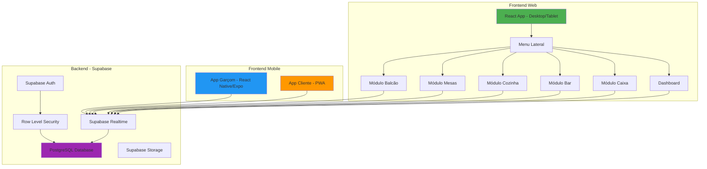
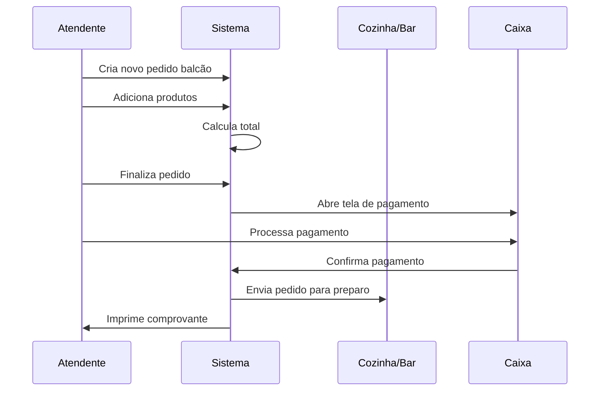
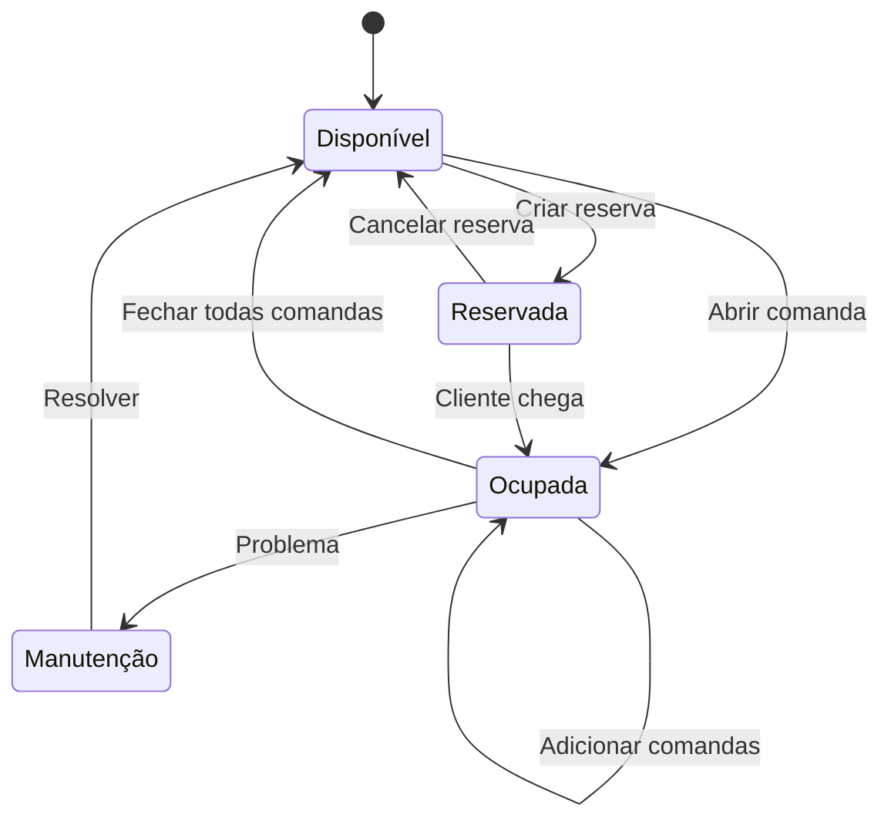
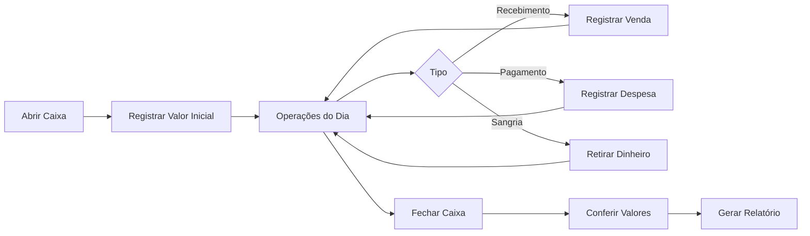
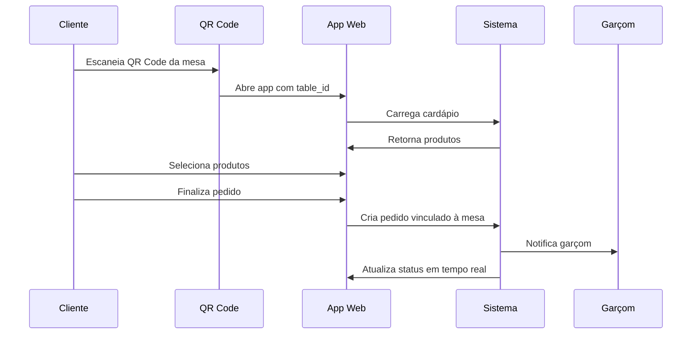

# Design Document - Sistema de Gestão Completo para Restaurantes e Bares

## Visão Geral

Este documento descreve o design técnico para transformar o EasyComand em um sistema completo de gestão de atendimento para bares e restaurantes. O sistema será construído sobre a base existente (React + TypeScript + Supabase) e incluirá novos módulos para atendimento no balcão, gestão de mesas e comandas, interfaces especializadas para cozinha e bar, módulo de caixa completo, aplicativo mobile para garçons (Expo/React Native) e aplicativo web para clientes via QR Code.

### Objetivos do Design

1. **Modularidade**: Cada funcionalidade será um módulo independente e reutilizável
2. **Tempo Real**: Sincronização instantânea entre todos os dispositivos usando Supabase Realtime
3. **Offline-First**: Aplicativo mobile funcionará offline com sincronização posterior
4. **Responsividade**: Interface adaptável para desktop, tablet e mobile
5. **Segurança**: Controle de acesso baseado em roles com RLS do Supabase
6. **Performance**: Otimização de queries e cache inteligente com React Query
7. **UX Profissional**: Interface moderna e intuitiva para o segmento gastronômico

## Arquitetura

### Diagrama de Arquitetura Geral



### Stack Tecnológica Detalhada

#### Frontend Web (Desktop/Tablet)
- **Framework**: React 18 com TypeScript
- **Build Tool**: Vite
- **Styling**: Tailwind CSS + Shadcn/ui
- **State Management**: 
  - React Context para estado global da aplicação
  - React Query para cache e sincronização de dados do servidor
  - Zustand para estado local complexo (carrinho, seleções temporárias)
- **Routing**: React Router DOM v6
- **Forms**: React Hook Form + Zod
- **Real-time**: Supabase Realtime Subscriptions
- **Animations**: Framer Motion
- **Icons**: Lucide React
- **Charts**: Recharts para relatórios

#### Frontend Mobile - App Garçom
- **Framework**: React Native com Expo
- **Navigation**: React Navigation
- **State Management**: React Query + Zustand
- **Offline Storage**: AsyncStorage + WatermelonDB
- **Push Notifications**: Expo Notifications
- **Camera**: Expo Camera (para QR Code)
- **Styling**: NativeWind (Tailwind para React Native)

#### Frontend Mobile - App Cliente (PWA)
- **Framework**: React 18 (mesma base do web)
- **PWA**: Service Workers para cache offline
- **QR Code**: react-qr-reader
- **Responsivo**: Mobile-first design

#### Backend
- **BaaS**: Supabase
- **Database**: PostgreSQL 15+
- **Auth**: Supabase Auth com JWT
- **Real-time**: Supabase Realtime (WebSockets)
- **Storage**: Supabase Storage para imagens
- **Security**: Row Level Security (RLS)

## Componentes e Interfaces

### 1. Layout Principal e Menu Lateral

#### Estrutura do Layout


```typescript
// Layout Component Structure
interface MainLayoutProps {
  children: React.ReactNode;
}

interface SidebarMenuItem {
  id: string;
  label: string;
  icon: LucideIcon;
  path: string;
  permissions: string[];
  badge?: number; // Para notificações
}

const menuItems: SidebarMenuItem[] = [
  { id: 'dashboard', label: 'Dashboard', icon: LayoutDashboard, path: '/dashboard', permissions: ['view_dashboard'] },
  { id: 'balcao', label: 'Balcão', icon: ShoppingBag, path: '/balcao', permissions: ['manage_counter'] },
  { id: 'mesas', label: 'Mesas', icon: Utensils, path: '/mesas', permissions: ['manage_tables'] },
  { id: 'cozinha', label: 'Cozinha', icon: ChefHat, path: '/cozinha', permissions: ['view_kitchen'] },
  { id: 'bar', label: 'Bar', icon: Wine, path: '/bar', permissions: ['view_bar'] },
  { id: 'caixa', label: 'Caixa', icon: DollarSign, path: '/caixa', permissions: ['manage_cashier'] },
  { id: 'cardapio', label: 'Cardápio', icon: BookOpen, path: '/cardapio', permissions: ['manage_menu'] },
  { id: 'estoque', label: 'Estoque', icon: Package, path: '/estoque', permissions: ['manage_stock'] },
  { id: 'clientes', label: 'Clientes', icon: Users, path: '/clientes', permissions: ['manage_customers'] },
  { id: 'relatorios', label: 'Relatórios', icon: BarChart3, path: '/relatorios', permissions: ['view_reports'] },
  { id: 'configuracoes', label: 'Configurações', icon: Settings, path: '/configuracoes', permissions: ['manage_settings'] },
];
```

#### Design System - Paleta de Cores

```typescript
// Tema para segmento gastronômico
const theme = {
  colors: {
    primary: {
      50: '#FFF8E1',  // Amarelo claro
      100: '#FFECB3',
      200: '#FFE082',
      300: '#FFD54F',
      400: '#FFCA28',
      500: '#FFC107', // Amarelo principal
      600: '#FFB300',
      700: '#FFA000',
      800: '#FF8F00',
      900: '#FF6F00',
    },
    secondary: {
      50: '#E8F5E9',  // Verde claro
      100: '#C8E6C9',
      200: '#A5D6A7',
      300: '#81C784',
      400: '#66BB6A',
      500: '#4CAF50', // Verde principal
      600: '#43A047',
      700: '#388E3C',
      800: '#2E7D32',
      900: '#1B5E20',
    },
    accent: {
      50: '#FFF3E0',  // Laranja claro
      100: '#FFE0B2',
      200: '#FFCC80',
      300: '#FFB74D',
      400: '#FFA726',
      500: '#FF9800', // Laranja principal
      600: '#FB8C00',
      700: '#F57C00',
      800: '#EF6C00',
      900: '#E65100',
    },
    neutral: {
      50: '#FAFAFA',
      100: '#F5F5F5',
      200: '#EEEEEE',
      300: '#E0E0E0',
      400: '#BDBDBD',
      500: '#9E9E9E',
      600: '#757575',
      700: '#616161',
      800: '#424242',
      900: '#212121',
    },
    status: {
      success: '#4CAF50',
      warning: '#FF9800',
      error: '#F44336',
      info: '#2196F3',
    }
  },
  typography: {
    fontFamily: {
      sans: ['Inter', 'system-ui', 'sans-serif'],
      display: ['Poppins', 'sans-serif'],
    },
    fontSize: {
      xs: '0.75rem',
      sm: '0.875rem',
      base: '1rem',
      lg: '1.125rem',
      xl: '1.25rem',
      '2xl': '1.5rem',
      '3xl': '1.875rem',
      '4xl': '2.25rem',
    }
  }
};
```

### 2. Módulo de Atendimento no Balcão

#### Fluxo de Atendimento




#### Estrutura de Dados

```typescript
interface CounterOrder {
  id: number;
  establishment_id: number;
  order_number: string;
  order_type: 'counter';
  status: 'open' | 'paid' | 'preparing' | 'ready' | 'delivered';
  items: OrderItem[];
  subtotal: number;
  service_fee_amount: number;
  discount_amount: number;
  total_amount: number;
  payment?: Payment;
  created_at: string;
  updated_at: string;
}

interface OrderItem {
  id: number;
  product_id: number;
  product: Product;
  quantity: number;
  unit_price: number;
  total_price: number;
  variations: OrderItemVariation[];
  notes?: string;
  status: 'pending' | 'preparing' | 'ready' | 'delivered';
}

interface Payment {
  id: number;
  order_id: number;
  payment_methods: PaymentMethod[];
  total_paid: number;
  change_amount: number;
  cpf_cnpj?: string;
  created_at: string;
}

interface PaymentMethod {
  type: 'cash' | 'credit_card' | 'debit_card' | 'pix' | 'digital_wallet';
  amount: number;
  installments?: number;
}
```

#### Componentes UI

```typescript
// Componente principal do módulo balcão
<CounterModule>
  <ProductGrid /> {/* Grid de produtos para seleção rápida */}
  <OrderSummary /> {/* Resumo do pedido atual */}
  <QuickActions /> {/* Ações rápidas: limpar, descontos, etc */}
  <PaymentModal /> {/* Modal de pagamento */}
</CounterModule>
```

### 3. Módulo de Gestão de Mesas e Comandas

#### Fluxo de Gestão de Mesas




#### Estrutura de Dados - Comandas

```typescript
interface Tab {
  id: number;
  establishment_id: number;
  tab_number: string;
  table_id: number;
  table: Table;
  customer_name?: string;
  customer_id?: number;
  waiter_id: number;
  waiter: User;
  status: 'open' | 'closed' | 'paid';
  orders: Order[];
  subtotal: number;
  service_fee_amount: number;
  discount_amount: number;
  total_amount: number;
  opened_at: string;
  closed_at?: string;
}

interface Table {
  id: number;
  establishment_id: number;
  environment_id: number;
  table_number: string;
  capacity: number;
  status: 'available' | 'occupied' | 'reserved' | 'maintenance';
  shape: 'round' | 'square' | 'rectangular' | 'counter';
  layout_x: number;
  layout_y: number;
  active_tabs: Tab[];
}
```

#### Componentes UI - Mesas

```typescript
<TablesModule>
  <FloorPlanView> {/* Visualização do layout do salão */}
    <TableCard status="available" /> {/* Card de mesa com status visual */}
  </FloorPlanView>
  <TableDetailsModal> {/* Modal com detalhes da mesa */}
    <TabsList /> {/* Lista de comandas da mesa */}
    <TabActions /> {/* Ações: nova comanda, transferir, fechar */}
  </TableDetailsModal>
</TablesModule>
```

### 4. Interface de Visualização - Cozinha

#### Design da Interface

```typescript
interface KitchenOrder {
  id: number;
  order_number: string;
  table_number?: string;
  tab_number?: string;
  items: KitchenItem[];
  priority: 'normal' | 'urgent';
  elapsed_time: number; // em minutos
  created_at: string;
}

interface KitchenItem {
  id: number;
  product_name: string;
  quantity: number;
  category: 'entrada' | 'prato_principal' | 'sobremesa' | 'acompanhamento';
  status: 'pending' | 'preparing' | 'ready';
  notes?: string;
  preparation_time: number;
  started_at?: string;
  completed_at?: string;
}
```

#### Layout da Tela

```typescript
<KitchenDisplay>
  <OrdersGrid layout="kanban"> {/* Colunas: Pendente, Preparando, Pronto */}
    <OrderCard priority="urgent" elapsedTime={15}>
      <ItemsList />
      <ActionButtons>
        <Button onClick={startPreparing}>Iniciar</Button>
        <Button onClick={markReady}>Pronto</Button>
      </ActionButtons>
    </OrderCard>
  </OrdersGrid>
  <SoundAlerts /> {/* Alertas sonoros para novos pedidos */}
</KitchenDisplay>
```

### 5. Interface de Visualização - Bar

Similar à cozinha, mas focada em bebidas:

```typescript
<BarDisplay>
  <DrinksQueue>
    <DrinkCard>
      <DrinkDetails />
      <PreparationStatus />
      <CompleteButton />
    </DrinkCard>
  </DrinksQueue>
  <PriorityIndicator /> {/* Indicador visual de prioridade */}
</BarDisplay>
```

### 6. Módulo de Caixa

#### Estrutura de Dados - Sessão de Caixa

```typescript
interface CashSession {
  id: number;
  establishment_id: number;
  operator_id: number;
  operator: User;
  opening_amount: number;
  closing_amount?: number;
  expected_amount?: number;
  difference_amount?: number;
  status: 'open' | 'closed';
  opened_at: string;
  closed_at?: string;
  movements: CashMovement[];
}

interface CashMovement {
  id: number;
  cash_session_id: number;
  type: 'sale' | 'withdrawal' | 'reinforcement' | 'expense';
  amount: number;
  description: string;
  payment_method: PaymentMethodType;
  reference_id?: number; // ID do pedido/pagamento
  created_at: string;
}
```

#### Fluxo de Caixa



#### Componentes UI - Caixa

```typescript
<CashierModule>
  <CashSessionHeader>
    <SessionInfo />
    <CurrentBalance />
  </CashSessionHeader>
  
  <CashOperations>
    <PaymentProcessing /> {/* Processar pagamentos de comandas */}
    <ExpenseRegistration /> {/* Registrar despesas */}
    <CashWithdrawal /> {/* Sangria */}
  </CashOperations>
  
  <CashClosing>
    <MovementsSummary />
    <BalanceReconciliation />
    <ClosingReport />
  </CashClosing>
</CashierModule>
```

### 7. Aplicativo Mobile - Garçom (React Native/Expo)

#### Estrutura do App

```typescript
// Navegação principal
<NavigationContainer>
  <Stack.Navigator>
    <Stack.Screen name="Login" component={LoginScreen} />
    <Stack.Screen name="Home" component={HomeScreen} />
    <Stack.Screen name="Tables" component={TablesScreen} />
    <Stack.Screen name="TabDetails" component={TabDetailsScreen} />
    <Stack.Screen name="NewOrder" component={NewOrderScreen} />
    <Stack.Screen name="ProductSearch" component={ProductSearchScreen} />
  </Stack.Navigator>
</NavigationContainer>
```

#### Funcionalidades Offline

```typescript
// Estratégia de sincronização
interface OfflineQueue {
  pendingOrders: Order[];
  pendingUpdates: Update[];
  lastSync: string;
}

// Hook para gerenciar offline
const useOfflineSync = () => {
  const [isOnline, setIsOnline] = useState(true);
  const [queue, setQueue] = useState<OfflineQueue>({ pendingOrders: [], pendingUpdates: [], lastSync: '' });
  
  useEffect(() => {
    // Detectar mudanças de conectividade
    const unsubscribe = NetInfo.addEventListener(state => {
      setIsOnline(state.isConnected);
      if (state.isConnected) {
        syncPendingData();
      }
    });
    return unsubscribe;
  }, []);
  
  const syncPendingData = async () => {
    // Sincronizar dados pendentes
    for (const order of queue.pendingOrders) {
      await supabase.from('orders').insert(order);
    }
    setQueue({ pendingOrders: [], pendingUpdates: [], lastSync: new Date().toISOString() });
  };
  
  return { isOnline, queue, addToQueue };
};
```

#### Push Notifications

```typescript
// Configuração de notificações
const setupNotifications = async () => {
  const { status } = await Notifications.requestPermissionsAsync();
  if (status !== 'granted') return;
  
  const token = await Notifications.getExpoPushTokenAsync();
  
  // Salvar token no Supabase
  await supabase.from('user_devices').upsert({
    user_id: userId,
    push_token: token.data,
    platform: Platform.OS
  });
};

// Listener para notificações
Notifications.addNotificationReceivedListener(notification => {
  // Pedido pronto, novo pedido, etc.
  const { type, data } = notification.request.content.data;
  
  if (type === 'order_ready') {
    showAlert(`Pedido #${data.order_number} pronto!`);
  }
});
```

### 8. Aplicativo Web para Clientes (PWA + QR Code)

#### Fluxo do Cliente



#### Estrutura do App Cliente

```typescript
interface CustomerAppProps {
  tableId: string; // Extraído do QR Code
  establishmentId: number;
}

<CustomerApp>
  <MenuBrowser>
    <CategoryFilter />
    <ProductList>
      <ProductCard>
        <ProductImage />
        <ProductInfo />
        <AddToCartButton />
      </ProductCard>
    </ProductList>
  </MenuBrowser>
  
  <Cart>
    <CartItems />
    <OrderNotes />
    <SubmitOrderButton />
  </Cart>
  
  <OrderTracking>
    <OrderStatus /> {/* Aguardando, Preparando, Pronto */}
    <EstimatedTime />
    <CallWaiterButton />
  </OrderTracking>
</CustomerApp>
```

#### Geração de QR Codes

```typescript
// Gerar QR Code para cada mesa
const generateTableQRCode = (establishmentId: number, tableId: number) => {
  const url = `https://app.easycomand.com/order?e=${establishmentId}&t=${tableId}`;
  return QRCode.toDataURL(url);
};

// No app cliente, extrair parâmetros
const useTableFromQR = () => {
  const searchParams = useSearchParams();
  const establishmentId = searchParams.get('e');
  const tableId = searchParams.get('t');
  
  return { establishmentId, tableId };
};
```

## Modelos de Dados

### Extensões ao Schema Existente

```sql
-- Tabela de comandas (tabs)
CREATE TABLE public.tabs (
    id SERIAL PRIMARY KEY,
    establishment_id INT NOT NULL REFERENCES public.establishments(id) ON DELETE CASCADE,
    tab_number VARCHAR(50) NOT NULL,
    table_id INT REFERENCES public.tables(id) ON DELETE SET NULL,
    customer_name VARCHAR(255),
    customer_id INT REFERENCES public.customers(id) ON DELETE SET NULL,
    waiter_id UUID REFERENCES public.users(id) ON DELETE SET NULL,
    status VARCHAR(20) NOT NULL DEFAULT 'open',
    subtotal DECIMAL(10, 2) DEFAULT 0.00,
    service_fee_amount DECIMAL(10, 2) DEFAULT 0.00,
    discount_amount DECIMAL(10, 2) DEFAULT 0.00,
    total_amount DECIMAL(10, 2) DEFAULT 0.00,
    opened_at TIMESTAMPTZ DEFAULT now(),
    closed_at TIMESTAMPTZ,
    created_at TIMESTAMPTZ DEFAULT now(),
    updated_at TIMESTAMPTZ DEFAULT now(),
    UNIQUE (establishment_id, tab_number)
);

-- Vincular pedidos a comandas
ALTER TABLE public.orders ADD COLUMN tab_id INT REFERENCES public.tabs(id) ON DELETE SET NULL;

-- Tabela de sessões de caixa
CREATE TABLE public.cash_sessions (
    id SERIAL PRIMARY KEY,
    establishment_id INT NOT NULL REFERENCES public.establishments(id) ON DELETE CASCADE,
    operator_id UUID NOT NULL REFERENCES public.users(id) ON DELETE CASCADE,
    opening_amount DECIMAL(10, 2) NOT NULL,
    closing_amount DECIMAL(10, 2),
    expected_amount DECIMAL(10, 2),
    difference_amount DECIMAL(10, 2),
    status public.cash_session_status NOT NULL DEFAULT 'open',
    opened_at TIMESTAMPTZ DEFAULT now(),
    closed_at TIMESTAMPTZ,
    created_at TIMESTAMPTZ DEFAULT now(),
    updated_at TIMESTAMPTZ DEFAULT now()
);

-- Tabela de movimentações de caixa
CREATE TABLE public.cash_movements (
    id SERIAL PRIMARY KEY,
    cash_session_id INT NOT NULL REFERENCES public.cash_sessions(id) ON DELETE CASCADE,
    establishment_id INT NOT NULL REFERENCES public.establishments(id) ON DELETE CASCADE,
    type public.cash_session_movement_type NOT NULL,
    amount DECIMAL(10, 2) NOT NULL,
    description TEXT,
    payment_method public.payment_method_type,
    reference_type VARCHAR(50), -- 'order', 'expense', 'withdrawal'
    reference_id INT,
    created_by UUID REFERENCES public.users(id),
    created_at TIMESTAMPTZ DEFAULT now()
);

-- Tabela de pagamentos
CREATE TABLE public.payments (
    id SERIAL PRIMARY KEY,
    establishment_id INT NOT NULL REFERENCES public.establishments(id) ON DELETE CASCADE,
    order_id INT REFERENCES public.orders(id) ON DELETE CASCADE,
    tab_id INT REFERENCES public.tabs(id) ON DELETE CASCADE,
    cash_session_id INT REFERENCES public.cash_sessions(id) ON DELETE SET NULL,
    total_amount DECIMAL(10, 2) NOT NULL,
    paid_amount DECIMAL(10, 2) NOT NULL,
    change_amount DECIMAL(10, 2) DEFAULT 0.00,
    cpf_cnpj VARCHAR(18),
    payment_methods JSONB NOT NULL, -- Array de métodos de pagamento
    created_by UUID REFERENCES public.users(id),
    created_at TIMESTAMPTZ DEFAULT now()
);

-- Tabela de dispositivos para push notifications
CREATE TABLE public.user_devices (
    id SERIAL PRIMARY KEY,
    user_id UUID NOT NULL REFERENCES public.users(id) ON DELETE CASCADE,
    push_token TEXT NOT NULL,
    platform VARCHAR(20) NOT NULL,
    is_active BOOLEAN DEFAULT true,
    created_at TIMESTAMPTZ DEFAULT now(),
    updated_at TIMESTAMPTZ DEFAULT now(),
    UNIQUE (user_id, push_token)
);

-- Habilitar RLS nas novas tabelas
ALTER TABLE public.tabs ENABLE ROW LEVEL SECURITY;
CREATE POLICY "Enable access for users of the same establishment" ON public.tabs 
FOR ALL USING (establishment_id = auth.get_current_establishment_id());

ALTER TABLE public.cash_sessions ENABLE ROW LEVEL SECURITY;
CREATE POLICY "Enable access for users of the same establishment" ON public.cash_sessions 
FOR ALL USING (establishment_id = auth.get_current_establishment_id());

ALTER TABLE public.cash_movements ENABLE ROW LEVEL SECURITY;
CREATE POLICY "Enable access for users of the same establishment" ON public.cash_movements 
FOR ALL USING (establishment_id = auth.get_current_establishment_id());

ALTER TABLE public.payments ENABLE ROW LEVEL SECURITY;
CREATE POLICY "Enable access for users of the same establishment" ON public.payments 
FOR ALL USING (establishment_id = auth.get_current_establishment_id());
```

## Tratamento de Erros

### Estratégia de Error Handling

```typescript
// Error boundary para capturar erros de React
class ErrorBoundary extends React.Component {
  componentDidCatch(error, errorInfo) {
    // Log para serviço de monitoramento
    logErrorToService(error, errorInfo);
  }
}

// Hook para tratamento de erros de API
const useApiError = () => {
  const handleError = (error: any) => {
    if (error.code === 'PGRST116') {
      // Erro de RLS - usuário sem permissão
      toast.error('Você não tem permissão para esta ação');
    } else if (error.message?.includes('network')) {
      // Erro de rede
      toast.error('Erro de conexão. Verifique sua internet.');
    } else {
      // Erro genérico
      toast.error('Ocorreu um erro. Tente novamente.');
    }
  };
  
  return { handleError };
};
```

### Validações

```typescript
// Schemas de validação com Zod
const orderSchema = z.object({
  items: z.array(z.object({
    product_id: z.number(),
    quantity: z.number().min(1),
    unit_price: z.number().positive(),
  })).min(1, 'Adicione pelo menos um item'),
  table_id: z.number().optional(),
  notes: z.string().max(500).optional(),
});

const paymentSchema = z.object({
  total_amount: z.number().positive(),
  payment_methods: z.array(z.object({
    type: z.enum(['cash', 'credit_card', 'debit_card', 'pix']),
    amount: z.number().positive(),
  })).min(1),
}).refine(data => {
  const total = data.payment_methods.reduce((sum, pm) => sum + pm.amount, 0);
  return Math.abs(total - data.total_amount) < 0.01;
}, 'A soma dos pagamentos deve ser igual ao total');
```

## Estratégia de Testes

### Testes Unitários
- Componentes UI com React Testing Library
- Funções utilitárias com Vitest
- Hooks customizados

### Testes de Integração
- Fluxos completos (criar pedido, processar pagamento)
- Integração com Supabase (usando banco de teste)

### Testes E2E
- Fluxos críticos com Playwright
- Testes de sincronização em tempo real

## Performance e Otimização

### Estratégias de Cache

```typescript
// Configuração do React Query
const queryClient = new QueryClient({
  defaultOptions: {
    queries: {
      staleTime: 5 * 60 * 1000, // 5 minutos
      cacheTime: 10 * 60 * 1000, // 10 minutos
      refetchOnWindowFocus: false,
      retry: 3,
    },
  },
});

// Cache de produtos (raramente mudam)
const useProducts = () => {
  return useQuery({
    queryKey: ['products', establishmentId],
    queryFn: () => supabase.from('products').select('*'),
    staleTime: 30 * 60 * 1000, // 30 minutos
  });
};

// Real-time para pedidos (mudam frequentemente)
const useOrders = () => {
  const queryClient = useQueryClient();
  
  useEffect(() => {
    const subscription = supabase
      .channel('orders')
      .on('postgres_changes', 
        { event: '*', schema: 'public', table: 'orders' },
        () => queryClient.invalidateQueries(['orders'])
      )
      .subscribe();
    
    return () => subscription.unsubscribe();
  }, []);
  
  return useQuery({
    queryKey: ['orders'],
    queryFn: () => supabase.from('orders').select('*'),
    staleTime: 0, // Sempre buscar dados frescos
  });
};
```

### Lazy Loading

```typescript
// Code splitting por rota
const Dashboard = lazy(() => import('./pages/Dashboard'));
const Counter = lazy(() => import('./pages/Counter'));
const Tables = lazy(() => import('./pages/Tables'));
const Kitchen = lazy(() => import('./pages/Kitchen'));
const Bar = lazy(() => import('./pages/Bar'));
const Cashier = lazy(() => import('./pages/Cashier'));

// Suspense para loading
<Suspense fallback={<LoadingSpinner />}>
  <Routes>
    <Route path="/dashboard" element={<Dashboard />} />
    <Route path="/balcao" element={<Counter />} />
    {/* ... */}
  </Routes>
</Suspense>
```

### Otimização de Queries

```typescript
// Usar select específico ao invés de *
const { data } = await supabase
  .from('orders')
  .select(`
    id,
    order_number,
    status,
    total_amount,
    items:order_items(
      id,
      quantity,
      product:products(name, price)
    )
  `)
  .eq('establishment_id', establishmentId)
  .order('created_at', { ascending: false })
  .limit(50);

// Paginação para listas grandes
const { data, count } = await supabase
  .from('orders')
  .select('*', { count: 'exact' })
  .range(page * pageSize, (page + 1) * pageSize - 1);
```

## Segurança

### Autenticação e Autorização

```typescript
// Middleware de verificação de permissões
const usePermission = (permission: string) => {
  const { user } = useAuth();
  const { data: userPermissions } = useQuery({
    queryKey: ['permissions', user?.id],
    queryFn: async () => {
      const { data } = await supabase
        .from('users')
        .select(`
          role:roles(
            permissions:role_permissions(
              permission:permissions(name)
            )
          )
        `)
        .eq('id', user?.id)
        .single();
      
      return data?.role?.permissions.map(p => p.permission.name) || [];
    },
  });
  
  return userPermissions?.includes(permission) || false;
};

// Componente protegido
const ProtectedComponent = ({ permission, children }) => {
  const hasPermission = usePermission(permission);
  
  if (!hasPermission) {
    return <AccessDenied />;
  }
  
  return children;
};
```

### Sanitização de Dados

```typescript
// Sanitizar inputs do usuário
import DOMPurify from 'dompurify';

const sanitizeInput = (input: string) => {
  return DOMPurify.sanitize(input, {
    ALLOWED_TAGS: [], // Remover todas as tags HTML
    ALLOWED_ATTR: [],
  });
};

// Usar em formulários
const handleSubmit = (data) => {
  const sanitized = {
    ...data,
    notes: sanitizeInput(data.notes),
    customer_name: sanitizeInput(data.customer_name),
  };
  
  // Enviar dados sanitizados
};
```

## Deployment e CI/CD

### Estrutura de Ambientes

- **Development**: Branch `develop` → Deploy automático no Netlify/Vercel
- **Staging**: Branch `staging` → Ambiente de testes
- **Production**: Branch `main` → Produção

### Pipeline CI/CD

```yaml
# .github/workflows/deploy.yml
name: Deploy

on:
  push:
    branches: [main, staging, develop]

jobs:
  test:
    runs-on: ubuntu-latest
    steps:
      - uses: actions/checkout@v3
      - uses: actions/setup-node@v3
      - run: npm ci
      - run: npm run lint
      - run: npm run test
      - run: npm run build

  deploy:
    needs: test
    runs-on: ubuntu-latest
    steps:
      - uses: actions/checkout@v3
      - name: Deploy to Netlify
        uses: netlify/actions/cli@master
        with:
          args: deploy --prod
        env:
          NETLIFY_SITE_ID: ${{ secrets.NETLIFY_SITE_ID }}
          NETLIFY_AUTH_TOKEN: ${{ secrets.NETLIFY_AUTH_TOKEN }}
```

## Monitoramento e Analytics

### Métricas a Monitorar

1. **Performance**
   - Tempo de carregamento das páginas
   - Tempo de resposta das queries
   - Taxa de erro de API

2. **Uso**
   - Pedidos por hora/dia
   - Produtos mais vendidos
   - Tempo médio de preparo
   - Taxa de ocupação de mesas

3. **Negócio**
   - Ticket médio
   - Receita por período
   - Taxa de conversão (app cliente)

### Ferramentas

- **Sentry**: Monitoramento de erros
- **Google Analytics**: Analytics de uso
- **Supabase Dashboard**: Métricas de banco de dados

## Considerações Finais

Este design fornece uma base sólida para implementação do sistema completo. Cada módulo foi projetado para ser:

- **Escalável**: Suporta crescimento de usuários e dados
- **Manutenível**: Código organizado e bem documentado
- **Seguro**: RLS, autenticação e validações em todas as camadas
- **Performático**: Cache inteligente e otimizações de queries
- **Resiliente**: Tratamento de erros e modo offline

A implementação seguirá uma abordagem incremental, construindo módulo por módulo sobre a base existente.
