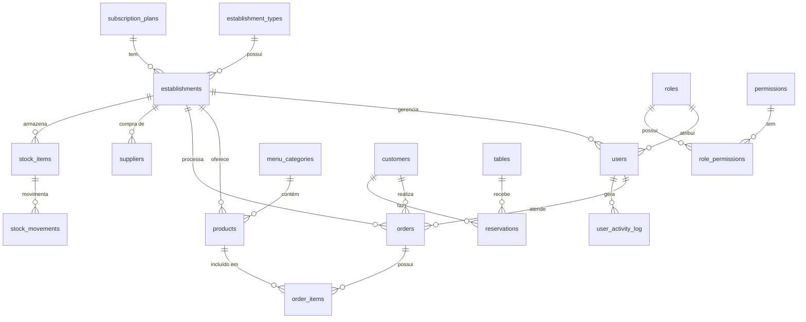
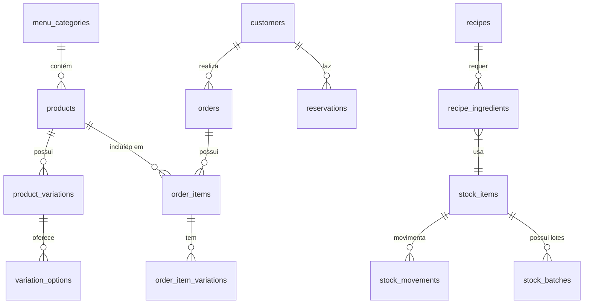

# Esquema de Banco de Dados

<cite>
**Arquivos Referenciados neste Documento**   
- [20250101000000_initial_schema.sql](file://supabase/migrations/20250101000000_initial_schema.sql)
- [20250101000000_initial_schema_corrected.sql](file://supabase/migrations/20250101000000_initial_schema_corrected.sql)
- [20250101000001_initial_schema_fixed.sql](file://supabase/migrations/20250101000001_initial_schema_fixed.sql)
- [20250101000001_rls_security_fix.sql](file://supabase/migrations/20250101000001_rls_security_fix.sql)
</cite>

## Sumário
1. [Introdução](#introdução)
2. [Estrutura do Esquema](#estrutura-do-esquema)
3. [Tabelas Globais](#tabelas-globais)
4. [Tabelas Específicas por Inquilino](#tabelas-específicas-por-inquilino)
5. [Relacionamentos entre Tabelas](#relacionamentos-entre-tabelas)
6. [Integridade Referencial e Restrições](#integridade-referencial-e-restrições)
7. [Segurança e Isolamento de Dados](#segurança-e-isolamento-de-dados)

## Introdução

O esquema de banco de dados do sistema easyComand é projetado para suportar uma arquitetura multi-inquilino (multi-tenant), onde múltiplos estabelecimentos operam de forma isolada dentro de uma única instância do sistema. O esquema é definido por migrações SQL localizadas no diretório `supabase/migrations`, que contém scripts responsáveis pela criação de todas as tabelas, tipos, funções e políticas de segurança. Este documento serve como referência central para desenvolvedores que precisam entender a estrutura de dados do sistema, destacando a separação entre dados globais e específicos por inquilino, bem como os mecanismos de segurança e integridade implementados.

**Section sources**
- [20250101000000_initial_schema.sql](file://supabase/migrations/20250101000000_initial_schema.sql#L1-L50)
- [20250101000000_initial_schema_corrected.sql](file://supabase/migrations/20250101000000_initial_schema_corrected.sql#L1-L50)

## Estrutura do Esquema

O esquema do banco de dados é dividido em duas categorias principais: **tabelas globais** e **tabelas específicas por inquilino**. As tabelas globais armazenam dados compartilhados entre todos os estabelecimentos, como tipos de estabelecimento, planos de assinatura, papéis e permissões. Já as tabelas específicas por inquilino contêm dados únicos de cada estabelecimento, garantindo o isolamento de informações. Todas as tabelas específicas por inquilino possuem uma coluna `establishment_id` que referencia o estabelecimento ao qual pertencem. A segurança e o isolamento de dados são reforçados por meio de políticas de Segurança em Nível de Linha (Row Level Security - RLS) no Supabase.

**Diagram sources**
- [20250101000000_initial_schema.sql](file://supabase/migrations/20250101000000_initial_schema.sql#L100-L500)
- [20250101000000_initial_schema_corrected.sql](file://supabase/migrations/20250101000000_initial_schema_corrected.sql#L100-L800)

**Section sources**
- [20250101000000_initial_schema.sql](file://supabase/migrations/20250101000000_initial_schema.sql#L1-L506)
- [20250101000001_initial_schema_fixed.sql](file://supabase/migrations/20250101000001_initial_schema_fixed.sql#L1-L548)

## Tabelas Globais

As tabelas globais são aquelas que não são específicas a um único estabelecimento e cujos dados são compartilhados por todo o sistema. Elas são fundamentais para a configuração e funcionalidade central do aplicativo.

### establishment_types

A tabela `establishment_types` armazena os diferentes tipos de estabelecimentos que podem ser cadastrados no sistema, como restaurantes, bares ou cafeterias. Cada tipo possui um nome único, garantindo que não haja duplicação.

**Section sources**
- [20250101000000_initial_schema.sql](file://supabase/migrations/20250101000000_initial_schema.sql#L30-L35)
- [20250101000000_initial_schema_corrected.sql](file://supabase/migrations/20250101000000_initial_schema_corrected.sql#L60-L65)

### subscription_plans

A tabela `subscription_plans` define os planos de assinatura disponíveis para os estabelecimentos. Cada plano possui um nome único, um preço, uma descrição e um conjunto de funcionalidades armazenadas em formato JSONB.

**Section sources**
- [20250101000000_initial_schema.sql](file://supabase/migrations/20250101000000_initial_schema.sql#L37-L43)
- [20250101000000_initial_schema_corrected.sql](file://supabase/migrations/20250101000000_initial_schema_corrected.sql#L67-L73)

### roles e permissions

As tabelas `roles` e `permissions` gerenciam o sistema de autorização do aplicativo. A tabela `roles` define os papéis (por exemplo, administrador, garçom, cozinheiro), enquanto `permissions` define as permissões individuais (por exemplo, criar pedidos, gerenciar produtos). A tabela de junção `role_permissions` estabelece a relação muitos-para-muitos entre papéis e permissões, permitindo que um papel tenha múltiplas permissões.

**Section sources**
- [20250101000000_initial_schema.sql](file://supabase/migrations/20250101000000_initial_schema.sql#L45-L55)
- [20250101000000_initial_schema_corrected.sql](file://supabase/migrations/20250101000000_initial_schema_corrected.sql#L75-L85)

## Tabelas Específicas por Inquilino

As tabelas específicas por inquilino contêm dados únicos de cada estabelecimento. O isolamento de dados é garantido pela coluna `establishment_id`, que é uma chave estrangeira referenciando a tabela `establishments`.

### establishments

A tabela `establishments` é o coração do modelo multi-inquilino. Ela armazena todas as informações de um estabelecimento, incluindo dados de identificação (CNPJ), endereço, tipo de estabelecimento, plano de assinatura e status operacional. Cada registro nesta tabela representa um inquilino distinto.

**Section sources**
- [20250101000000_initial_schema.sql](file://supabase/migrations/20250101000000_initial_schema.sql#L57-L85)
- [20250101000000_initial_schema_corrected.sql](file://supabase/migrations/20250101000000_initial_schema_corrected.sql#L87-L115)

### users

A tabela `users` armazena os perfis dos usuários do sistema, vinculados a um estabelecimento específico. O ID do usuário é um UUID que é sincronizado com a tabela `auth.users` do Supabase através de um gatilho (`handle_new_user`), evitando uma chave estrangeira direta e mantendo a segurança.

**Section sources**
- [20250101000000_initial_schema.sql](file://supabase/migrations/20250101000000_initial_schema.sql#L87-L115)
- [20250101000000_initial_schema_corrected.sql](file://supabase/migrations/20250101000000_initial_schema_corrected.sql#L117-L145)

### products e orders

A tabela `products` armazena os produtos do cardápio, cada um associado a uma categoria de menu (`menu_categories`) e a um estabelecimento. A tabela `orders` representa os pedidos realizados, contendo informações como tipo de pedido, status, valor total e o usuário que o atendeu. Os pedidos são compostos por itens (`order_items`), que fazem referência aos produtos.

**Section sources**
- [20250101000000_initial_schema.sql](file://supabase/migrations/20250101000000_initial_schema.sql#L180-L230)
- [20250101000000_initial_schema_corrected.sql](file://supabase/migrations/20250101000000_initial_schema_corrected.sql#L220-L270)

### tables, reservations, suppliers e stock_items

- **tables**: Define as mesas físicas de um estabelecimento, com número, capacidade e status.
- **reservations**: Armazena reservas de mesas feitas por clientes.
- **suppliers**: Contém informações sobre fornecedores de insumos.
- **stock_items**: Representa os itens em estoque, com informações sobre unidade de medida, custo e fornecedor preferencial.

Todas essas tabelas possuem a coluna `establishment_id` para garantir o isolamento de dados.

**Section sources**
- [20250101000000_initial_schema.sql](file://supabase/migrations/20250101000000_initial_schema.sql#L130-L180)
- [20250101000000_initial_schema_corrected.sql](file://supabase/migrations/20250101000000_initial_schema_corrected.sql#L160-L220)

## Relacionamentos entre Tabelas

Os relacionamentos entre as tabelas são fundamentais para a integridade e funcionalidade do sistema. Abaixo estão alguns exemplos-chave:

- Um `product` pertence a uma `menu_category` e pode ter múltiplas `product_variations` (como tamanho ou sabor).
- Um `order` contém múltiplos `order_items`, cada um referenciando um `product`.
- Um `stock_item` pode ter múltiplos `stock_movements`, que registram entradas e saídas de estoque.
- Um `customer` pode ter múltiplos `orders` e `reservations`.

Esses relacionamentos são implementados através de chaves estrangeiras, garantindo que as operações de leitura e escrita mantenham a consistência dos dados.

**Diagram sources**
- [20250101000000_initial_schema.sql](file://supabase/migrations/20250101000000_initial_schema.sql#L180-L250)
- [20250101000000_initial_schema_corrected.sql](file://supabase/migrations/20250101000000_initial_schema_corrected.sql#L220-L290)

## Integridade Referencial e Restrições

O esquema emprega extensivamente chaves estrangeiras para garantir a integridade referencial. Por exemplo, ao excluir um `establishment`, todos os `users`, `products` e `orders` associados são automaticamente excluídos devido à cláusula `ON DELETE CASCADE`. Além disso, restrições de unicidade são aplicadas em colunas críticas, como `cnpj` na tabela `establishments` e `name` na tabela `products`, evitando duplicações. Tipos ENUM são utilizados para colunas com valores fixos, como `order_status` e `table_status`, garantindo que apenas valores válidos sejam inseridos.

**Section sources**
- [20250101000000_initial_schema.sql](file://supabase/migrations/20250101000000_initial_schema.sql#L57-L250)
- [20250101000000_initial_schema_corrected.sql](file://supabase/migrations/20250101000000_initial_schema_corrected.sql#L87-L290)

## Segurança e Isolamento de Dados

A segurança do sistema é garantida por meio da Segurança em Nível de Linha (RLS) do Supabase. Todas as tabelas específicas por inquilino têm a RLS habilitada, com políticas que restringem o acesso apenas aos dados do estabelecimento ao qual o usuário autenticado pertence. Isso é feito através de uma função auxiliar (`auth.get_establishment_id` ou `public.requesting_user_establishment_id`) que recupera o `establishment_id` do usuário atual. O gatilho `handle_new_user` sincroniza automaticamente novos usuários do sistema de autenticação com a tabela `public.users`, completando o mecanismo de isolamento seguro.

**Section sources**
- [20250101000000_initial_schema.sql](file://supabase/migrations/20250101000000_initial_schema.sql#L450-L500)
- [20250101000001_rls_security_fix.sql](file://supabase/migrations/20250101000001_rls_security_fix.sql#L1-L357)