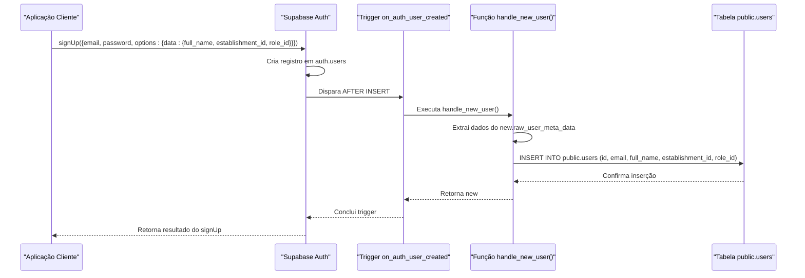
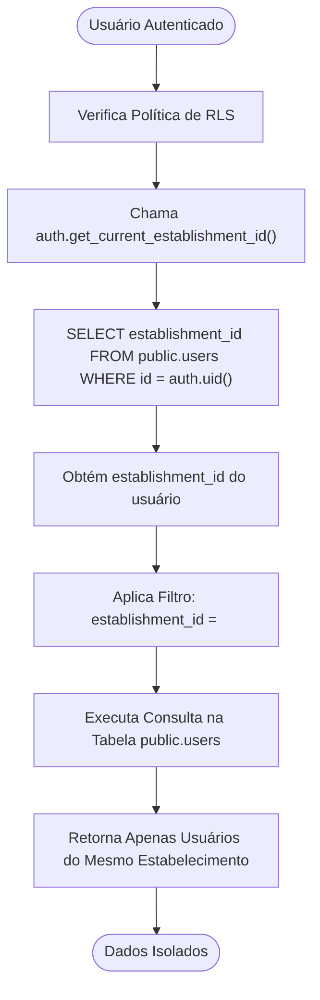
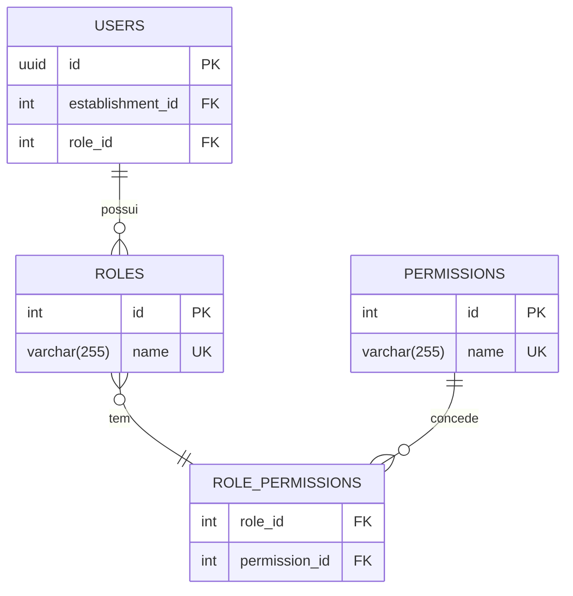

# Gestão de Usuários por Inquilino

<cite>
**Arquivos Referenciados neste Documento**   
- [20250101000001_initial_schema_fixed.sql](file://supabase/migrations/20250101000001_initial_schema_fixed.sql)
- [20250101000000_initial_schema.sql](file://supabase/migrations/20250101000000_initial_schema.sql)
- [20250101000000_initial_schema_corrected.sql](file://supabase/migrations/20250101000000_initial_schema_corrected.sql)
- [20250101000001_rls_security_fix.sql](file://supabase/migrations/20250101000001_rls_security_fix.sql)
</cite>

## Sumário
1. [Introdução](#introdução)
2. [Estrutura da Tabela `users`](#estrutura-da-tabela-users)
3. [Sincronização com `auth.users`](#sincronização-com-authusers)
4. [Segurança e Isolamento de Dados (RLS)](#segurança-e-isolamento-de-dados-rls)
5. [Controle de Acesso e Atualizações](#controle-de-acesso-e-atualizações)
6. [Recuperação de Dados por Estabelecimento](#recuperação-de-dados-por-estabelecimento)
7. [Atribuição de Papéis (Roles)](#atribuição-de-papéis-roles)
8. [Conclusão](#conclusão)

## Introdução

Este documento detalha a implementação da tabela `users` no contexto de uma arquitetura multi-inquilino, onde múltiplos estabelecimentos (inquilinos) compartilham a mesma instância de banco de dados, mas seus dados são logicamente isolados. O foco está em como o campo `establishment_id` é utilizado para vincular cada usuário a um estabelecimento específico, garantindo que as operações de leitura e escrita sejam restritas ao seu próprio contexto. A documentação abrange a sincronização automática com o sistema de autenticação, as políticas de segurança de linha (RLS) e as práticas recomendadas para gerenciar permissões e papéis.

**Seção fontes**
- [20250101000001_initial_schema_fixed.sql](file://supabase/migrations/20250101000001_initial_schema_fixed.sql#L1-L547)

## Estrutura da Tabela `users`

A tabela `public.users` é o componente central para o gerenciamento de perfis de usuários dentro do sistema. Ela não armazena credenciais, mas sim informações de perfil e metadados que são vinculados ao registro de autenticação no esquema `auth`.

O campo `establishment_id` é a chave para a arquitetura multi-inquilino. Ele é uma chave estrangeira que referencia a tabela `public.establishments`, garantindo que cada usuário pertença a um único estabelecimento. A restrição `ON DELETE CASCADE` assegura que se um estabelecimento for removido, todos os seus usuários também serão excluídos, mantendo a integridade referencial.

A combinação de `establishment_id` e `email` é definida como `UNIQUE`, o que impede que dois usuários com o mesmo endereço de e-mail existam dentro do mesmo estabelecimento, evitando conflitos.

```mermaid
erDiagram
USERS {
uuid id PK
int establishment_id FK
varchar(255) full_name
varchar(255) email
varchar(20) phone_number
int role_id FK
decimal(10, 2) salary
date admission_date
user_status status
timestamptz last_login_at
timestamptz created_at
timestamptz updated_at
}
ESTABLISHMENTS {
int id PK
varchar(255) name
varchar(18) cnpj UK
int establishment_type_id FK
varchar(255) address_street
varchar(50) address_number
varchar(255) address_complement
varchar(255) address_neighborhood
varchar(255) address_city
varchar(2) address_state
varchar(10) address_zip_code
int subscription_plan_id FK
establishment_operational_status operational_status
int table_capacity
boolean accepts_delivery
boolean accepts_reservations
decimal(5, 2) service_fee_percentage
timestamptz created_at
timestamptz updated_at
}
ROLES {
int id PK
varchar(255) name UK
text description
timestamptz created_at
timestamptz updated_at
}
USERS ||--o{ ESTABLISHMENTS : "pertence_a"
USERS ||--o{ ROLES : "possui"
```

**Fontes do diagrama**
- [20250101000001_initial_schema_fixed.sql](file://supabase/migrations/20250101000001_initial_schema_fixed.sql#L124-L158)

**Seção fontes**
- [20250101000001_initial_schema_fixed.sql](file://supabase/migrations/20250101000001_initial_schema_fixed.sql#L124-L158)

## Sincronização com `auth.users`

A integridade entre o sistema de autenticação e a tabela de perfis é mantida por um mecanismo de gatilho (trigger), evitando a necessidade de uma chave estrangeira direta para o esquema protegido `auth.users`, o que poderia causar problemas de permissão.

A função `public.handle_new_user()` é um procedimento armazenado que é executado automaticamente após a inserção de um novo registro na tabela `auth.users` (ou seja, quando um novo usuário se cadastra). Esta função extrai os metadados fornecidos durante o processo de inscrição (como `full_name`, `establishment_id` e `role_id`) e os utiliza para criar um novo registro correspondente na tabela `public.users`.

O `establishment_id` e o `role_id` são passados como parte dos `raw_user_meta_data` durante a chamada de `signUp` no cliente, permitindo que o administrador do estabelecimento atribua o usuário ao local e ao papel correto desde o início.



**Fontes do diagrama**
- [20250101000001_initial_schema_fixed.sql](file://supabase/migrations/20250101000001_initial_schema_fixed.sql#L419-L437)
- [20250101000000_initial_schema_corrected.sql](file://supabase/migrations/20250101000000_initial_schema_corrected.sql#L698-L713)

**Seção fontes**
- [20250101000001_initial_schema_fixed.sql](file://supabase/migrations/20250101000001_initial_schema_fixed.sql#L419-L437)

## Segurança e Isolamento de Dados (RLS)

A segurança de dados entre inquilinos é garantida pela **Segurança em Nível de Linha (Row Level Security - RLS)** do PostgreSQL. A RLS é habilitada na tabela `public.users` e em todas as outras tabelas específicas do inquilino.

A política de segurança principal para a tabela `users` utiliza uma função auxiliar chamada `auth.get_current_establishment_id()`. Esta função consulta a tabela `public.users` para encontrar o `establishment_id` do usuário atualmente autenticado (identificado por `auth.uid()`). A política então restringe todas as operações (SELECT, INSERT, UPDATE, DELETE) para que apenas linhas onde o `establishment_id` corresponda ao do usuário atual sejam acessíveis.

Essa abordagem garante que um usuário do Estabelecimento A nunca possa ver, modificar ou excluir dados de um usuário do Estabelecimento B, mesmo se tentar fazer uma consulta direta.



**Fontes do diagrama**
- [20250101000001_initial_schema_fixed.sql](file://supabase/migrations/20250101000001_initial_schema_fixed.sql#L469-L485)
- [20250101000001_initial_schema_fixed.sql](file://supabase/migrations/20250101000001_initial_schema_fixed.sql#L501)

**Seção fontes**
- [20250101000001_initial_schema_fixed.sql](file://supabase/migrations/20250101000001_initial_schema_fixed.sql#L469-L485)
- [20250101000001_initial_schema_fixed.sql](file://supabase/migrations/20250101000001_initial_schema_fixed.sql#L501)

## Controle de Acesso e Atualizações

Embora a política principal restrinja o acesso a usuários do mesmo estabelecimento, uma política adicional refinada permite um controle mais granular sobre as operações de atualização.

A política `Users can update their own profile` (ou variações semelhantes em diferentes migrações) especifica que um usuário pode atualizar seu próprio registro de perfil. Isso é feito verificando se o `id` da linha que está sendo atualizada é igual ao `auth.uid()` do usuário atual.

Essa política é crucial para permitir que os usuários atualizem suas próprias informações, como número de telefone ou nome completo, sem conceder a eles a permissão de modificar os perfis de outros colegas de trabalho. A política de leitura, por outro lado, permanece ampla dentro do estabelecimento, permitindo que gerentes, por exemplo, vejam a lista completa de funcionários.

**Seção fontes**
- [20250101000000_initial_schema.sql](file://supabase/migrations/20250101000000_initial_schema.sql#L449)

## Recuperação de Dados por Estabelecimento

Para recuperar a lista de todos os usuários de um estabelecimento específico, uma consulta simples pode ser feita diretamente na tabela `public.users`. Graças à RLS, o banco de dados automaticamente filtra os resultados, garantindo que apenas os usuários do estabelecimento do usuário autenticado sejam retornados.

```sql
-- Esta consulta, quando executada por um usuário autenticado,
-- retornará automaticamente apenas os usuários do mesmo estabelecimento.
SELECT id, full_name, email, role_id, status FROM public.users;
```

Se for necessário realizar uma operação administrativa que exija uma visão de todos os usuários (por exemplo, em um painel de superadmin), isso deve ser feito com uma conexão de banco de dados que tenha privilégios elevados e que possa contornar as políticas de RLS, ou através de uma função específica que seja executada com `SECURITY DEFINER`.

**Seção fontes**
- [20250101000001_initial_schema_fixed.sql](file://supabase/migrations/20250101000001_initial_schema_fixed.sql#L501)

## Atribuição de Papéis (Roles)

A tabela `public.roles` armazena os diferentes papéis (ou funções) que podem ser atribuídos aos usuários, como "Proprietário", "Gerente", "Garçom" ou "Cozinheiro". A tabela `users` possui uma chave estrangeira `role_id` que referencia a tabela `roles`, estabelecendo a relação entre um usuário e seu papel.

A atribuição de um papel é feita durante o processo de criação do usuário, quando o `role_id` é passado nos metadados de inscrição. Posteriormente, um usuário com privilégios suficientes (por exemplo, um gerente) pode atualizar o `role_id` de outro usuário no mesmo estabelecimento, desde que a política de atualização permita essa ação.

A combinação de `role_id` e `establishment_id` é fundamental para implementar um sistema de controle de acesso baseado em papéis (RBAC), onde as permissões de um usuário são determinadas tanto pelo seu papel quanto pelo seu contexto de estabelecimento.



**Fontes do diagrama**
- [20250101000001_initial_schema_fixed.sql](file://supabase/migrations/20250101000001_initial_schema_fixed.sql#L75-L98)

**Seção fontes**
- [20250101000001_initial_schema_fixed.sql](file://supabase/migrations/20250101000001_initial_schema_fixed.sql#L75-L98)

## Conclusão

A implementação da tabela `users` com o campo `establishment_id` é a pedra angular da arquitetura multi-inquilino deste sistema. A combinação de um gatilho de sincronização (`handle_new_user`) com o sistema de autenticação, a aplicação rigorosa de políticas de RLS e o uso de uma tabela de `roles` permite criar um ambiente seguro e escalável onde múltiplos estabelecimentos podem operar de forma independente e isolada dentro de uma única instância de banco de dados. Este modelo garante a privacidade dos dados, a integridade do sistema e fornece as bases para um controle de acesso granular e eficaz.