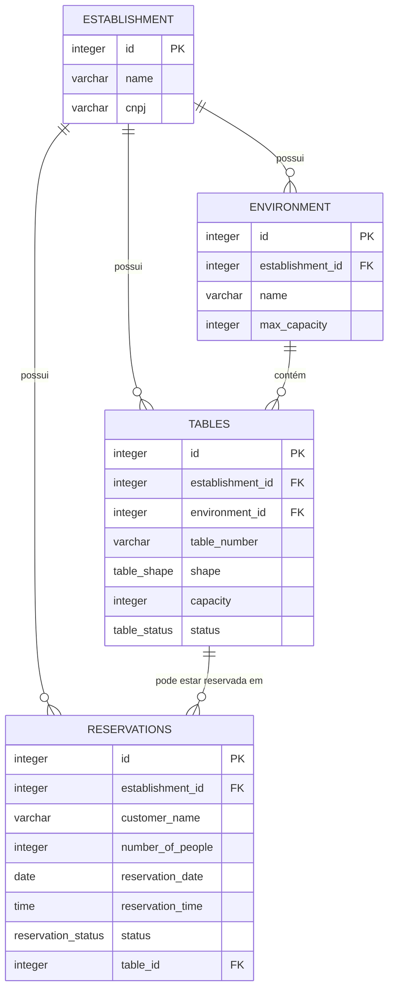

# Mesas e Reservas por Inquilino

<cite>
**Referenced Files in This Document**   
- [20250101000000_initial_schema.sql](file://supabase/migrations/20250101000000_initial_schema.sql)
- [20250101000001_initial_schema_fixed.sql](file://supabase/migrations/20250101000001_initial_schema_fixed.sql)
- [20250101000001_rls_security_fix.sql](file://supabase/migrations/20250101000001_rls_security_fix.sql)
- [20250101000000_initial_schema_corrected.sql](file://supabase/migrations/20250101000000_initial_schema_corrected.sql)
</cite>

## Tabela de Conteúdos
1. [Introdução](#introdução)
2. [Modelo de Dados: Ambientes, Mesas e Reservas](#modelo-de-dados-ambientes-mesas-e-reservas)
3. [Políticas de Segurança de Linha (RLS)](#políticas-de-segurança-de-linha-rls)
4. [Exemplos de Consultas](#exemplos-de-consultas)
5. [Conclusão](#conclusão)

## Introdução

Este documento detalha o modelo de dados e as políticas de segurança para a gestão de salão em um sistema de gerenciamento de restaurantes multi-inquilino. O foco está nas tabelas `environments`, `tables` e `reservations`, que são fundamentais para a organização física do estabelecimento, controle de capacidade e agendamento de clientes. A arquitetura é projetada para garantir que os dados de cada estabelecimento (inquilino) sejam isolados e acessíveis apenas por seus usuários autorizados, utilizando o mecanismo Row Level Security (RLS) do Supabase.

## Modelo de Dados: Ambientes, Mesas e Reservas

O modelo de dados é hierárquico e centrado no conceito de `establishment_id`, que atua como o identificador primário para a segregação de dados entre diferentes inquilinos.

### Relacionamento entre Tabelas

As tabelas `environments`, `tables` e `reservations` estão interligadas por meio do campo `establishment_id`, criando uma cadeia de propriedade e controle.



**Diagram sources**
- [20250101000000_initial_schema.sql](file://supabase/migrations/20250101000000_initial_schema.sql#L447-L467)

### Tabela `environments` (Ambientes)

A tabela `environments` representa áreas físicas distintas dentro de um estabelecimento, como "Sala Interna", "Varanda" ou "Bar".

- **`establishment_id`**: Chave estrangeira que vincula o ambiente a um estabelecimento específico.
- **`name`**: Nome descritivo do ambiente.
- **`max_capacity`**: Capacidade máxima de pessoas que o ambiente pode acomodar simultaneamente. Este campo é opcional e pode ser usado para controle agregado de ocupação.
- **`layout_x`, `layout_y`**: Coordenadas para representação gráfica do ambiente em um mapa de layout.

**Section sources**
- [20250101000000_initial_schema.sql](file://supabase/migrations/20250101000000_initial_schema.sql#L447-L467)

### Tabela `tables` (Mesas)

A tabela `tables` representa as mesas individuais dentro de um ambiente.

- **`establishment_id`**: Garante que a mesa pertença ao estabelecimento correto.
- **`environment_id`**: Chave estrangeira que vincula a mesa a um ambiente específico.
- **`table_number`**: Número ou identificador único da mesa (ex: "Mesa 1", "Bar 3").
- **`shape`**: Forma da mesa, definida por um tipo ENUM (`table_shape`). Os valores possíveis são: `round`, `square`, `rectangular`, `counter`.
- **`capacity`**: Número máximo de pessoas que a mesa pode acomodar. Este campo é crucial para o sistema de reservas.
- **`status`**: Estado atual da mesa, definido por um tipo ENUM (`table_status`). Os valores possíveis são:
  - `available`: Disponível para uso.
  - `occupied`: Ocupada por clientes.
  - `reserved`: Reservada para um cliente em um horário futuro.
  - `maintenance`: Em manutenção, indisponível.
- **`notes`**: Campo de texto livre para anotações (ex: "cadeira quebrada").

**Section sources**
- [20250101000000_initial_schema.sql](file://supabase/migrations/20250101000000_initial_schema.sql#L447-L467)
- [20250101000001_initial_schema_fixed.sql](file://supabase/migrations/20250101000001_initial_schema_fixed.sql#L208-L235)

### Tabela `reservations` (Reservas)

A tabela `reservations` armazena os agendamentos de clientes.

- **`establishment_id`**: Vincula a reserva ao estabelecimento.
- **`customer_name`, `customer_phone`, `customer_email`**: Informações de contato do cliente que fez a reserva.
- **`number_of_people`**: Número de pessoas para as quais a reserva foi feita.
- **`reservation_date`, `reservation_time`**: Data e hora exata da reserva.
- **`status`**: Status da reserva, definido por um tipo ENUM (`reservation_status`). Os valores possíveis são:
  - `confirmed`: Reserva confirmada.
  - `cancelled`: Reserva cancelada.
  - `attended`: Cliente compareceu.
  - `no_show`: Cliente não compareceu.
- **`table_id`**: Chave estrangeira opcional que vincula a reserva a uma mesa específica. Se `NULL`, a reserva é para um número de pessoas, mas a mesa será atribuída no momento da chegada.

**Section sources**
- [20250101000000_initial_schema.sql](file://supabase/migrations/20250101000000_initial_schema.sql#L447-L467)

## Políticas de Segurança de Linha (RLS)

O isolamento de dados entre inquilinos é garantido pelo Row Level Security (RLS), uma funcionalidade do PostgreSQL que filtra automaticamente as linhas retornadas por consultas com base em políticas definidas.

### Mecanismo de Isolamento

Todas as tabelas que contêm o campo `establishment_id` têm o RLS habilitado. Uma função auxiliar, como `public.get_my_establishment_id()` ou `auth.get_current_establishment_id()`, é usada para determinar o `establishment_id` do usuário autenticado atual (obtido via `auth.uid()`).

### Políticas Aplicadas

Para as tabelas `environments`, `tables` e `reservations`, a política de RLS é consistente:

```sql
-- Política de exemplo para a tabela 'tables'
CREATE POLICY "Tenant isolation for tables" ON public.tables
FOR ALL
USING (establishment_id = public.get_my_establishment_id());
```

Esta política significa que qualquer operação (SELECT, INSERT, UPDATE, DELETE) realizada por um usuário será automaticamente filtrada para incluir apenas as linhas onde o `establishment_id` corresponde ao `establishment_id` do próprio usuário. Isso garante que um usuário do Estabelecimento A nunca possa ver, modificar ou excluir dados do Estabelecimento B.

**Section sources**
- [20250101000000_initial_schema.sql](file://supabase/migrations/20250101000000_initial_schema.sql#L447-L467)
- [20250101000001_rls_security_fix.sql](file://supabase/migrations/20250101000001_rls_security_fix.sql#L74-L96)

## Exemplos de Consultas

Os exemplos abaixo demonstram como interagir com o sistema de mesas e reservas, assumindo que o usuário já está autenticado e que o RLS está ativo.

### Verificar Disponibilidade de Mesas

Para encontrar mesas disponíveis para um grupo de 4 pessoas na "Varanda" (`environment_id` = 2) em 2025-03-15 às 20:00:

```sql
SELECT t.id, t.table_number, t.capacity, t.shape
FROM public.tables t
JOIN public.environments e ON t.environment_id = e.id
WHERE e.id = 2
  AND t.capacity >= 4
  AND t.status = 'available'
  AND t.establishment_id = (SELECT establishment_id FROM public.users WHERE id = auth.uid())
  AND NOT EXISTS (
    SELECT 1 FROM public.reservations r
    WHERE r.table_id = t.id
      AND r.reservation_date = '2025-03-15'
      AND r.reservation_time = '20:00:00'
      AND r.status IN ('confirmed', 'attended')
  );
```

**Section sources**
- [20250101000000_initial_schema.sql](file://supabase/migrations/20250101000000_initial_schema.sql#L447-L467)

### Criar uma Nova Reserva

Para criar uma reserva para 2 pessoas na "Mesa 5" (`table_id` = 5) em 2025-03-15 às 19:30:

```sql
INSERT INTO public.reservations (
  establishment_id,
  customer_name,
  customer_phone,
  number_of_people,
  reservation_date,
  reservation_time,
  table_id,
  status
)
VALUES (
  (SELECT establishment_id FROM public.users WHERE id = auth.uid()),
  'João Silva',
  '+5511999998888',
  2,
  '2025-03-15',
  '19:30:00',
  5,
  'confirmed'
);
```

Após a inserção, o status da mesa deve ser atualizado para `reserved`:

```sql
UPDATE public.tables
SET status = 'reserved'
WHERE id = 5
  AND establishment_id = (SELECT establishment_id FROM public.users WHERE id = auth.uid());
```

**Section sources**
- [20250101000000_initial_schema.sql](file://supabase/migrations/20250101000000_initial_schema.sql#L447-L467)

### Atualizar o Status de uma Mesa

Para atualizar o status de uma mesa para `occupied` quando os clientes chegam:

```sql
UPDATE public.tables
SET status = 'occupied'
WHERE id = 5
  AND establishment_id = (SELECT establishment_id FROM public.users WHERE id = auth.uid());
```

Para colocar uma mesa em `maintenance`:

```sql
UPDATE public.tables
SET status = 'maintenance', notes = 'Pernas instáveis'
WHERE id = 3
  AND establishment_id = (SELECT establishment_id FROM public.users WHERE id = auth.uid());
```

**Section sources**
- [20250101000000_initial_schema.sql](file://supabase/migrations/20250101000000_initial_schema.sql#L447-L467)

## Conclusão

O modelo de dados apresentado fornece uma estrutura robusta e segura para a gestão de salão em um ambiente multi-inquilino. A combinação de uma hierarquia clara (`establishment` -> `environment` -> `table`) com o poderoso mecanismo de RLS do Supabase garante que os dados sejam organizados de forma lógica e protegidos contra acesso não autorizado. As consultas exemplificadas demonstram como o sistema pode ser utilizado para operações diárias, como verificar disponibilidade, criar reservas e gerenciar o status das mesas, tudo isso mantendo a integridade e a privacidade dos dados de cada estabelecimento.