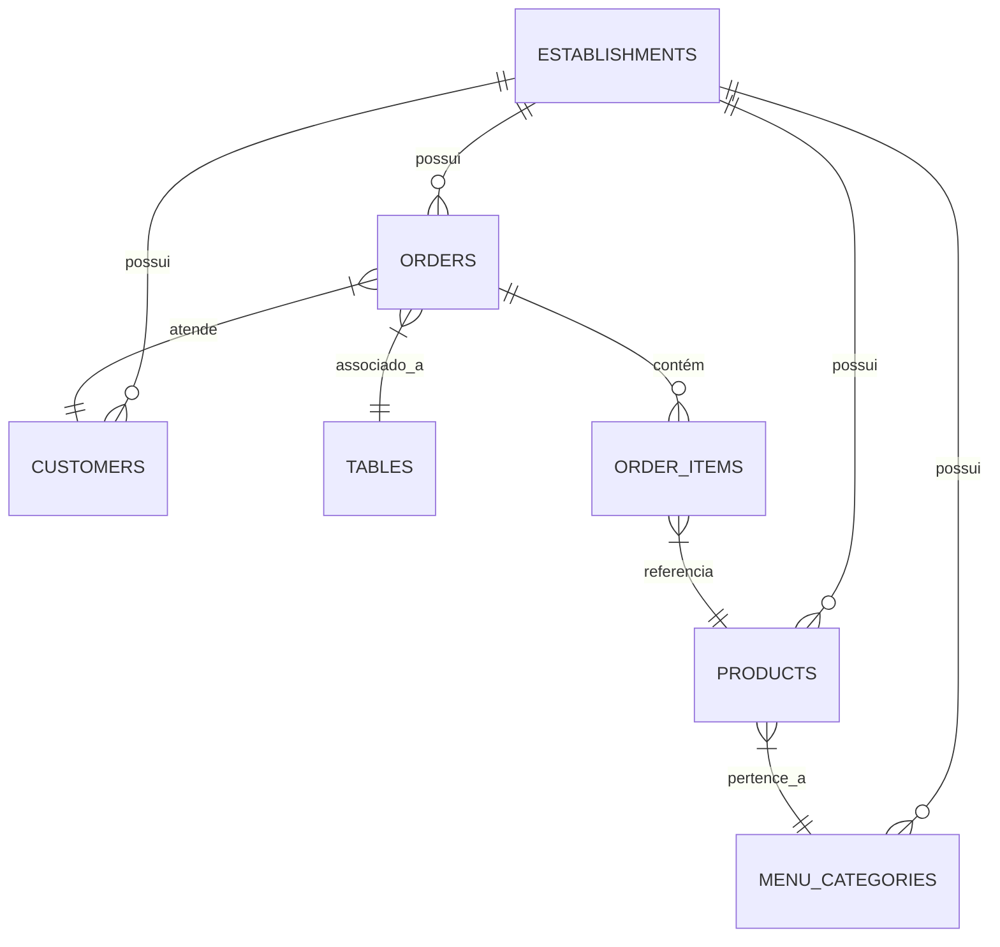
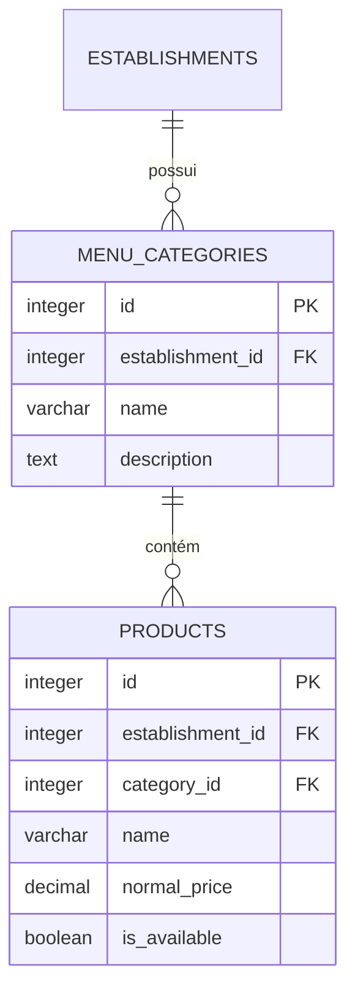
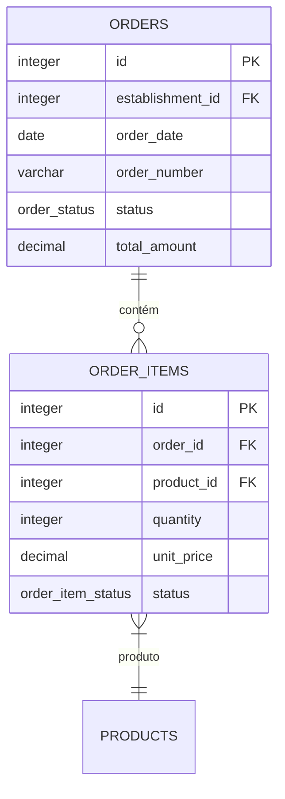
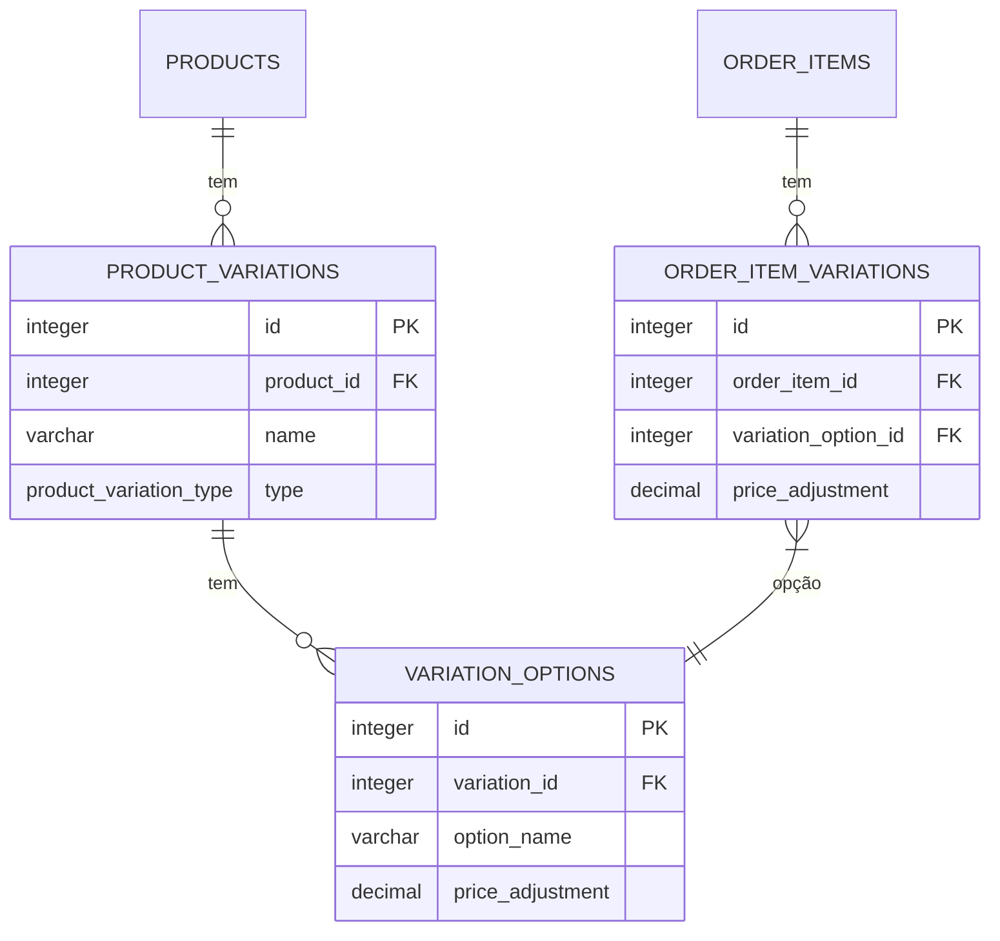

# Produtos e Pedidos por Inquilino

<cite>
**Arquivos Referenciados neste Documento**  
- [20250101000000_initial_schema.sql](file://supabase/migrations/20250101000000_initial_schema.sql)
- [20250101000001_rls_security_fix.sql](file://supabase/migrations/20250101000001_rls_security_fix.sql)
- [20250101000000_initial_schema_corrected.sql](file://supabase/migrations/20250101000000_initial_schema_corrected.sql)
- [20250101000001_initial_schema_fixed.sql](file://supabase/migrations/20250101000001_initial_schema_fixed.sql)
</cite>

## Sumário
1. [Introdução](#introdução)
2. [Isolamento de Dados por Inquilino](#isolamento-de-dados-por-inquilino)
3. [Relacionamentos entre Produtos e Categorias de Menu](#relacionamentos-entre-produtos-e-categorias-de-menu)
4. [Estrutura de Pedidos e Itens de Pedido](#estrutura-de-pedidos-e-itens-de-pedido)
5. [Políticas de Segurança em Nível de Linha (RLS)](#políticas-de-segurança-em-nível-de-linha-rls)
6. [Variações de Produtos e Ajustes de Preço](#variações-de-produtos-e-ajustes-de-preço)
7. [Exemplos de Consultas](#exemplos-de-consultas)

## Introdução
Este documento detalha a estrutura de dados e as políticas de segurança relacionadas às tabelas `products`, `orders` e `order_items` no contexto de uma arquitetura multi-inquilino. O sistema foi projetado para garantir que cada estabelecimento (inquilino) tenha seus dados isolados dos demais, utilizando o campo `establishment_id` como chave de segregação. Além disso, são abordados os relacionamentos entre produtos e categorias de menu, a vinculação dos itens de pedido ao pedido principal, o uso de variações de produtos e as políticas de segurança implementadas via Row Level Security (RLS).

**Fontes da seção**
- [20250101000000_initial_schema.sql](file://supabase/migrations/20250101000000_initial_schema.sql#L1-L506)

## Isolamento de Dados por Inquilino
O isolamento de dados é garantido pela presença do campo `establishment_id` nas tabelas principais do sistema, como `products` e `orders`. Esse campo referencia a tabela `establishments` e é utilizado pelas políticas de RLS para filtrar os dados acessíveis a cada usuário com base no estabelecimento ao qual pertence.

Todas as operações de leitura, inserção, atualização e exclusão são automaticamente filtradas pela função `public.get_my_establishment_id()` ou `auth.get_establishment_id()`, que obtém o `establishment_id` do usuário autenticado a partir da tabela `public.users`. Isso assegura que um usuário só possa acessar ou modificar dados do seu próprio estabelecimento.



**Fontes do diagrama**
- [20250101000000_initial_schema.sql](file://supabase/migrations/20250101000000_initial_schema.sql#L116-L117)
- [20250101000000_initial_schema.sql](file://supabase/migrations/20250101000000_initial_schema.sql#L388-L389)

**Fontes da seção**
- [20250101000000_initial_schema.sql](file://supabase/migrations/20250101000000_initial_schema.sql#L388-L389)
- [20250101000000_initial_schema.sql](file://supabase/migrations/20250101000000_initial_schema.sql#L469-L473)

## Relacionamentos entre Produtos e Categorias de Menu
A tabela `products` está diretamente relacionada à tabela `menu_categories` através da chave estrangeira `category_id`. Cada produto pertence a uma única categoria de menu, e essa relação é utilizada para organizar o cardápio do estabelecimento.

A tabela `menu_categories` também possui o campo `establishment_id`, garantindo que as categorias sejam específicas de cada inquilino. Assim, a hierarquia completa de isolamento é mantida: um produto só pode ser criado em uma categoria que pertença ao mesmo estabelecimento.



**Fontes do diagrama**
- [20250101000000_initial_schema.sql](file://supabase/migrations/20250101000000_initial_schema.sql#L213-L214)
- [20250101000000_initial_schema.sql](file://supabase/migrations/20250101000000_initial_schema.sql#L281-L282)

**Fontes da seção**
- [20250101000000_initial_schema.sql](file://supabase/migrations/20250101000000_initial_schema.sql#L213-L214)
- [20250101000000_initial_schema.sql](file://supabase/migrations/20250101000000_initial_schema.sql#L281-L282)

## Estrutura de Pedidos e Itens de Pedido
A tabela `orders` representa um pedido feito em um estabelecimento, contendo informações como tipo de pedido, status, valores totais e dados do cliente. Cada pedido é vinculado ao seu estabelecimento por meio do campo `establishment_id`.

A tabela `order_items` armazena os itens individuais de um pedido, com uma chave estrangeira `order_id` que referencia `orders`. Cada item inclui o produto (`product_id`), quantidade, preço unitário e status. Essa estrutura permite que um pedido contenha múltiplos itens, cada um com seu próprio preço e status de preparo.



**Fontes do diagrama**
- [20250101000000_initial_schema.sql](file://supabase/migrations/20250101000000_initial_schema.sql#L388-L389)
- [20250101000000_initial_schema.sql](file://supabase/migrations/20250101000000_initial_schema.sql#L401-L402)

**Fontes da seção**
- [20250101000000_initial_schema.sql](file://supabase/migrations/20250101000000_initial_schema.sql#L388-L389)
- [20250101000000_initial_schema.sql](file://supabase/migrations/20250101000000_initial_schema.sql#L401-L402)

## Políticas de Segurança em Nível de Linha (RLS)
As políticas de RLS são fundamentais para a segurança do sistema multi-inquilino. Elas garantem que os dados só possam ser acessados por usuários do mesmo estabelecimento. As principais políticas aplicadas são:

- **Tabelas com `establishment_id`**: São habilitadas com políticas `USING (establishment_id = public.get_my_establishment_id())` para operações de `SELECT`, `INSERT`, `UPDATE` e `DELETE`.
- **Tabelas filhas (como `order_items`)**: Utilizam subconsultas para garantir que o acesso seja permitido apenas se o registro pai (`orders`) pertencer ao estabelecimento do usuário.
- **Função auxiliar**: A função `public.get_my_establishment_id()` ou `auth.get_establishment_id()` é usada nas políticas para obter o ID do estabelecimento do usuário autenticado.

Essas políticas são aplicadas em todas as tabelas relevantes, incluindo `products`, `orders`, `customers`, `menu_categories`, entre outras.

```mermaid
graph TD
A[Usuário Autenticado] --> B{Chama Consulta SQL}
B --> C[Supabase Aplica RLS]
C --> D{establishment_id = get_my_establishment_id()?}
D --> |Sim| E[Retorna Dados]
D --> |Não| F[Nega Acesso]
```

**Fontes do diagrama**
- [20250101000000_initial_schema.sql](file://supabase/migrations/20250101000000_initial_schema.sql#L469-L504)
- [20250101000001_rls_security_fix.sql](file://supabase/migrations/20250101000001_rls_security_fix.sql#L0-L72)

**Fontes da seção**
- [20250101000000_initial_schema.sql](file://supabase/migrations/20250101000000_initial_schema.sql#L469-L504)
- [20250101000001_rls_security_fix.sql](file://supabase/migrations/20250101000001_rls_security_fix.sql#L0-L72)

## Variações de Produtos e Ajustes de Preço
O sistema suporta variações de produtos (como tamanho, sabor, preparo) por meio das tabelas `product_variations` e `variation_options`. Cada variação tem um tipo definido (`product_variation_type`) e pode ter múltiplas opções, cada uma com um ajuste de preço (`price_adjustment`).

Quando um item é adicionado a um pedido, as variações escolhidas são registradas na tabela `order_item_variations`, que vincula o `order_item` à `variation_option` e armazena o ajuste de preço aplicado. Isso permite que o preço final do item seja calculado com precisão.



**Fontes do diagrama**
- [20250101000000_initial_schema.sql](file://supabase/migrations/20250101000000_initial_schema.sql#L298-L301)
- [20250101000000_initial_schema.sql](file://supabase/migrations/20250101000000_initial_schema.sql#L312-L315)
- [20250101000000_initial_schema.sql](file://supabase/migrations/20250101000000_initial_schema.sql#L415-L418)

**Fontes da seção**
- [20250101000000_initial_schema.sql](file://supabase/migrations/20250101000000_initial_schema.sql#L298-L315)
- [20250101000000_initial_schema.sql](file://supabase/migrations/20250101000000_initial_schema.sql#L415-L418)

## Exemplos de Consultas
Abaixo estão exemplos de consultas SQL que demonstram o uso prático das tabelas e políticas descritas.

### Listar Produtos de um Estabelecimento
```sql
SELECT id, name, normal_price, is_available
FROM public.products
WHERE establishment_id = (SELECT establishment_id FROM public.users WHERE id = auth.uid())
  AND is_available = true;
```

### Criar um Novo Pedido
```sql
INSERT INTO public.orders (
  establishment_id, order_date, order_number, order_type, status, subtotal, total_amount
) VALUES (
  (SELECT establishment_id FROM public.users WHERE id = auth.uid()),
  CURRENT_DATE, '001', 'local', 'open', 25.00, 25.00
) RETURNING id;
```

### Atualizar Status de um Item de Pedido
```sql
UPDATE public.order_items
SET status = 'ready', updated_at = NOW()
WHERE id = 123
  AND order_id IN (SELECT id FROM public.orders WHERE establishment_id = (SELECT establishment_id FROM public.users WHERE id = auth.uid()));
```

**Fontes da seção**
- [20250101000000_initial_schema.sql](file://supabase/migrations/20250101000000_initial_schema.sql#L388-L389)
- [20250101000000_initial_schema.sql](file://supabase/migrations/20250101000000_initial_schema.sql#L401-L402)
- [20250101000000_initial_schema.sql](file://supabase/migrations/20250101000000_initial_schema.sql#L469-L473)