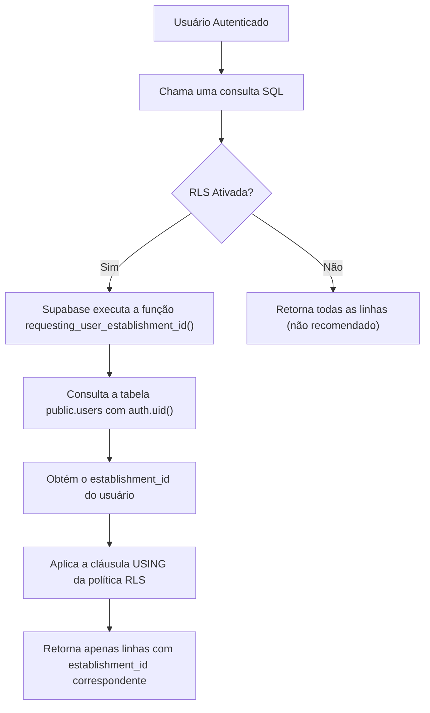

# Políticas de Segurança em Nível de Linha (RLS)

<cite>
**Arquivos Referenciados neste Documento**  
- [20250101000001_rls_security_fix.sql](file://supabase/migrations/20250101000001_rls_security_fix.sql)
- [20250101000000_initial_schema_corrected.sql](file://supabase/migrations/20250101000000_initial_schema_corrected.sql)
- [20250101000001_initial_schema_fixed.sql](file://supabase/migrations/20250101000001_initial_schema_fixed.sql)
- [20250101000000_initial_schema.sql](file://supabase/migrations/20250101000000_initial_schema.sql)
</cite>

## Tabela de Conteúdos
1. [Introdução](#introdução)
2. [Função de Ajuda para Identificação do Estabelecimento](#função-de-ajuda-para-identificação-do-estabelecimento)
3. [Aplicação de Políticas RLS em Tabelas Diretas](#aplicação-de-políticas-rls-em-tabelas-diretas)
4. [Políticas para Tabelas com Acesso Indireto](#políticas-para-tabelas-com-acesso-indireto)
5. [Diferenças entre Políticas de SELECT, INSERT, UPDATE e DELETE](#diferenças-entre-políticas-de-select-insert-update-e-delete)
6. [Boas Práticas de Segurança](#boas-práticas-de-segurança)

## Introdução

As Políticas de Segurança em Nível de Linha (Row Level Security - RLS) são o mecanismo fundamental para garantir o isolamento de dados entre múltiplos inquilinos (estabelecimentos) no sistema easyComand. Este mecanismo assegura que um usuário autenticado só possa acessar, modificar ou excluir dados pertencentes ao seu próprio estabelecimento, prevenindo vazamentos de dados entre diferentes clientes do sistema. A implementação da RLS é crítica para a arquitetura multi-inquilino da aplicação, onde um único banco de dados serve a múltiplos estabelecimentos independentes.

**Section sources**
- [20250101000001_rls_security_fix.sql](file://supabase/migrations/20250101000001_rls_security_fix.sql#L0-L37)
- [20250101000000_initial_schema_corrected.sql](file://supabase/migrations/20250101000000_initial_schema_corrected.sql#L686-L717)

## Função de Ajuda para Identificação do Estabelecimento

A implementação da RLS depende de uma função de ajuda que determina o `establishment_id` do usuário autenticado. Esta função é chamada dentro das cláusulas `USING` das políticas RLS para filtrar as linhas com base no contexto do usuário atual.

Existem duas versões principais dessa função identificadas no códigobase:

1.  **`public.requesting_user_establishment_id()`**: Esta é a função mais recente e padronizada, definida no arquivo `20250101000001_rls_security_fix.sql`. Ela consulta a tabela `public.users` usando o identificador do usuário autenticado (`auth.uid()`) para retornar o `establishment_id` associado.

2.  **`auth.get_establishment_id()`**: Uma função alternativa definida no esquema `auth`, com funcionalidade semelhante, localizada no arquivo `20250101000000_initial_schema_corrected.sql`.

Ambas as funções são declaradas com `SECURITY DEFINER`, o que significa que são executadas com os privilégios do seu proprietário (geralmente um superusuário), permitindo que acessem a tabela `users` mesmo quando chamadas por usuários com privilégios limitados. Isso é essencial para o funcionamento da RLS, pois a política precisa ser capaz de consultar o `establishment_id` do usuário, independentemente das permissões do usuário em outras tabelas.



**Diagram sources**
- [20250101000001_rls_security_fix.sql](file://supabase/migrations/20250101000001_rls_security_fix.sql#L0-L37)
- [20250101000000_initial_schema_corrected.sql](file://supabase/migrations/20250101000000_initial_schema_corrected.sql#L686-L717)

**Section sources**
- [20250101000001_rls_security_fix.sql](file://supabase/migrations/20250101000001_rls_security_fix.sql#L0-L37)
- [20250101000000_initial_schema_corrected.sql](file://supabase/migrations/20250101000000_initial_schema_corrected.sql#L686-L717)

## Aplicação de Políticas RLS em Tabelas Diretas

Para tabelas que possuem diretamente uma coluna `establishment_id`, as políticas RLS são simples e diretas. A cláusula `USING` compara o `establishment_id` da linha com o valor retornado pela função de ajuda.

**Exemplo para a tabela `products`:**
```sql
ALTER TABLE public.products ENABLE ROW LEVEL SECURITY;
CREATE POLICY "Allow access to own establishment data" ON public.products FOR ALL
USING (establishment_id = public.requesting_user_establishment_id());
```

Este padrão é aplicado consistentemente a todas as tabelas principais do inquilino, como `establishments`, `orders`, `customers`, `suppliers`, `stock_items`, entre outras. A política `FOR ALL` combina automaticamente as permissões de `SELECT`, `INSERT`, `UPDATE` e `DELETE` sob a mesma condição de segurança.

**Section sources**
- [20250101000001_rls_security_fix.sql](file://supabase/migrations/20250101000001_rls_security_fix.sql#L50-L60)
- [20250101000000_initial_schema_corrected.sql](file://supabase/migrations/20250101000000_initial_schema_corrected.sql#L718-L747)

## Políticas para Tabelas com Acesso Indireto

Algumas tabelas não possuem uma coluna `establishment_id` diretamente, mas estão logicamente ligadas a um estabelecimento através de uma chave estrangeira. Para essas tabelas, as políticas RLS usam subconsultas (`EXISTS`) para verificar o `establishment_id` da tabela pai.

**Exemplo para a tabela `product_images`:**
```sql
ALTER TABLE public.product_images ENABLE ROW LEVEL SECURITY;
CREATE POLICY "Allow access via parent product" ON public.product_images FOR ALL
USING (
  EXISTS (
    SELECT 1 FROM public.products p
    WHERE p.id = product_images.product_id AND p.establishment_id = public.requesting_user_establishment_id()
  )
);
```

Neste caso, um usuário só pode acessar uma imagem de produto se o produto pai (`product_id`) pertencer ao seu estabelecimento. Esse padrão é usado para tabelas como `product_images`, `order_items`, `combo_products`, `recipe_ingredients` e `cash_session_movements`, garantindo que o isolamento de dados seja mantido em toda a cadeia de relacionamentos.

**Section sources**
- [20250101000001_rls_security_fix.sql](file://supabase/migrations/20250101000001_rls_security_fix.sql#L78-L95)
- [20250101000001_initial_schema_fixed.sql](file://supabase/migrations/20250101000001_initial_schema_fixed.sql#L536-L546)

## Diferenças entre Políticas de SELECT, INSERT, UPDATE e DELETE

O Supabase permite definir políticas específicas para cada operação (`SELECT`, `INSERT`, `UPDATE`, `DELETE`) ou usar `FOR ALL` para aplicar a mesma condição a todas.

*   **`FOR ALL`**: Como visto nos exemplos acima, aplica a cláusula `USING` a todas as operações. É o padrão mais comum no easyComand para simplicidade e consistência.
*   **Políticas Separadas**: Em casos específicos, podem ser necessárias regras diferentes. Por exemplo, na tabela `users`, existe uma política de `SELECT` que permite a um usuário ver outros usuários do mesmo estabelecimento, e uma política de `UPDATE` que restringe a modificação apenas ao próprio perfil (`id = auth.uid()`).
*   **Cláusula `WITH CHECK`**: Usada em operações de `INSERT` e `UPDATE`, garante que os dados inseridos ou modificados também atendam à condição de segurança. No easyComand, isso é implícito em políticas `FOR ALL` com `USING`, mas pode ser especificado explicitamente para maior clareza.

**Section sources**
- [20250101000001_rls_security_fix.sql](file://supabase/migrations/20250101000001_rls_security_fix.sql#L50-L60)
- [20250101000000_initial_schema.sql](file://supabase/migrations/20250101000000_initial_schema.sql#L490-L504)

## Boas Práticas de Segurança

A implementação da RLS no easyComand segue várias boas práticas de segurança:

1.  **`SECURITY DEFINER`**: O uso de `SECURITY DEFINER` nas funções de ajuda é crucial. Ele permite que a função execute com privilégios elevados para consultar o `establishment_id`, enquanto o usuário final opera com privilégios mínimos.
2.  **Ativação de RLS em Todas as Tabelas de Inquilino**: O script de migração garante que a RLS esteja ativada em todas as tabelas que contêm dados específicos do estabelecimento, eliminando pontos cegos.
3.  **Padronização de Nomes de Políticas**: Os nomes das políticas são descritivos (por exemplo, `"Allow access to own establishment data"`), facilitando a auditoria e a manutenção.
4.  **Uso de `auth.uid()`**: A função `auth.uid()` é fornecida pelo Supabase e é a maneira segura e confiável de obter o identificador do usuário autenticado no contexto da sessão atual.

Essas práticas combinadas criam uma camada robusta de segurança que protege os dados sensíveis de cada estabelecimento, formando a espinha dorsal da arquitetura multi-inquilino do sistema.

**Section sources**
- [20250101000001_rls_security_fix.sql](file://supabase/migrations/20250101000001_rls_security_fix.sql#L0-L37)
- [20250101000000_initial_schema_corrected.sql](file://supabase/migrations/20250101000000_initial_schema_corrected.sql#L686-L717)