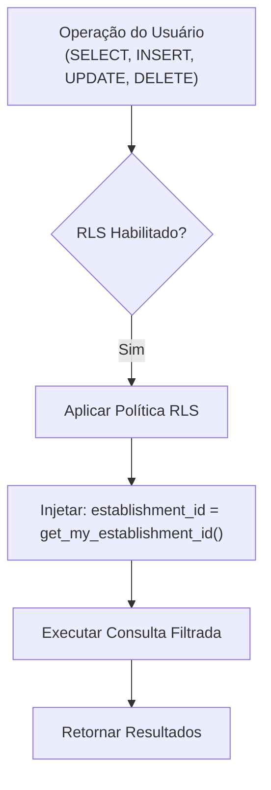

# Função get_my_establishment_id

<cite>
**Arquivos Referenciados neste Documento**  
- [supabase/migrations/20250101000000_initial_schema.sql](file://supabase/migrations/20250101000000_initial_schema.sql)
</cite>

## Sumário
1. [Introdução](#introdução)
2. [Definição da Função](#definição-da-função)
3. [Mecanismo de Segurança em Nível de Linha (RLS)](#mecanismo-de-segurança-em-nível-de-linha-rls)
4. [Uso em Políticas RLS](#uso-em-políticas-rls)
5. [Impacto no Desempenho e Otimizações](#impacto-no-desempenho-e-otimizações)
6. [Conclusão](#conclusão)

## Introdução

A função armazenada `get_my_establishment_id` é um componente fundamental da arquitetura de segurança do sistema multi-inquilino implementado no projeto. Ela desempenha um papel crucial na aplicação de políticas de Segurança em Nível de Linha (Row Level Security - RLS) no Supabase, garantindo que cada usuário autenticado tenha acesso apenas aos dados do seu próprio estabelecimento. Esta documentação detalha a implementação, funcionamento e uso da função, servindo como referência essencial para desenvolvedores que precisam auditar, depurar ou estender as políticas de segurança do sistema.

**Section sources**
- [supabase/migrations/20250100000000_initial_schema.sql](file://supabase/migrations/20250101000000_initial_schema.sql#L431-L435)

## Definição da Função

A função `get_my_establishment_id` é definida como uma função SQL estável que retorna um valor inteiro representando o `establishment_id` associado ao usuário autenticado atual. Sua implementação utiliza o contexto de segurança `SECURITY DEFINER` e define explicitamente o `search_path` como `public`, práticas essenciais para garantir a segurança e o isolamento adequado em um ambiente multi-inquilino.

A função consulta diretamente a tabela `public.users`, utilizando a função `auth.uid()` do Supabase como chave de pesquisa para identificar o registro do usuário autenticado. O `auth.uid()` retorna o identificador único (UUID) do usuário atualmente autenticado no sistema de autenticação do Supabase. O valor do `establishment_id` retornado é então usado como base para todas as verificações de acesso nas políticas RLS.

**Section sources**
- [supabase/migrations/20250101000000_initial_schema.sql](file://supabase/migrations/20250101000000_initial_schema.sql#L431-L435)

## Mecanismo de Segurança em Nível de Linha (RLS)

O mecanismo de RLS implementado no sistema depende criticamente da função `get_my_establishment_id` para isolar os dados entre diferentes inquilinos (estabelecimentos). Quando um usuário realiza uma consulta a uma tabela protegida por RLS, o Supabase automaticamente avalia as políticas definidas para essa tabela. A expressão `establishment_id = get_my_establishment_id()` é injetada na cláusula `WHERE` da consulta do usuário, filtrando os resultados para incluir apenas as linhas que pertencem ao estabelecimento do usuário autenticado.

O uso de `SECURITY DEFINER` na função é crucial, pois permite que ela seja executada com os privilégios do seu proprietário (geralmente um superusuário ou função com amplos privilégios), em vez dos privilégios do usuário que a chamou. Isso é necessário porque a função precisa acessar a tabela `public.users`, que pode não estar diretamente acessível para todos os usuários finais. O `SET search_path = public` garante que a função sempre resolva nomes de tabelas e funções no esquema `public`, prevenindo ataques de injeção de esquema que poderiam redirecionar a consulta para tabelas maliciosas em outros esquemas.

**Section sources**
- [supabase/migrations/20250101000000_initial_schema.sql](file://supabase/migrations/20250101000000_initial_schema.sql#L431-L435)

## Uso em Políticas RLS

A função `get_my_establishment_id` é utilizada extensivamente em políticas RLS aplicadas a todas as tabelas que armazenam dados específicos de um estabelecimento. A seguir estão exemplos de como a função é empregada em diferentes tabelas do sistema:

### Tabelas de Dados do Estabelecimento

Para tabelas como `public.orders`, `public.products` e `public.tables`, a função é usada para garantir o isolamento total entre inquilinos. As políticas são definidas para operações de `SELECT`, `INSERT`, `UPDATE` e `DELETE`.



**Diagram sources**
- [supabase/migrations/20250101000000_initial_schema.sql](file://supabase/migrations/20250101000000_initial_schema.sql#L470)
- [supabase/migrations/20250101000000_initial_schema.sql](file://supabase/migrations/20250101000000_initial_schema.sql#L473)
- [supabase/migrations/20250101000000_initial_schema.sql](file://supabase/migrations/20250101000000_initial_schema.sql#L458)

**Section sources**
- [supabase/migrations/20250101000000_initial_schema.sql](file://supabase/migrations/20250101000000_initial_schema.sql#L445-L502)

### Exemplos de Políticas

Abaixo estão exemplos concretos de políticas RLS que utilizam a função `get_my_establishment_id`, extraídas diretamente do script de migração:

- **Tabela `public.products` (Leitura)**:
  ```sql
  CREATE POLICY "Tenant isolation for products" ON public.products USING (establishment_id = public.get_my_establishment_id());
  ```
  Esta política garante que um usuário só possa selecionar produtos que pertençam ao seu estabelecimento.

- **Tabela `public.products` (Inserção)**:
  ```sql
  CREATE POLICY "Allow tenant insert for products" ON public.products FOR INSERT WITH CHECK (establishment_id = public.get_my_establishment_id());
  ```
  Esta política garante que, ao inserir um novo produto, o campo `establishment_id` deve corresponder ao estabelecimento do usuário autenticado.

- **Tabela `public.users` (Leitura)**:
  ```sql
  CREATE POLICY "Users can see other users from their own establishment" ON public.users FOR SELECT USING (establishment_id = public.get_my_establishment_id());
  ```
  Esta política permite que um usuário veja os perfis de outros usuários, mas apenas dentro do seu próprio estabelecimento, promovendo a colaboração interna enquanto mantém a privacidade entre inquilinos.

## Impacto no Desempenho e Otimizações

O desempenho da função `get_my_establishment_id` é crítico, pois ela é chamada para cada operação de banco de dados que envolva uma tabela protegida por RLS. A consulta subjacente `SELECT establishment_id FROM public.users WHERE id = auth.uid()` é uma operação de pesquisa por chave primária, que é extremamente eficiente quando indexada corretamente.

A importância de um índice na coluna `id` da tabela `public.users` não pode ser subestimada. Como `id` é definido como `PRIMARY KEY`, um índice único é automaticamente criado pelo PostgreSQL. Isso garante que a busca pelo `auth.uid()` seja executada em tempo constante (O(1)), minimizando o impacto adicional nas consultas do usuário. Sem esse índice, a consulta se transformaria em uma varredura sequencial da tabela, tornando o sistema praticamente inutilizável sob carga.

A natureza `STABLE` da função também contribui para a otimização. O PostgreSQL entende que a função retornará o mesmo resultado durante a execução de uma única consulta, permitindo que o otimizador de consultas cacheie o valor do `establishment_id` e o reutilize em múltiplas verificações RLS dentro da mesma transação, evitando chamadas repetidas à função.

**Section sources**
- [supabase/migrations/20250101000000_initial_schema.sql](file://supabase/migrations/20250101000000_initial_schema.sql#L431-L435)

## Conclusão

A função `get_my_establishment_id` é a espinha dorsal da estratégia de segurança multi-inquilino do sistema. Sua implementação simples, mas cuidadosamente projetada, combina o poder do RLS do Supabase com boas práticas de segurança de banco de dados (`SECURITY DEFINER`, `SET search_path`) para criar um ambiente seguro e isolado. O entendimento profundo do seu funcionamento é essencial para qualquer desenvolvedor que trabalhe com o sistema, pois qualquer modificação ou extensão das políticas de acesso deve respeitar e, muitas vezes, se basear nessa função fundamental.