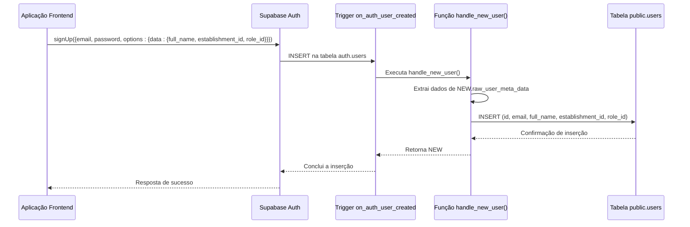

# Trigger handle_new_user

<cite>
**Arquivos Referenciados neste Documento**   
- [20250101000000_initial_schema_corrected.sql](file://supabase/migrations/20250101000000_initial_schema_corrected.sql)
- [20250101000001_initial_schema_fixed.sql](file://supabase/migrations/20250101000001_initial_schema_fixed.sql)
- [20250101000001_rls_security_fix.sql](file://supabase/migrations/20250101000001_rls_security_fix.sql)
- [20250101000000_initial_schema.sql](file://supabase/migrations/20250101000000_initial_schema.sql)
</cite>

## Sumário

1. [Introdução](#introdução)
2. [Arquitetura do Sistema e Isolamento de Inquilinos](#arquitetura-do-sistema-e-isolamento-de-inquilinos)
3. [Análise Detalhada da Função `handle_new_user`](#análise-detalhada-da-função-handle_new_user)
4. [Fluxo de Execução do Trigger](#fluxo-de-execução-do-trigger)
5. [Importância do `SECURITY DEFINER` e `SET search_path`](#importância-do-security-definer-e-set-search_path)
6. [Exemplo Prático de Código](#exemplo-prático-de-código)
7. [Tratamento de Falhas e Metadados Ausentes](#tratamento-de-falhas-e-metadados-ausentes)
8. [Conclusão](#conclusão)

## Introdução

Este documento fornece uma análise detalhada do trigger `handle_new_user` no banco de dados Supabase do sistema easyComand. O objetivo principal deste trigger é automatizar a criação de perfis de usuários na tabela pública `public.users` sempre que um novo usuário se cadastra no sistema de autenticação do Supabase (`auth.users`). Essa automação é fundamental para a arquitetura multi-inquilino do easyComand, pois garante que os dados do usuário sejam imediatamente sincronizados e disponíveis no esquema público, permitindo a aplicação de políticas de segurança (Row Level Security - RLS) para isolar os dados entre diferentes estabelecimentos. A documentação a seguir explica o funcionamento, a importância e os detalhes técnicos dessa função, servindo como um guia essencial para desenvolvedores que precisam entender, manter ou estender o fluxo de autenticação e autorização do sistema.

## Arquitetura do Sistema e Isolamento de Inquilinos

O sistema easyComand é projetado com uma arquitetura multi-inquilino, onde múltiplos estabelecimentos (como restaurantes ou bares) compartilham a mesma instância do banco de dados, mas seus dados são logicamente isolados. Esse isolamento é alcançado principalmente através do uso do Row Level Security (RLS) do Supabase. O RLS garante que um usuário só possa acessar dados que pertencem ao seu próprio estabelecimento, identificado pela coluna `establishment_id` presente na maioria das tabelas.

A tabela `public.users` desempenha um papel central nesse modelo. Ela armazena informações públicas sobre os usuários, como nome completo, cargo e o ID do estabelecimento ao qual pertencem. A chave primária dessa tabela é um UUID que corresponde ao ID do usuário no esquema protegido `auth.users`. Como não é possível criar uma chave estrangeira direta para o esquema `auth` por razões de segurança, o trigger `handle_new_user` é a solução elegante para manter a integridade referencial e a sincronização automática entre os dois esquemas.

**Section sources**
- [20250101000000_initial_schema_corrected.sql](file://supabase/migrations/20250101000000_initial_schema_corrected.sql#L1-L747)

## Análise Detalhada da Função `handle_new_user`

A função `handle_new_user` é uma função do tipo `TRIGGER` escrita em PL/pgSQL, a linguagem procedural do PostgreSQL. Ela é definida no esquema `public` e é chamada automaticamente pelo trigger `on_auth_user_created` sempre que um novo registro é inserido na tabela `auth.users`.

O propósito principal da função é extrair dados do novo usuário a partir do campo `raw_user_meta_data` do registro inserido no `auth.users` e usá-los para criar um novo registro correspondente na tabela `public.users`. Os dados extraídos incluem o `full_name` (nome completo), o `establishment_id` (ID do estabelecimento) e o `role_id` (ID do cargo). Esses dados são fornecidos durante o processo de cadastro no frontend da aplicação, geralmente através da API de autenticação do Supabase.

A função utiliza a variável especial `NEW`, que é uma referência ao novo registro sendo inserido no `auth.users`. Ela acessa os valores desejados usando a sintaxe de operadores JSON (`->>` para strings e `::integer` para conversão de tipo). Após a inserção bem-sucedida no `public.users`, a função retorna o registro `NEW`, que é uma prática padrão para triggers do tipo `AFTER INSERT`.

**Section sources**
- [20250101000000_initial_schema_corrected.sql](file://supabase/migrations/20250101000000_initial_schema_corrected.sql#L657-L684)
- [20250101000001_initial_schema_fixed.sql](file://supabase/migrations/20250101000001_initial_schema_fixed.sql#L419-L438)

## Fluxo de Execução do Trigger



**Diagram sources**
- [20250101000000_initial_schema_corrected.sql](file://supabase/migrations/20250101000000_initial_schema_corrected.sql#L657-L684)

O fluxo começa no frontend, onde um novo usuário se cadastra fornecendo seu email, senha e metadados adicionais (nome completo, ID do estabelecimento e ID do cargo). Ao chamar a função `signUp` da API do Supabase, esses dados são enviados para o esquema de autenticação. O Supabase então insere um novo registro na tabela `auth.users`, armazenando o email e os metadados no campo `raw_user_meta_data`.

Essa operação de inserção dispara automaticamente o trigger `on_auth_user_created`. O trigger, por sua vez, invoca a função `handle_new_user()`. A função lê o registro recém-criado (`NEW`), extrai os valores necessários dos metadados e os insere na tabela `public.users`, garantindo que o ID do usuário seja o mesmo em ambos os esquemas. Esse processo é transparente para o usuário e ocorre de forma atômica, garantindo que a sincronização seja completa ou não ocorra de todo.

## Importância do `SECURITY DEFINER` e `SET search_path`

Dois aspectos críticos na definição da função `handle_new_user` são as cláusulas `SECURITY DEFINER` e `SET search_path`.

A cláusula `SECURITY DEFINER` altera o contexto de execução da função. Por padrão, uma função é executada com as permissões do usuário que a chamou (o `invoker`). No entanto, como o trigger é acionado por uma operação no esquema `auth`, o usuário que "chama" a função é o próprio Supabase Auth, que não possui permissões para escrever na tabela `public.users`. Ao usar `SECURITY DEFINER`, a função é executada com as permissões do seu proprietário (geralmente um superusuário ou um usuário com privilégios elevados). Isso permite que a função contorne as políticas de RLS e insira dados diretamente na tabela `public.users`, mesmo quando o RLS está ativo.

A cláusula `SET search_path = public` é uma medida de segurança e clareza. Ela define explicitamente o caminho de busca para a função, garantindo que todos os nomes de tabelas e funções não qualificados (como `users`) sejam resolvidos no esquema `public`. Isso evita ambiguidades e potenciais erros de segurança que poderiam ocorrer se o `search_path` do usuário invocador incluísse outros esquemas. É uma prática recomendada para funções `SECURITY DEFINER` para prevenir ataques de injeção de esquema.

**Section sources**
- [20250101000000_initial_schema_corrected.sql](file://supabase/migrations/20250101000000_initial_schema_corrected.sql#L657-L684)
- [20250101000001_rls_security_fix.sql](file://supabase/migrations/20250101000001_rls_security_fix.sql#L39-L40)

## Exemplo Prático de Código

O código SQL completo para a função e o trigger é o seguinte:

```sql
CREATE OR REPLACE FUNCTION public.handle_new_user()
RETURNS TRIGGER
LANGUAGE plpgsql
SECURITY DEFINER
SET search_path = public
AS $$
BEGIN
  INSERT INTO public.users (id, email, full_name, establishment_id, role_id)
  VALUES (
    NEW.id,
    NEW.email,
    NEW.raw_user_meta_data->>'full_name',
    (NEW.raw_user_meta_data->>'establishment_id')::integer,
    (NEW.raw_user_meta_data->>'role_id')::integer
  );
  RETURN NEW;
END;
$$;

CREATE TRIGGER on_auth_user_created
  AFTER INSERT ON auth.users
  FOR EACH ROW EXECUTE FUNCTION public.handle_new_user();
```

**Section sources**
- [20250101000000_initial_schema_corrected.sql](file://supabase/migrations/20250101000000_initial_schema_corrected.sql#L657-L684)

## Tratamento de Falhas e Metadados Ausentes

Uma consideração importante é o tratamento de falhas. O código atual não inclui tratamento de erros explícito. Se os metadados `full_name`, `establishment_id` ou `role_id` não forem fornecidos durante o cadastro, a função tentará inserir `NULL` para esses campos. Dependendo das restrições da tabela `public.users` (por exemplo, se `full_name` for `NOT NULL`), isso pode causar uma falha na inserção, o que, por sua vez, fará com que toda a operação de cadastro falhe, pois o trigger é parte da mesma transação.

Para tornar o sistema mais robusto, poderiam ser implementadas estratégias como:
1.  **Validação no Frontend:** Garantir que o frontend sempre envie os metadados obrigatórios.
2.  **Valores Padrão:** Definir valores padrão na tabela `public.users` para campos como `role_id` (por exemplo, um ID de "funcionário padrão").
3.  **Tratamento de Erros na Função:** Modificar a função para verificar a presença dos metadados e tomar uma ação alternativa (como inserir um registro com campos nulos e registrar um erro) em vez de falhar abruptamente.

Atualmente, a abordagem do sistema é confiar na integridade dos dados fornecidos pelo frontend, o que é uma prática comum em aplicações bem controladas.

**Section sources**
- [20250101000000_initial_schema_corrected.sql](file://supabase/migrations/20250101000000_initial_schema_corrected.sql#L657-L684)

## Conclusão

O trigger `handle_new_user` é um componente fundamental e bem projetado da arquitetura do easyComand. Ele resolve elegantemente o desafio de sincronizar dados entre o esquema de autenticação protegido e o esquema público, habilitando o modelo de multi-inquilino com segurança. O uso de `SECURITY DEFINER` e `SET search_path` demonstra uma compreensão profunda das nuances de segurança do PostgreSQL e do Supabase. Essa automação elimina completamente a necessidade de qualquer intervenção manual no cadastro de usuários, garantindo um fluxo de trabalho eficiente e seguro. Para desenvolvedores, entender esse mecanismo é crucial para qualquer trabalho relacionado à autenticação, autorização ou gerenciamento de usuários no sistema.