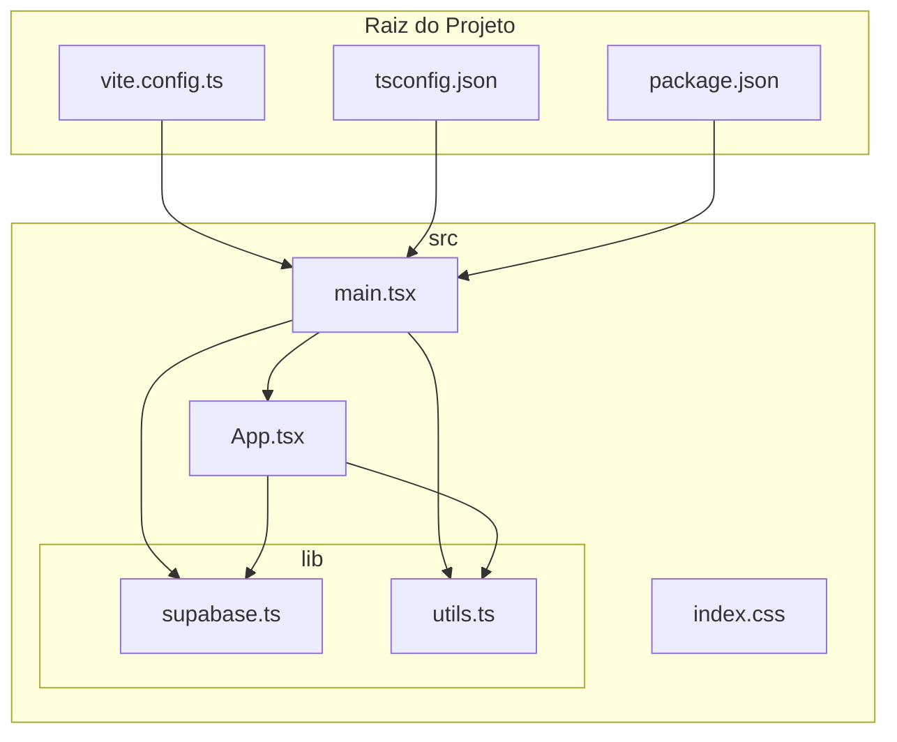
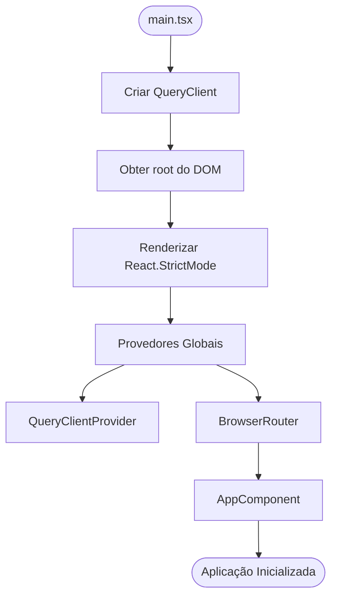
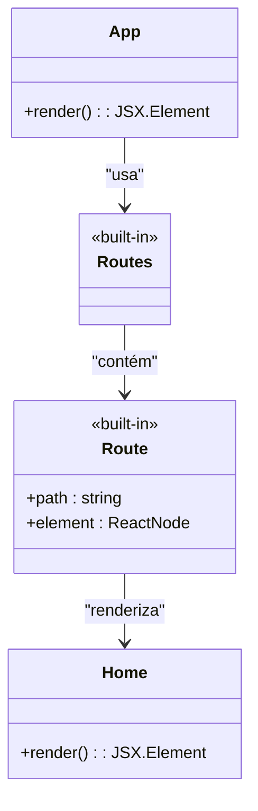
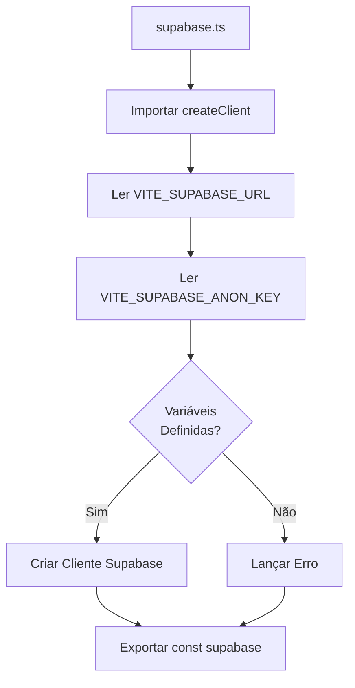

# Arquitetura Frontend

<cite>
**Arquivos Referenciados neste Documento**   
- [main.tsx](file://src/main.tsx)
- [App.tsx](file://src/App.tsx)
- [supabase.ts](file://src/lib/supabase.ts)
- [utils.ts](file://src/lib/utils.ts)
- [vite.config.ts](file://vite.config.ts)
- [package.json](file://package.json)
- [tsconfig.json](file://tsconfig.json)
</cite>

## Sumário
1. [Introdução](#introdução)
2. [Estrutura do Projeto](#estrutura-do-projeto)
3. [Fluxo de Inicialização](#fluxo-de-inicialização)
4. [Gerenciamento de Rotas](#gerenciamento-de-rotas)
5. [Integração com Supabase](#integração-com-supabase)
6. [Utilitários e Estilos](#utilitários-e-estilos)
7. [Padrões de Código e Boas Práticas](#padrões-de-código-e-boas-práticas)
8. [Conclusão](#conclusão)

## Introdução

Este documento apresenta uma análise detalhada da arquitetura do frontend do sistema **easyComand**, uma aplicação web moderna desenvolvida como uma **SPA (Single Page Application)** utilizando **React com TypeScript** e construída com **Vite**. O objetivo é fornecer uma visão clara do fluxo de inicialização, da estrutura de componentes, dos padrões de gerenciamento de estado e das integrações principais, capacitando desenvolvedores a compreenderem e contribuírem efetivamente para o projeto.

A aplicação é projetada para gestão de restaurantes e bares, com foco em modularidade, escalabilidade e boas práticas de desenvolvimento. A arquitetura adota soluções modernas como React Router para navegação, React Query para gerenciamento de estado assíncrono e Supabase como backend, tudo integrado de forma coesa.

## Estrutura do Projeto

A estrutura de diretórios do projeto é organizada de forma clara e escalável, seguindo convenções modernas do ecossistema React. O ponto de entrada principal é o arquivo `main.tsx`, localizado no diretório `src/`, que inicializa a aplicação React no DOM. O componente raiz `App.tsx` contém a definição das rotas da aplicação.

O diretório `src/lib/` abriga módulos de utilidade e serviços de infraestrutura, como a instância do cliente Supabase e funções auxiliares para manipulação de classes CSS. A configuração do ambiente de desenvolvimento e build é gerenciada por arquivos na raiz do projeto, incluindo `vite.config.ts` para o Vite, `tsconfig.json` para o TypeScript e `package.json` para dependências.

**Diagram sources**
- [main.tsx](file://src/main.tsx#L1-L18)
- [App.tsx](file://src/App.tsx#L1-L30)
- [vite.config.ts](file://vite.config.ts#L1-L13)
- [tsconfig.json](file://tsconfig.json#L1-L33)

**Section sources**
- [main.tsx](file://src/main.tsx#L1-L18)
- [App.tsx](file://src/App.tsx#L1-L30)
- [vite.config.ts](file://vite.config.ts#L1-L13)

## Fluxo de Inicialização

O processo de inicialização da aplicação começa no arquivo `main.tsx`, que atua como o **entry point** do sistema. Este arquivo é responsável por montar a aplicação React no elemento raiz do DOM (`#root`) e por envolver o componente principal com provedores globais essenciais.

A aplicação é envolvida por dois provedores principais:
1. **`QueryClientProvider`**: Provedor do React Query que fornece uma instância centralizada de `QueryClient`, permitindo o gerenciamento eficiente de dados assíncronos, cache, refetching e sincronização entre componentes.
2. **`BrowserRouter`**: Provedor do React Router DOM que habilita o roteamento baseado no histórico do navegador, permitindo navegação suave entre diferentes views da SPA sem recarregar a página.

Essa composição de provedores estabelece um contexto global que está disponível para todos os componentes filhos, facilitando o acesso a funcionalidades de roteamento e gerenciamento de estado assíncrono em qualquer parte da aplicação.

**Diagram sources**
- [main.tsx](file://src/main.tsx#L1-L18)

**Section sources**
- [main.tsx](file://src/main.tsx#L1-L18)

## Gerenciamento de Rotas

O gerenciamento de rotas é centralizado no componente `App.tsx`, que utiliza o `Routes` e `Route` do React Router DOM para definir o mapeamento entre URLs e componentes. Atualmente, a aplicação possui uma única rota configurada: a rota raiz (`/`), que renderiza o componente `Home`.

O componente `Home` é um componente funcional escrito em TypeScript que exibe uma mensagem de boas-vindas e o status atual do projeto. Ele utiliza classes do Tailwind CSS para estilização, demonstrando a integração do framework de estilos com o React. A estrutura está preparada para a adição de novas rotas, como telas de login, dashboard e gestão de pedidos, conforme indicado pelo comentário no código.

**Diagram sources**
- [App.tsx](file://src/App.tsx#L1-L30)

**Section sources**
- [App.tsx](file://src/App.tsx#L1-L30)

## Integração com Supabase

A integração com o backend é realizada através do Supabase, um backend como serviço baseado em PostgreSQL. A instância do cliente Supabase é configurada e exportada de forma centralizada no arquivo `src/lib/supabase.ts`.

Este módulo importa a função `createClient` do `@supabase/supabase-js` e a utiliza para criar uma instância configurada com a URL do projeto e a chave anônima, ambas obtidas das variáveis de ambiente (`VITE_SUPABASE_URL` e `VITE_SUPABASE_ANON_KEY`). O código inclui uma verificação de segurança que lança um erro caso essas variáveis não estejam definidas, garantindo que a aplicação não prossiga com uma configuração inválida.

Essa instância exportada pode ser importada em qualquer componente ou serviço ao longo da aplicação para realizar operações de banco de dados, autenticação de usuários e acesso a armazenamento de arquivos, proporcionando uma interface consistente e segura para a camada de dados.

**Diagram sources**
- [supabase.ts](file://src/lib/supabase.ts#L1-L10)

**Section sources**
- [supabase.ts](file://src/lib/supabase.ts#L1-L10)

## Utilitários e Estilos

O projeto inclui utilitários essenciais no arquivo `src/lib/utils.ts`, que fornece a função `cn()`. Esta função é uma combinação segura de `clsx` e `tailwind-merge`, projetada para mesclar classes CSS do Tailwind de forma eficaz, especialmente quando há necessidade de sobrescrever classes.

A função `cn()` é crucial para evitar conflitos de estilos, garantindo que classes mais específicas ou dinâmicas prevaleçam sobre as genéricas. Isso é particularmente útil em componentes reutilizáveis onde as classes podem ser passadas como props.

Além disso, a configuração do projeto utiliza aliases de importação, definidos tanto no `vite.config.ts` quanto no `tsconfig.json`, que mapeiam o caminho `@/` para o diretório `./src/`. Isso permite importações mais limpas e robustas, como `import { supabase } from '@/lib/supabase'`, melhorando a legibilidade e a manutenção do código.

**Section sources**
- [utils.ts](file://src/lib/utils.ts#L1-L6)
- [vite.config.ts](file://vite.config.ts#L1-L13)
- [tsconfig.json](file://tsconfig.json#L1-L33)

## Padrões de Código e Boas Práticas

A arquitetura do frontend do easyComand adota diversos padrões modernos de desenvolvimento React:

1. **Componentes Funcionais com Hooks**: Todos os componentes são escritos como funções, aproveitando o poder dos Hooks do React para gerenciar estado, efeitos colaterais e lógica de renderização.

2. **Gerenciamento de Estado Assíncrono com React Query**: Embora o uso específico de `useQuery` não tenha sido encontrado nos arquivos analisados, as dependências listadas no `package.json` confirmam a presença do `@tanstack/react-query`. Este padrão permite que componentes busquem dados do Supabase de forma declarativa, com recursos avançados como cache automático, deduplicação de requisições e atualização em segundo plano.

3. **Injeção de Dependências via Contexto**: Os provedores globais (`QueryClientProvider` e `BrowserRouter`) demonstram o uso do contexto do React para injetar dependências e estado global, evitando o "prop drilling" e promovendo uma arquitetura mais limpa.

4. **Tipagem Forte com TypeScript**: O uso de TypeScript garante segurança de tipos em toda a aplicação, reduzindo erros em tempo de execução e melhorando a experiência de desenvolvimento com IntelliSense.

5. **Estilização com Tailwind CSS**: O framework utility-first permite estilização rápida e consistente diretamente no JSX, com a função `cn()` garantindo a integridade dos estilos.

6. **Build Moderno com Vite**: A utilização do Vite proporciona tempos de inicialização rápidos, HMR eficiente e uma experiência de desenvolvimento otimizada.

**Section sources**
- [package.json](file://package.json#L1-L46)
- [main.tsx](file://src/main.tsx#L1-L18)
- [App.tsx](file://src/App.tsx#L1-L30)
- [utils.ts](file://src/lib/utils.ts#L1-L6)

## Conclusão

A arquitetura frontend do easyComand é uma base sólida e moderna para o desenvolvimento de uma aplicação de gestão de restaurantes e bares. Sua estrutura clara, combinada com tecnologias atuais como React, TypeScript, Vite, React Query e Supabase, proporciona um ambiente de desenvolvimento produtivo, escalável e manutenível.

O fluxo de inicialização bem definido, a separação de responsabilidades entre os arquivos principais e a adoção de boas práticas de código estabelecem um padrão elevado para o desenvolvimento futuro. Com esta documentação, novos desenvolvedores podem rapidamente compreender a estrutura do projeto e começar a contribuir com novas funcionalidades, como a tela de login e o dashboard, que são os próximos passos indicados no componente `Home`.