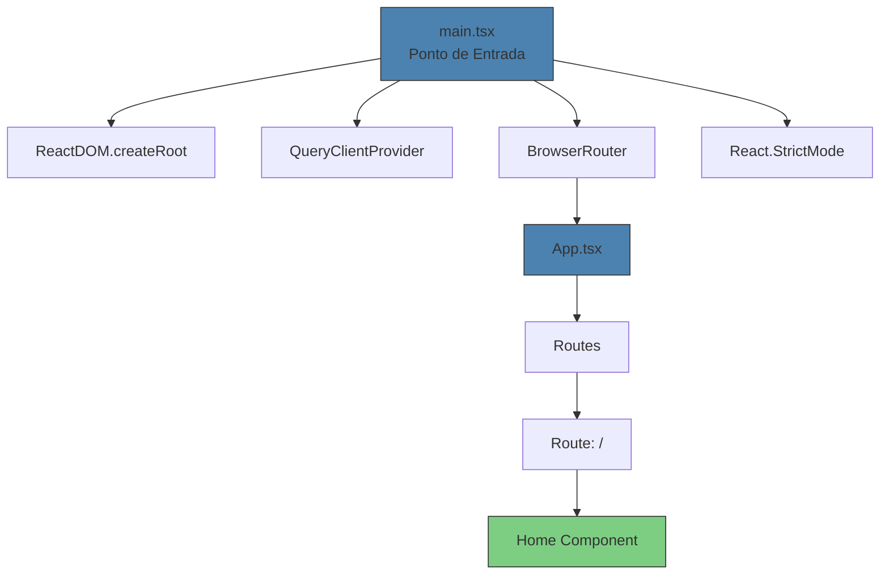

<cite>
**Arquivos Referenciados neste Documento**  
- [main.tsx](file://src/main.tsx)
- [App.tsx](file://src/App.tsx)
- [package.json](file://package.json)
- [tsconfig.json](file://tsconfig.json)
</cite>

## Sumário
1. [Introdução](#introdução)
2. [Estrutura do Projeto](#estrutura-do-projeto)
3. [Componentes Principais](#componentes-principais)
4. [Visão Geral da Arquitetura](#visão-geral-da-arquitetura)
5. [Análise Detalhada dos Componentes](#análise-detalhada-dos-componentes)
6. [Integração de Novos Componentes](#integração-de-novos-componentes)
7. [Conclusão](#conclusão)

## Introdução

Este documento apresenta uma análise detalhada dos componentes principais do frontend da aplicação easyComand, com foco no fluxo de inicialização e na estrutura de rotas. O objetivo é fornecer uma compreensão clara da arquitetura inicial da aplicação, permitindo que novos desenvolvedores integrem-se rapidamente ao projeto e adicionem novos componentes de forma correta e consistente.

## Estrutura do Projeto

A aplicação easyComand segue uma estrutura de projeto típica para aplicações React modernas, utilizando Vite como bundler, TypeScript como linguagem principal e Tailwind CSS para estilização. Os arquivos principais do frontend estão localizados no diretório `src/`, enquanto as configurações de build, dependências e ambiente estão na raiz do projeto.

O arquivo `package.json` define as dependências principais, incluindo React 18, React Router DOM para roteamento, React Query para gerenciamento de estado e dados, além de bibliotecas de UI como Lucide React e Sonner. A configuração do TypeScript é gerenciada pelo `tsconfig.json`, que define aliases para facilitar a importação de módulos.

**Section sources**
- [package.json](file://package.json#L1-L47)
- [tsconfig.json](file://tsconfig.json#L1-L34)

## Componentes Principais

Os componentes principais do frontend são `main.tsx` e `App.tsx`, que juntos formam a base da aplicação React. O `main.tsx` atua como ponto de entrada da aplicação, responsável por inicializar o ambiente React e envolver a aplicação com provedores essenciais. O `App.tsx` define a estrutura de rotas da aplicação, determinando quais componentes serão renderizados com base na URL atual.

Esses dois arquivos estabelecem o padrão arquitetural da aplicação, combinando boas práticas de gerenciamento de estado, roteamento e renderização, criando uma base sólida para o desenvolvimento de novas funcionalidades.

**Section sources**
- [main.tsx](file://src/main.tsx#L1-L19)
- [App.tsx](file://src/App.tsx#L1-L31)

## Visão Geral da Arquitetura

**Diagram sources**
- [main.tsx](file://src/main.tsx#L1-L19)
- [App.tsx](file://src/App.tsx#L1-L31)

## Análise Detalhada dos Componentes

### Análise do main.tsx

O arquivo `main.tsx` é o ponto de entrada da aplicação React, responsável por inicializar o ambiente de renderização e configurar os provedores globais necessários para o funcionamento da aplicação. Ele utiliza `ReactDOM.createRoot` para criar uma raiz de renderização no elemento DOM com ID `root`, implementando o modo de renderização concorrente introduzido no React 18.

O componente é envolvido por `React.StrictMode`, que ativa verificações e avisos adicionais durante o desenvolvimento para identificar potenciais problemas na aplicação, como efeitos colaterais indesejados e práticas obsoletas. Embora não afete o ambiente de produção, é uma ferramenta valiosa para garantir a qualidade do código durante o desenvolvimento.

A aplicação é envolvida por dois provedores essenciais: `QueryClientProvider` do React Query, que gerencia o estado de dados e o cache de requisições assíncronas, e `BrowserRouter` do React Router, que habilita o roteamento baseado no histórico do navegador. Essa combinação permite uma experiência de usuário fluida com navegação sem recarregamento de página e gerenciamento eficiente de dados.

**Section sources**
- [main.tsx](file://src/main.tsx#L1-L19)

### Análise do App.tsx

O arquivo `App.tsx` define a estrutura de rotas da aplicação utilizando os componentes `Routes` e `Route` do React Router. Atualmente, a aplicação possui uma única rota configurada, a rota raiz `/`, que renderiza o componente `Home`. Esta estrutura é extensível, permitindo a adição de novas rotas conforme o desenvolvimento da aplicação avança.

O componente `Home` é um componente funcional simples que exibe uma mensagem de boas-vindas e informações sobre o estado atual do projeto. Ele utiliza classes do Tailwind CSS para estilização, demonstrando a integração da biblioteca de estilos com o React. A estrutura do componente é organizada em um layout flexível que centraliza o conteúdo na tela, proporcionando uma experiência visual agradável.

A abordagem de rotas declarativas utilizada permite uma gestão clara e previsível do fluxo de navegação da aplicação, facilitando a manutenção e a escalabilidade do código.

**Section sources**
- [App.tsx](file://src/App.tsx#L1-L31)

## Integração de Novos Componentes

Para integrar novos componentes à aplicação, os desenvolvedores devem seguir um processo padronizado que garante a consistência arquitetural. Primeiro, o novo componente deve ser criado como um arquivo TypeScript no diretório `src/`, seguindo a convenção de nomenclatura PascalCase e a extensão `.tsx`. Em seguida, ele deve ser importado no arquivo `App.tsx` e adicionado como uma nova rota dentro do componente `Routes`.

A adição de uma nova rota envolve a criação de um elemento `Route` com o atributo `path` definindo o caminho da URL e o atributo `element` especificando o componente a ser renderizado. Por exemplo, para adicionar uma rota de login, seria incluído um novo elemento `<Route path="/login" element={<Login />} />` dentro de `Routes`.

Este processo garante que todos os componentes da aplicação sigam um padrão consistente de organização e que o fluxo de navegação seja gerenciado de forma centralizada, facilitando a manutenção e a evolução da aplicação.

**Section sources**
- [App.tsx](file://src/App.tsx#L20-L27)

## Conclusão

A arquitetura inicial do frontend da aplicação easyComand demonstra uma implementação sólida e moderna de uma aplicação React, combinando boas práticas de desenvolvimento com tecnologias atualizadas. A separação clara entre o ponto de entrada (`main.tsx`) e a estrutura de rotas (`App.tsx`) cria uma base organizada e escalável para o desenvolvimento de novas funcionalidades.

O uso de `React.StrictMode`, `React Query` e `React Router` reflete decisões arquiteturais conscientes que priorizam a qualidade do código, o gerenciamento eficiente de estado e uma experiência de usuário fluida. Este documento fornece uma base sólida para novos desenvolvedores compreenderem a estrutura da aplicação e contribuírem de forma eficaz para seu desenvolvimento futuro.