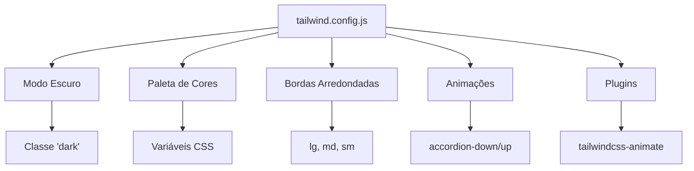

# Estilização

<cite>
**Arquivos Referenciados neste Documento**  
- [src/index.css](file://src/index.css)
- [tailwind.config.js](file://tailwind.config.js)
- [src/lib/utils.ts](file://src/lib/utils.ts)
- [src/App.tsx](file://src/App.tsx)
</cite>

## Sumário
1. [Introdução](#introdução)
2. [Estrutura de Estilização Global](#estrutura-de-estilização-global)
3. [Configuração do Tailwind CSS](#configuração-do-tailwind-css)
4. [Função `cn()` para Composição de Classes](#função-cn-para-composição-de-classes)
5. [Boas Práticas de Estilização](#boas-práticas-de-estilização)
6. [Conclusão](#conclusão)

## Introdução

O sistema de estilização do **easyComand** é baseado no **Tailwind CSS**, uma abordagem utilitária que permite a criação de interfaces de usuário altamente personalizáveis e responsivas diretamente no JSX. Este documento detalha a arquitetura de estilização do projeto, abrangendo desde a configuração inicial até as práticas recomendadas para uso consistente de estilos em componentes. O foco está em garantir que os desenvolvedores possam aplicar estilos de forma eficiente, segura e escalável, aproveitando ao máximo as funcionalidades do Tailwind.

## Estrutura de Estilização Global

O arquivo `index.css` é o ponto central da estilização global da aplicação. Ele importa os três níveis principais do Tailwind CSS por meio das diretivas `@tailwind`: `base`, `components` e `utilities`. Essa estrutura permite uma separação clara entre estilos base, componentes reutilizáveis e utilitários atômicos.

Além disso, o arquivo define uma paleta de cores e variáveis CSS no seletor `:root`, que são usadas em todo o sistema por meio de funções `hsl(var(--nome))`. Essas variáveis são dinamicamente ajustadas no modo escuro, graças à classe `.dark`, que sobrescreve os valores padrão. Isso garante uma transição suave entre os temas claro e escuro sem a necessidade de reescrever estilos.

O uso de `@layer base` também aplica estilos padrão ao corpo da página e a todos os elementos, garantindo consistência visual desde o início.

**Section sources**
- [src/index.css](file://src/index.css#L1-L76)

## Configuração do Tailwind CSS

O arquivo `tailwind.config.js` é responsável por configurar o comportamento do Tailwind na aplicação. Ele define o modo escuro como ativado por classe (`darkMode: ["class"]`), permitindo que o tema seja alternado dinamicamente com a adição da classe `dark` ao elemento raiz.

A propriedade `content` especifica os diretórios onde o Tailwind deve procurar por classes utilizadas, garantindo que apenas os estilos efetivamente usados sejam incluídos no build final. A configuração estende o tema padrão com cores personalizadas baseadas nas variáveis CSS definidas em `index.css`, além de definir bordas arredondadas (`borderRadius`) e animações como `accordion-down` e `accordion-up`, usadas em componentes interativos.

O uso de `plugins: [require("tailwindcss-animate")]` adiciona suporte a animações prontas para uso, facilitando a criação de interfaces dinâmicas.



**Diagram sources**
- [tailwind.config.js](file://tailwind.config.js#L1-L78)

## Função `cn()` para Composição de Classes

A função `cn()` definida em `utils.ts` é uma utilidade essencial para a composição segura de classes CSS. Ela combina as bibliotecas `clsx` e `tailwind-merge` para resolver conflitos entre classes e garantir que a última classe definida prevaleça, mesmo em casos de sobreposição.

A função aceita múltiplos argumentos do tipo `ClassValue` (strings, arrays, objetos) e os processa com `clsx`, que converte condicionais e arrays em uma única string de classes. Em seguida, `twMerge` normaliza e mescla essas classes, eliminando duplicatas e resolvendo conflitos — por exemplo, se `p-4` e `p-2` forem aplicados, apenas `p-2` será mantido.

Essa abordagem é especialmente útil em componentes onde classes são passadas como props, permitindo a sobreposição segura de estilos sem efeitos colaterais indesejados.

### Exemplo de Uso em Componente

Embora não haja um componente complexo no momento, a função `cn()` pode ser usada em qualquer componente da seguinte forma:

```tsx
<div className={cn("p-4 bg-primary text-primary-foreground", isDark && "bg-secondary")}>
  Conteúdo estilizado
</div>
```

Neste exemplo, se `isDark` for verdadeiro, `bg-secondary` substituirá `bg-primary` de forma segura.

**Section sources**
- [src/lib/utils.ts](file://src/lib/utils.ts#L1-L7)

## Boas Práticas de Estilização

### 1. **Utilitários Responsivos**
Use prefixos como `sm:`, `md:`, `lg:` para aplicar estilos condicionalmente com base no tamanho da tela. Por exemplo:
```tsx
<div className="text-sm md:text-base lg:text-lg">Texto responsivo</div>
```

### 2. **Suporte a Modo Escuro**
Garanta que todos os componentes funcionem bem em ambos os temas. Use as classes `dark:bg-*`, `dark:text-*` para ajustar estilos no modo escuro.

### 3. **Acessibilidade**
Priorize contrastes adequados e use classes como `sr-only` para conteúdo acessível apenas a leitores de tela. Evite estilização baseada apenas em cor — combine com ícones ou padrões.

### 4. **Composição com `cn()`**
Sempre que houver sobreposição de classes (por exemplo, em componentes compostos), use `cn()` para garantir que os estilos sejam aplicados de forma previsível.

### 5. **Evitar Estilos Inline**
Prefira classes do Tailwind a estilos inline. Isso mantém a consistência e permite a reutilização.

## Conclusão

O sistema de estilização do **easyComand** é robusto, flexível e escalável, graças à integração eficaz do Tailwind CSS com variáveis CSS, configuração personalizada e a função `cn()` para composição segura de classes. Ao seguir as boas práticas descritas, os desenvolvedores podem criar interfaces visualmente consistentes, responsivas e acessíveis, com mínima duplicação de código e máxima manutenibilidade. A arquitetura atual permite fácil evolução futura, como a adição de novos temas, breakpoints ou animações.