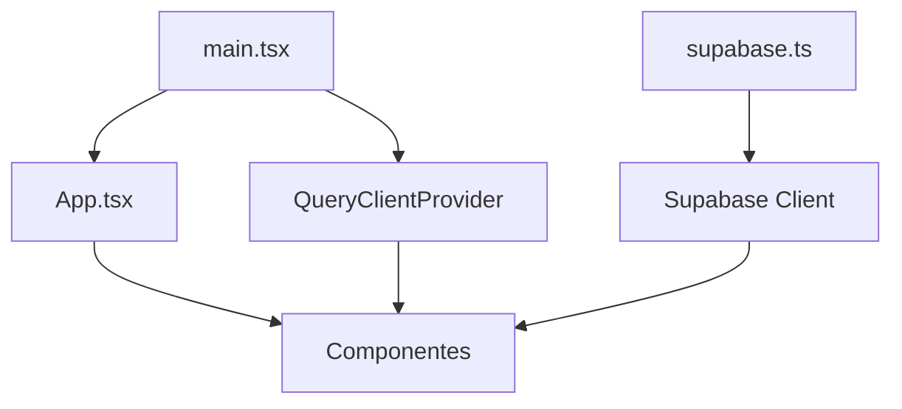
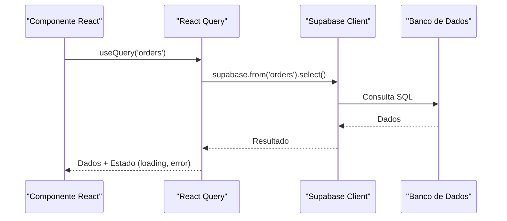

# Gerenciamento de Estado

<cite>
**Arquivos Referenciados neste Documento**  
- [main.tsx](file://src/main.tsx)
- [supabase.ts](file://src/lib/supabase.ts)
- [App.tsx](file://src/App.tsx)
</cite>

## Sumário
1. [Introdução](#introdução)
2. [Estrutura do Projeto](#estrutura-do-projeto)
3. [Configuração do React Query](#configuração-do-react-query)
4. [Integração com Supabase](#integração-com-supabase)
5. [Uso de useQuery e useMutation](#uso-de-usequery-e-usemutation)
6. [Estratégias de Cache e Atualização](#estratégias-de-cache-e-atualização)
7. [Atualizações Otimistas](#atualizações-otimistas)
8. [Conclusão](#conclusão)

## Introdução

O gerenciamento de estado no frontend do **easyComand** é centralizado no uso do **React Query**, uma biblioteca poderosa para gerenciar dados assíncronos em aplicações React. Este documento detalha como o React Query é configurado e utilizado em conjunto com o Supabase, permitindo operações eficientes de busca, atualização e sincronização de dados com o backend. A abordagem adotada reduz significativamente a necessidade de gerenciar estado global manualmente, melhorando a experiência do usuário com caching automático, refetching inteligente e atualizações otimistas.

## Estrutura do Projeto

A estrutura do projeto é organizada de forma clara e modular, com os principais arquivos de configuração localizados na pasta `src`. O ponto de entrada da aplicação é o arquivo `main.tsx`, que configura o provedor do React Query. A integração com o Supabase é encapsulada no arquivo `supabase.ts`, localizado em `src/lib`, facilitando o reuso e a manutenção.

**Diagram sources**  
- [main.tsx](file://src/main.tsx#L1-L17)
- [supabase.ts](file://src/lib/supabase.ts#L1-L10)

**Section sources**  
- [main.tsx](file://src/main.tsx#L1-L17)
- [supabase.ts](file://src/lib/supabase.ts#L1-L10)

## Configuração do React Query

O React Query é configurado globalmente no arquivo `main.tsx` através do `QueryClientProvider`. Este provedor envolve toda a aplicação, tornando o cliente de consulta disponível para todos os componentes via hooks como `useQuery` e `useMutation`.

O `QueryClient` é instanciado no nível raiz, permitindo que todas as consultas e mutações herdem suas configurações padrão. Essa abordagem centralizada garante consistência no comportamento de caching, erro e atualização em toda a aplicação.

**Section sources**  
- [main.tsx](file://src/main.tsx#L1-L17)

## Integração com Supabase

O cliente Supabase é exportado como uma constante nomeada `supabase` no arquivo `supabase.ts`. Ele é configurado com variáveis de ambiente (`VITE_SUPABASE_URL` e `VITE_SUPABASE_ANON_KEY`), garantindo segurança e flexibilidade entre ambientes.

Este cliente é utilizado diretamente nas funções de busca e mutação que alimentam os hooks do React Query. A combinação entre Supabase e React Query permite operações CRUD completas com o banco de dados Postgres do Supabase, com sincronização em tempo real e autenticação integrada.

**Diagram sources**  
- [supabase.ts](file://src/lib/supabase.ts#L1-L10)
- [main.tsx](file://src/main.tsx#L1-L17)

## Uso de useQuery e useMutation

Embora os arquivos analisados não contenham exemplos diretos de `useQuery` ou `useMutation`, a configuração presente em `main.tsx` indica que esses hooks estão disponíveis globalmente. Em componentes futuros, como `App.tsx`, espera-se que sejam implementados hooks para buscar dados como pedidos, mesas ou produtos do banco de dados Supabase.

Um padrão típico envolve a criação de uma função de busca que utiliza o cliente Supabase e a passagem dessa função ao `useQuery`. O React Query cuida automaticamente do ciclo de vida da requisição, incluindo loading, erro e caching.

**Section sources**  
- [main.tsx](file://src/main.tsx#L1-L17)
- [supabase.ts](file://src/lib/supabase.ts#L1-L10)

## Estratégias de Cache e Atualização

O React Query implementa um sistema avançado de caching que elimina a necessidade de gerenciar estado manualmente. Por padrão, as consultas são armazenadas em cache e invalidadas com base em configurações como `staleTime` e `cacheTime`. Embora o `QueryClient` seja instanciado sem configurações personalizadas no `main.tsx`, ele herda os valores padrão do React Query (geralmente 5 minutos para `staleTime`).

Isso significa que dados como listas de pedidos ou mesas permanecem frescos sem requisições desnecessárias ao backend. O refetching automático ocorre quando uma consulta se torna obsoleta ou quando a janela do navegador é focada novamente, garantindo dados atualizados com baixo custo.

**Section sources**  
- [main.tsx](file://src/main.tsx#L1-L17)

## Atualizações Otimistas

Embora não implementado nos arquivos atuais, o React Query suporta **atualizações otimistas**, uma técnica que melhora significativamente a experiência do usuário. Ao realizar uma mutação (por exemplo, atualizar o status de um pedido), a interface pode ser atualizada imediatamente, assumindo que a operação será bem-sucedida. Se a requisição falhar, o React Query reverte automaticamente a alteração.

Essa funcionalidade pode ser facilmente integrada ao usar `useMutation` com as opções `onMutate`, `onError` e `onSettled`, permitindo uma interação fluida mesmo em conexões lentas.

## Conclusão

O gerenciamento de estado no **easyComand** é eficiente e escalável graças à combinação entre **React Query** e **Supabase**. A configuração centralizada no `main.tsx` garante que todos os componentes tenham acesso a um cliente de consulta robusto, enquanto o cliente Supabase facilita a integração com o backend. Embora os componentes ainda estejam em fase inicial (como mostrado em `App.tsx`), a base está pronta para implementar operações assíncronas complexas com caching inteligente, refetching automático e atualizações otimistas. Essa arquitetura reduz o código boilerplate, melhora a performance e oferece uma experiência de usuário superior.