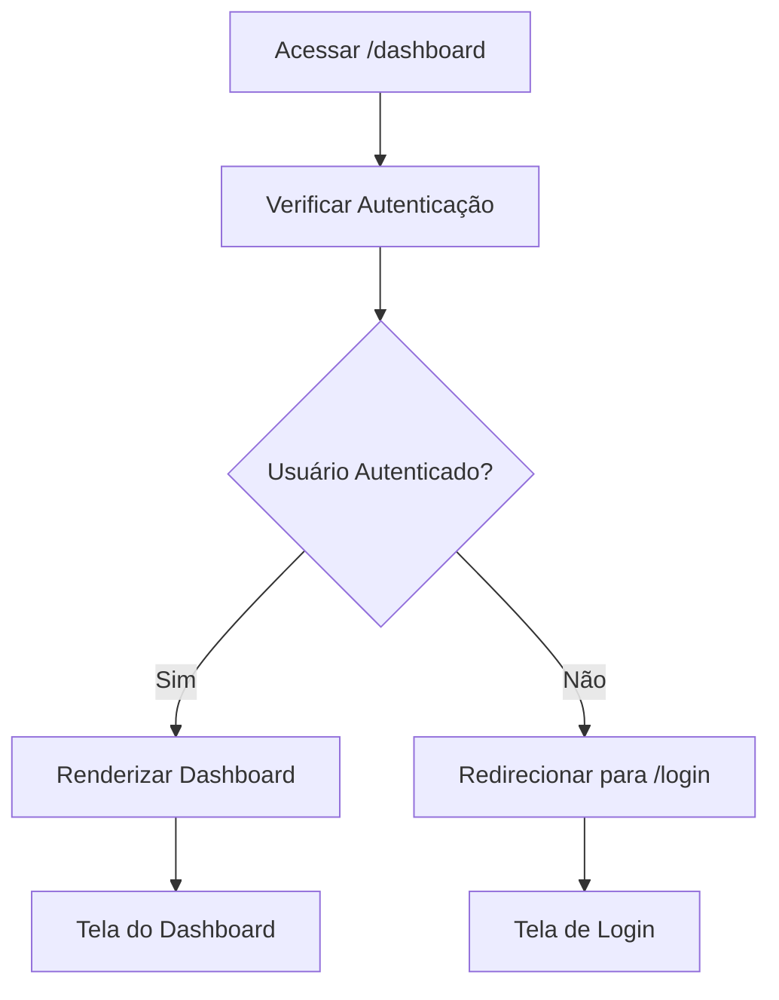

# Rotas

<cite>
**Arquivos Referenciados neste Documento**  
- [App.tsx](file://src/App.tsx)
- [main.tsx](file://src/main.tsx)
- [package.json](file://package.json)
</cite>

## Sumário
1. [Introdução](#introdução)
2. [Estrutura do Projeto e Configuração do Roteamento](#estrutura-do-projeto-e-configuração-do-roteamento)
3. [Componente App e Definição de Rotas](#componente-app-e-definição-de-rotas)
4. [Adição de Novas Rotas](#adição-de-novas-rotas)
5. [Roteamento no Lado do Cliente em SPAs](#roteamento-no-lado-do-cliente-em-spas)
6. [Boas Práticas no Roteamento](#boas-práticas-no-roteamento)
7. [Conclusão](#conclusão)

## Introdução

Este documento fornece uma análise detalhada do sistema de roteamento do projeto **easyComand**, uma aplicação React projetada para gestão de restaurantes e bares. O sistema utiliza `react-router-dom` para gerenciar a navegação entre diferentes telas da aplicação, permitindo uma experiência de Single Page Application (SPA) fluida e eficiente. O foco está na configuração inicial do roteamento, na estrutura do componente `App.tsx`, e em como o sistema está preparado para escalar com novas funcionalidades, como dashboards, pedidos e reservas. O documento também aborda conceitos fundamentais, boas práticas e orientações para a implementação de rotas protegidas e aninhadas.

## Estrutura do Projeto e Configuração do Roteamento

A aplicação easyComand é uma aplicação React moderna, configurada com Vite e TypeScript. O roteamento é um aspecto central da arquitetura, permitindo que diferentes partes da interface sejam exibidas com base na URL do navegador, sem recarregar a página inteira.

A configuração do roteamento começa no ponto de entrada da aplicação, o arquivo `main.tsx`. Aqui, o componente `App` é envolvido por um `BrowserRouter`, que é o componente principal do `react-router-dom` responsável por sincronizar as mudanças de URL com a interface da aplicação.

```mermaid
graph TB
subgraph "Entrada da Aplicação"
main["main.tsx"]
BrowserRouter["<BrowserRouter>"]
end
subgraph "Componente Principal"
App["App.tsx"]
Routes["<Routes>"]
Route["<Route path=\"/\" element={<Home />} />"]
Home["Home()"]
end
main --> BrowserRouter
BrowserRouter --> App
App --> Routes
Routes --> Route
Route --> Home
```

**Diagram sources**
- [main.tsx](file://src/main.tsx#L0-L17)
- [App.tsx](file://src/App.tsx#L0-L29)

**Section sources**
- [main.tsx](file://src/main.tsx#L0-L17)
- [App.tsx](file://src/App.tsx#L0-L29)

## Componente App e Definição de Rotas

O componente `App` é o coração do sistema de roteamento. Ele utiliza os componentes `Routes` e `Route` do `react-router-dom` para definir quais componentes devem ser renderizados com base na URL atual.

Atualmente, o arquivo `App.tsx` define uma única rota raiz (`/`), que renderiza o componente funcional `Home`. Este componente exibe uma mensagem de boas-vindas e um status indicando que a estrutura do projeto foi configurada com sucesso, servindo como uma tela inicial.

A estrutura é simples e clara:
- O componente `Routes` atua como um contêiner que gerencia todas as rotas.
- O componente `Route` define uma rota específica, mapeando um caminho (path) a um elemento (element) a ser renderizado.
- A rota `/` está configurada para renderizar o componente `Home`.
- Um comentário no código (`{/* Outras rotas serão adicionadas aqui */}`) indica explicitamente que o sistema está preparado para receber novas rotas, tornando a extensibility uma característica de design.

**Section sources**
- [App.tsx](file://src/App.tsx#L0-L29)

## Adição de Novas Rotas

O sistema é facilmente extensível. Para adicionar novas rotas, como `/dashboard`, `/orders` ou `/reservations`, um novo componente `Route` deve ser adicionado dentro do contêiner `Routes` no `App.tsx`.

### Exemplo de Adição de Nova Rota

Para adicionar uma rota para o dashboard, o desenvolvedor deve:
1.  Criar um novo componente, por exemplo, `Dashboard.tsx`, em um diretório apropriado (como `src/pages/`).
2.  Importar esse componente no `App.tsx`.
3.  Adicionar uma nova declaração `Route` dentro do `Routes`.

```tsx
<Route path="/dashboard" element={<Dashboard />} />
```

### Adição de uma Rota Protegida

Uma rota protegida só deve ser acessível por usuários autenticados. Isso pode ser implementado criando um componente de rota personalizado, como `PrivateRoute`, que verifica o estado de autenticação antes de renderizar o componente filho.



Embora o código atual não mostre uma implementação de autenticação, a estrutura está pronta para isso. O componente `PrivateRoute` poderia ser usado da seguinte forma:

```tsx
<Route path="/dashboard" element={<PrivateRoute><Dashboard /></PrivateRoute>} />
```

### Adição de uma Rota Aninhada

Rotas aninhadas são úteis para criar layouts hierárquicos, como um painel de administração com múltiplas subtelas. Isso é feito definindo rotas filhas dentro de um componente pai.

Por exemplo, para criar rotas aninhadas sob `/admin`:
1.  Criar um componente `AdminLayout.tsx` que define um layout comum (como um menu lateral).
2.  Dentro do `AdminLayout`, usar outro componente `Routes` para definir as rotas filhas.
3.  Definir as rotas filhas no `App.tsx` com caminhos como `/admin/dashboard` e `/admin/users`.

```tsx
<Route path="/admin" element={<AdminLayout />}>
  <Route path="dashboard" element={<AdminDashboard />} />
  <Route path="users" element={<UserManagement />} />
</Route>
```

Note que a rota filha `dashboard` será acessada via `/admin/dashboard`, mas o componente `AdminLayout` será renderizado em todas as rotas aninhadas.

**Section sources**
- [App.tsx](file://src/App.tsx#L0-L29)

## Roteamento no Lado do Cliente em SPAs

O `react-router-dom` implementa o conceito de **roteamento no lado do cliente (client-side routing)**, que é fundamental para aplicações de página única (SPAs).

Em vez de fazer uma nova solicitação ao servidor para cada página, o `BrowserRouter` utiliza a **API do Histórico do Navegador (Browser History API)**. Quando um usuário clica em um link ou digita uma URL:
1.  O `BrowserRouter` intercepta a mudança de URL.
2.  Ele impede o comportamento padrão de recarregar a página.
3.  Ele verifica as rotas definidas no componente `Routes`.
4.  Ele renderiza o componente correspondente à nova URL sem fazer uma nova solicitação HTTP ao servidor.

Isso resulta em uma experiência de usuário muito mais rápida e fluida, pois apenas os componentes necessários são atualizados, mantendo o estado da aplicação e evitando flashes de tela. O `BrowserRouter` mantém o estado da aplicação sincronizado com a URL, permitindo que os usuários usem os botões "Voltar" e "Avançar" do navegador normalmente, e que possam copiar e colar URLs para compartilhar links diretos para partes específicas da aplicação.

**Section sources**
- [main.tsx](file://src/main.tsx#L0-L17)

## Boas Práticas no Roteamento

Para garantir um sistema de roteamento robusto, escalável e eficiente, as seguintes boas práticas são recomendadas:

### Lazy Loading

O **lazy loading** é uma técnica que carrega componentes de rota apenas quando são necessários. Isso reduz o tamanho do pacote inicial da aplicação, melhorando o tempo de carregamento inicial.

Isso é feito usando `React.lazy` em conjunto com `Suspense`. Embora o código atual não implemente isso, é uma prática recomendada para rotas principais.

```tsx
const Dashboard = React.lazy(() => import('./pages/Dashboard'));

<Route path="/dashboard" element={
  <Suspense fallback={<LoadingSpinner />}>
    <Dashboard />
  </Suspense>
} />
```

### Proteção de Rotas Baseada na Autenticação

Como mencionado anteriormente, rotas sensíveis devem ser protegidas. Um componente de rota personalizado (`PrivateRoute`) deve verificar um estado de autenticação (gerenciado por um contexto, Redux, ou um serviço como Supabase) antes de renderizar o componente filho. Se o usuário não estiver autenticado, ele deve ser redirecionado para uma página de login.

### Estrutura de Arquivos

Organize os componentes de rota em uma estrutura de diretórios clara, como `src/pages/` para telas principais e `src/components/` para componentes reutilizáveis. Isso melhora a manutenibilidade.

### Gerenciamento de Estado de Carregamento

Ao usar lazy loading, sempre envolva os componentes carregados com `Suspense` e forneça um `fallback` (como um spinner de carregamento) para uma melhor experiência do usuário.

**Section sources**
- [App.tsx](file://src/App.tsx#L0-L29)
- [main.tsx](file://src/main.tsx#L0-L17)

## Conclusão

O sistema de roteamento do easyComand, baseado em `react-router-dom`, está bem estruturado e preparado para o crescimento. A separação clara entre a configuração do `BrowserRouter` no `main.tsx` e a definição das rotas no `App.tsx` segue uma arquitetura limpa. A adição de novas rotas é um processo direto, e o sistema pode ser facilmente estendido com rotas protegidas e aninhadas para atender a requisitos de negócios mais complexos. A adoção de boas práticas, como lazy loading e proteção de rotas, será crucial para manter a aplicação performática e segura à medida que novas funcionalidades forem implementadas.