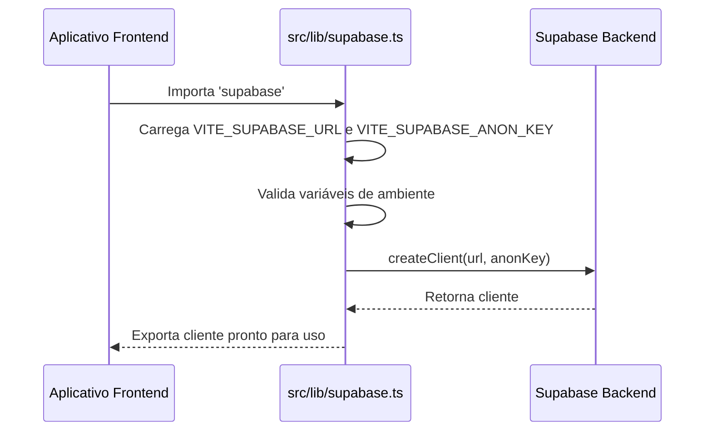
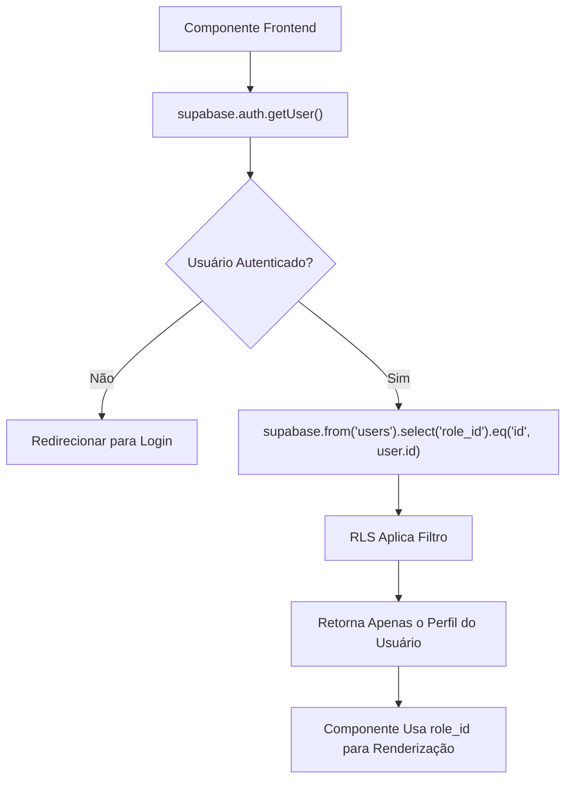

# Autenticação e Segurança

<cite>
**Arquivos Referenciados neste Documento**  
- [src/lib/supabase.ts](file://src/lib/supabase.ts)
- [supabase/migrations/20250101000001_rls_security_fix.sql](file://supabase/migrations/20250101000001_rls_security_fix.sql)
- [supabase/migrations/20250101000000_initial_schema_corrected.sql](file://supabase/migrations/20250101000000_initial_schema_corrected.sql)
</cite>

## Sumário
1. [Introdução](#introdução)
2. [Fluxo de Autenticação e Criação de Perfil](#fluxo-de-autenticação-e-criação-de-perfil)
3. [Segurança no Banco de Dados com RLS](#segurança-no-banco-de-dados-com-rls)
4. [Função de Acesso ao Estabelecimento](#função-de-acesso-ao-estabelecimento)
5. [Inicialização do Cliente Supabase](#inicialização-do-cliente-supabase)
6. [Verificação de Papel do Usuário](#verificação-de-papel-do-usuário)
7. [Boas Práticas de Segurança](#boas-práticas-de-segurança)
8. [Conclusão](#conclusão)

## Introdução

Este documento detalha o sistema de autenticação e segurança implementado no aplicativo **easyComand**. O sistema é baseado no **Supabase Auth** para gerenciar o cadastro e login de usuários, combinado com políticas de segurança rigorosas no banco de dados para garantir a integridade e a confidencialidade dos dados. A arquitetura é multi-inquilino (multi-tenant), o que significa que dados de diferentes estabelecimentos comerciais são isolados com segurança. O documento aborda o fluxo de criação de perfil, o uso de Políticas de Segurança em Nível de Linha (RLS), funções de segurança e boas práticas para desenvolvedores.

## Fluxo de Autenticação e Criação de Perfil

O processo de autenticação começa com o Supabase Auth, que gerencia as credenciais dos usuários (email e senha). Quando um novo usuário se cadastra, um gatilho (trigger) no banco de dados é acionado para criar um perfil público correspondente.

A função `handle_new_user()` é executada automaticamente após a inserção de um novo usuário na tabela protegida `auth.users`. Essa função insere um novo registro na tabela `public.users`, sincronizando o ID do usuário do Supabase com o perfil público. Os dados do perfil, como `full_name`, `establishment_id` e `role_id`, são extraídos dos metadados fornecidos durante o processo de cadastro.

Este mecanismo evita a necessidade de uma chave estrangeira direta entre `public.users` e `auth.users`, o que poderia causar problemas de permissão, mantendo ao mesmo tempo a integridade dos dados.

**Section sources**
- [supabase/migrations/20250101000000_initial_schema_corrected.sql](file://supabase/migrations/20250101000000_initial_schema_corrected.sql#L650-L670)

## Segurança no Banco de Dados com RLS

A segurança dos dados no easyComand é garantida principalmente pelo uso de **Políticas de Segurança em Nível de Linha (Row Level Security - RLS)**. O RLS é ativado em todas as tabelas que contêm dados específicos de um estabelecimento (tenant-specific tables), como `establishments`, `products`, `orders`, e `users`.

As políticas RLS garantem que um usuário autenticado só possa acessar, modificar ou excluir dados que pertençam ao seu próprio estabelecimento. Isso é fundamental para a arquitetura multi-inquilino, pois previne que um usuário de um estabelecimento acesse dados de outro.

```mermaid
graph TD
A[Usuário Autenticado] --> B{Consulta ao Banco de Dados}
B --> C[RLS Verifica a Política]
C --> D[Função: requesting_user_establishment_id()]
D --> E[Obtém o establishment_id do Usuário]
E --> F{establishment_id da Linha == establishment_id do Usuário?}
F --> |Sim| G[Permitir Acesso]
F --> |Não| H[Negar Acesso]
```

**Diagram sources**
- [supabase/migrations/20250101000001_rls_security_fix.sql](file://supabase/migrations/20250101000001_rls_security_fix.sql#L1-L357)

**Section sources**
- [supabase/migrations/20250101000001_rls_security_fix.sql](file://supabase/migrations/20250101000001_rls_security_fix.sql#L72-L357)

## Função de Acesso ao Estabelecimento

A função `requesting_user_establishment_id()` é uma peça central da estratégia de segurança. Ela é uma função SQL definida com `SECURITY DEFINER`, o que significa que é executada com os privilégios do seu proprietário (geralmente um superusuário), permitindo que ela acesse a tabela `public.users` mesmo quando chamada por um usuário com privilégios limitados.

Essa função consulta a tabela `public.users` usando `auth.uid()` (que retorna o ID do usuário autenticado) para recuperar o `establishment_id` associado. O valor retornado é então usado diretamente nas cláusulas `USING` das políticas RLS para filtrar as linhas acessíveis.

```sql
CREATE OR REPLACE FUNCTION public.requesting_user_establishment_id()
RETURNS int
LANGUAGE sql
STABLE
SECURITY DEFINER
SET search_path = public
AS $$
  SELECT establishment_id
  FROM public.users
  WHERE id = auth.uid();
$$;
```

**Section sources**
- [supabase/migrations/20250101000001_rls_security_fix.sql](file://supabase/migrations/20250101000001_rls_security_fix.sql#L4-L24)

## Inicialização do Cliente Supabase

No lado do cliente (frontend), a comunicação com o Supabase é gerenciada por um cliente instanciado no arquivo `src/lib/supabase.ts`. Este arquivo é responsável por criar uma instância singleton do cliente Supabase, que é então importada e usada em todo o aplicativo.

A URL do projeto e a chave de API anônima são carregadas de variáveis de ambiente (`VITE_SUPABASE_URL` e `VITE_SUPABASE_ANON_KEY`), o que é uma prática essencial para evitar expor credenciais sensíveis no código-fonte.



**Diagram sources**
- [src/lib/supabase.ts](file://src/lib/supabase.ts#L1-L11)

**Section sources**
- [src/lib/supabase.ts](file://src/lib/supabase.ts#L1-L11)

## Verificação de Papel do Usuário

Embora o RLS garanta o acesso aos dados, o frontend ainda precisa saber o papel (role) do usuário autenticado para renderizar a interface correta (por exemplo, mostrar opções de gerência apenas para proprietários). Isso é feito consultando a tabela `public.users` após o login.

Um componente pode obter o papel do usuário atual fazendo uma consulta ao Supabase. A própria consulta é segura devido ao RLS, pois o usuário só pode acessar seu próprio perfil. O resultado da consulta inclui o `role_id`, que pode ser usado para controlar a lógica de exibição.



**Diagram sources**
- [src/lib/supabase.ts](file://src/lib/supabase.ts#L1-L11)
- [supabase/migrations/20250101000001_rls_security_fix.sql](file://supabase/migrations/20250101000001_rls_security_fix.sql#L72-L357)

## Boas Práticas de Segurança

Este sistema implementa várias boas práticas de segurança:

1.  **Nunca exponha chaves no frontend**: As chaves de API são carregadas via variáveis de ambiente e nunca são codificadas no código-fonte.
2.  **RLS em vez de controle de acesso na aplicação**: A segurança dos dados é implementada no banco de dados (camada de dados), não na aplicação. Isso é mais robusto, pois qualquer aplicação ou ferramenta que acesse o banco de dados estará sujeita às mesmas políticas.
3.  **Autenticação centralizada**: O Supabase Auth gerencia a autenticação, reduzindo a superfície de ataque e eliminando a necessidade de implementar lógica de login insegura.
4.  **Princípio do menor privilégio**: Os usuários do banco de dados usados pelo frontend têm apenas os privilégios mínimos necessários, reforçados pelo RLS.
5.  **Validação de ambiente**: O código valida a presença das variáveis de ambiente críticas antes de inicializar o cliente.

## Conclusão

O sistema de autenticação e segurança do easyComand é uma combinação eficaz de ferramentas modernas (Supabase Auth) e práticas de segurança robustas (RLS). Ao delegar a responsabilidade de segurança dos dados ao banco de dados, o sistema garante que a integridade dos dados seja mantida independentemente de como a aplicação é implementada. Os desenvolvedores devem confiar no RLS para proteger os dados e focar na lógica de negócios e na experiência do usuário, sempre lembrando de seguir as boas práticas, especialmente em relação à proteção de credenciais.