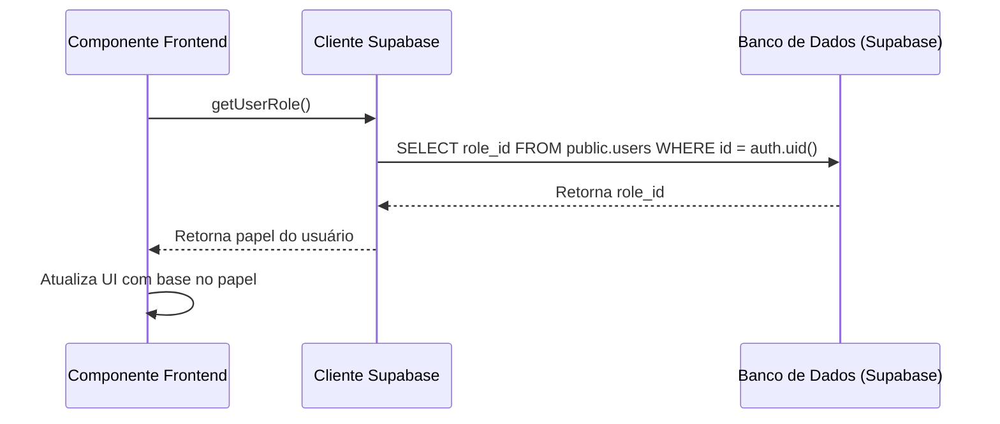

# Controle de Acesso por Papel

<cite>
**Arquivos Referenciados neste Documento**  
- [supabase/migrations/20250101000000_initial_schema_corrected.sql](file://supabase/migrations/20250101000000_initial_schema_corrected.sql)
- [supabase/migrations/20250101000001_rls_security_fix.sql](file://supabase/migrations/20250101000001_rls_security_fix.sql)
- [src/lib/supabase.ts](file://src/lib/supabase.ts)
</cite>

## Sumário
1. [Introdução](#introdução)
2. [Estrutura do Sistema RBAC](#estrutura-do-sistema-rbac)
3. [Definição de Papéis e Permissões](#definição-de-papéis-e-permissões)
4. [Políticas RLS para Controle de Acesso](#políticas-rls-para-controle-de-acesso)
5. [Verificação de Papel no Frontend](#verificação-de-papel-no-frontend)
6. [Boas Práticas para Gerenciamento de Acesso](#boas-práticas-para-gerenciamento-de-acesso)
7. [Conclusão](#conclusão)

## Introdução

O sistema de controle de acesso baseado em papéis (RBAC - Role-Based Access Control) no easyComand é um componente fundamental para a segurança e governança da aplicação. Este sistema garante que usuários com diferentes funções dentro de um estabelecimento (como proprietário, garçom ou cozinha) tenham acesso apenas aos dados e funcionalidades apropriadas ao seu papel. A implementação combina um modelo de banco de dados robusto com políticas de segurança do Supabase (RLS - Row Level Security) para criar um ambiente seguro e escalável. Este documento detalha a arquitetura, implementação e melhores práticas para este sistema crítico.

## Estrutura do Sistema RBAC

O sistema RBAC do easyComand é construído sobre três tabelas principais no esquema `public` do banco de dados: `roles`, `permissions` e `role_permissions`. Essas tabelas formam uma relação muitos-para-muitos que permite uma atribuição de permissões flexível e escalável aos papéis dos usuários.

```mermaid
erDiagram
ROLES {
integer id PK
varchar(255) name UK
text description
timestamptz created_at
timestamptz updated_at
}
PERMISSIONS {
integer id PK
varchar(255) name UK
text description
timestamptz created_at
timestamptz updated_at
}
ROLE_PERMISSIONS {
integer role_id FK
integer permission_id FK
timestamptz created_at
timestamptz updated_at
}
USERS {
uuid id PK
integer establishment_id FK
varchar(255) full_name
varchar(255) email
integer role_id FK
public.user_status status
timestamptz created_at
timestamptz updated_at
}
ROLES ||--o{ ROLE_PERMISSIONS : "possui"
PERMISSIONS ||--o{ ROLE_PERMISSIONS : "possui"
ROLES ||--o{ USERS : "atribuído_a"
```

**Diagram sources**
- [supabase/migrations/20250101000000_initial_schema_corrected.sql](file://supabase/migrations/20250101000000_initial_schema_corrected.sql#L57-L99)

**Section sources**
- [supabase/migrations/20250101000000_initial_schema_corrected.sql](file://supabase/migrations/20250101000000_initial_schema_corrected.sql#L57-L99)

A tabela `public.roles` armazena os diferentes papéis que podem existir dentro do sistema, como 'owner' (proprietário), 'waiter' (garçom) e 'kitchen' (cozinha). A tabela `public.permissions` define as permissões atômicas que podem ser concedidas, como "create_order" ou "update_product". A tabela de junção `public.role_permissions` estabelece qual permissão pertence a qual papel, permitindo que um papel tenha múltiplas permissões e que uma permissão seja compartilhada por múltiplos papéis. O usuário final, representado pela tabela `public.users`, possui um `role_id` que o vincula a um papel específico, herdando assim todas as permissões associadas a esse papel.

## Definição de Papéis e Permissões

Embora a definição exata dos papéis e suas permissões não esteja presente nos arquivos de migração analisados, a estrutura do banco de dados permite uma definição clara e escalável. Os papéis são definidos na tabela `public.roles` e suas permissões são atribuídas através da tabela `public.role_permissions`.

Com base na lógica de negócios comum em sistemas de gestão de restaurantes, podemos inferir um modelo típico de permissões:

| Papel (Role) | Permissões Associadas (Permissions) | Restrições |
| :--- | :--- | :--- |
| **Proprietário (owner)** | create_order, update_order, delete_order, create_product, update_product, delete_product, manage_users, view_financials | Acesso total a todas as funcionalidades do estabelecimento. |
| **Gerente (manager)** | create_order, update_order, delete_order, create_product, update_product, manage_users | Pode gerenciar produtos e usuários, mas pode ter restrições em relatórios financeiros. |
| **Garçom (waiter)** | create_order, update_order, view_menu | Pode criar e atualizar pedidos, mas não pode alterar produtos ou preços. |
| **Cozinha (kitchen)** | view_orders, update_order_status | Pode ver os pedidos e atualizar seu status (ex: "preparando", "pronto"), mas não pode criá-los ou alterar itens. |

A atribuição de permissões é feita inserindo registros na tabela `role_permissions`. Por exemplo, para conceder a permissão "create_order" ao papel "waiter", seria executado um comando SQL como `INSERT INTO public.role_permissions (role_id, permission_id) VALUES ((SELECT id FROM public.roles WHERE name = 'waiter'), (SELECT id FROM public.permissions WHERE name = 'create_order'));`. Este modelo evita o hardcoding de permissões no código da aplicação, permitindo que a política de acesso seja gerenciada diretamente no banco de dados.

## Políticas RLS para Controle de Acesso

O Supabase utiliza políticas de segurança em nível de linha (RLS) para garantir que as operações no banco de dados respeitem as regras de acesso definidas pelos papéis. As políticas RLS são definidas em cada tabela e são automaticamente aplicadas em todas as consultas, independentemente do cliente.

O sistema implementa duas camadas de segurança: isolamento por estabelecimento e controle por papel. A função `public.requesting_user_establishment_id()` é usada para garantir que um usuário só possa acessar dados do seu próprio estabelecimento. Para implementar o controle baseado em papel, funções como `auth.get_current_user_role_id()` são utilizadas nas cláusulas `USING` das políticas.

```mermaid
graph TD
A[Usuário Autenticado] --> B[Consulta ao Banco de Dados]
B --> C{RLS Aplicada?}
C --> |Sim| D[Verifica Estabelecimento]
D --> E[Verifica Papel do Usuário]
E --> F{Operação Permitida?}
F --> |Sim| G[Retorna Dados]
F --> |Não| H[Retorna Erro 403]
C --> |Não| I[Retorna Dados (Inseguro)]
```

**Diagram sources**
- [supabase/migrations/20250101000001_rls_security_fix.sql](file://supabase/migrations/20250101000001_rls_security_fix.sql#L1-L356)

**Section sources**
- [supabase/migrations/20250101000001_rls_security_fix.sql](file://supabase/migrations/20250101000001_rls_security_fix.sql#L1-L356)

Um exemplo claro está na política para a tabela `establishments`. A política de atualização (`FOR UPDATE`) exige que o usuário seja um administrador (papel com `role_id` <= 2, assumindo que 1=Proprietário e 2=Gerente) e que o estabelecimento pertença ao usuário:
```sql
CREATE POLICY "Admins can update their own establishment" ON public.establishments FOR UPDATE USING (id = auth.get_current_establishment_id() AND auth.get_current_user_role_id() <= 2);
```
Isso demonstra como o `role_id` é usado diretamente na política RLS para diferenciar entre um proprietário, que pode fazer qualquer alteração, e um garçom, que não pode alterar nenhuma informação do estabelecimento. Para tabelas como `products`, a política RLS geralmente se baseia apenas no `establishment_id`, mas a lógica de negócios no frontend ou em uma camada de API deve verificar o `role_id` antes de permitir operações de escrita.

## Verificação de Papel no Frontend

Embora o backend (através do RLS) seja a linha de defesa final, o frontend deve verificar o papel do usuário para fornecer uma experiência de usuário adequada, como ocultar botões de ação que o usuário não tem permissão para usar.

O componente frontend pode obter o `role_id` do usuário autenticado fazendo uma consulta à tabela `public.users` usando o cliente Supabase. O cliente é inicializado no arquivo `src/lib/supabase.ts` e exportado para uso em toda a aplicação.



**Diagram sources**
- [src/lib/supabase.ts](file://src/lib/supabase.ts#L1-L10)

**Section sources**
- [src/lib/supabase.ts](file://src/lib/supabase.ts#L1-L10)

Após a autenticação, o componente pode chamar uma função assíncrona para buscar o `role_id` do usuário atual. Com base nesse valor, o componente pode renderizar condicionalmente elementos da interface. Por exemplo, um botão "Editar Produto" só seria exibido se o `role_id` do usuário for 1 (proprietário) ou 2 (gerente). É crucial lembrar que esta verificação no frontend é apenas para melhorar a UX; a segurança real reside nas políticas RLS do backend, que impedirão a operação mesmo se o usuário tentar contornar a interface.

## Boas Práticas para Gerenciamento de Acesso

Para garantir a segurança e a manutenibilidade do sistema RBAC, algumas boas práticas devem ser seguidas:

1.  **Evitar Hardcoding de IDs de Papel:** Nunca use valores numéricos como `role_id = 1` diretamente no código do frontend ou em políticas RLS complexas. Em vez disso, crie constantes nomeadas (ex: `const ROLE_OWNER = 1;`) ou, idealmente, use os nomes dos papéis (`role.name = 'owner'`) em consultas. Isso torna o código mais legível e menos suscetível a erros se os IDs forem reorganizados.

2.  **Gerenciar Permissões no Banco de Dados:** Atribua permissões aos papéis diretamente no banco de dados, preferencialmente através de scripts de migração. Isso centraliza o controle de acesso e permite que mudanças na política de segurança sejam versionadas junto com o código.

3.  **Princípio do Menor Privilégio:** Conceda a cada papel apenas as permissões mínimas necessárias para executar suas funções. Um garçom não precisa da permissão para excluir um produto, por exemplo.

4.  **Auditoria e Logs:** Mantenha um log de atividades do usuário (`user_activity_log`) que registre ações críticas, incluindo o `role_id` do usuário que realizou a ação. Isso é essencial para auditoria e rastreamento de problemas.

5.  **Testes de Segurança:** Implemente testes automatizados que verifiquem se as políticas RLS estão funcionando corretamente, garantindo que um usuário com um papel específico não possa acessar dados ou executar operações para as quais não tem permissão.

## Conclusão

O sistema de controle de acesso por papel no easyComand é uma arquitetura robusta que combina um modelo de banco de dados flexível com as poderosas políticas de segurança do Supabase. Ao separar claramente papéis e permissões e aplicar as regras de acesso diretamente no nível do banco de dados com RLS, o sistema garante uma governança de segurança eficaz. O frontend complementa esse sistema ao fornecer uma experiência de usuário contextualizada, mas sempre confiando no backend como a autoridade final. A adesão às boas práticas, como evitar hardcoding e seguir o princípio do menor privilégio, é crucial para manter a integridade e a segurança do sistema à medida que ele evolui.