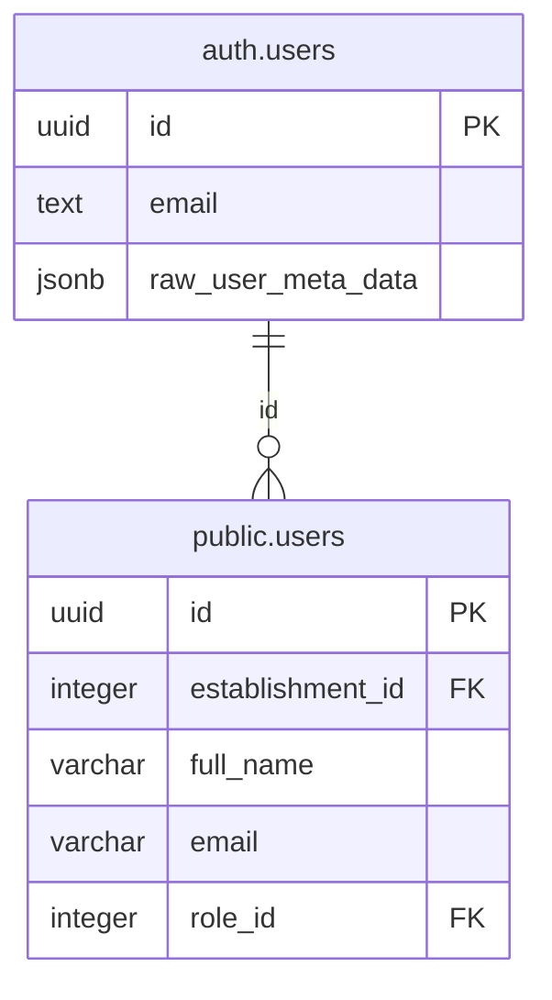

# Sincronização de Usuários

<cite>
**Arquivos Referenciados neste Documento**   
- [supabase/migrations/20250101000000_initial_schema.sql](file://supabase/migrations/20250101000000_initial_schema.sql)
- [supabase/migrations/20250101000000_initial_schema_corrected.sql](file://supabase/migrations/20250101000000_initial_schema_corrected.sql)
- [supabase/migrations/20250101000001_initial_schema_fixed.sql](file://supabase/migrations/20250101000001_initial_schema_fixed.sql)
- [supabase/migrations/20250101000001_rls_security_fix.sql](file://supabase/migrations/20250101000001_rls_security_fix.sql)
- [src/lib/supabase.ts](file://src/lib/supabase.ts)
</cite>

## Sumário
1. [Introdução](#introdução)
2. [Arquitetura de Sincronização](#arquitetura-de-sincronização)
3. [Função `handle_new_user()`](#função-handle_new_user)
4. [Trigger `on_auth_user_created`](#trigger-on_auth_user_created)
5. [Segurança e Execução](#segurança-e-execução)
6. [Integridade Referencial](#integridade-referencial)
7. [Acesso no Frontend](#acesso-no-frontend)
8. [Tratamento de Falhas](#tratamento-de-falhas)
9. [Conclusão](#conclusão)

## Introdução

Este documento detalha o mecanismo de sincronização entre o sistema de autenticação do Supabase (`auth.users`) e a tabela de perfis do aplicativo (`public.users`). Este processo é fundamental para a operação multi-inquilino do sistema, garantindo que cada novo usuário autenticado tenha automaticamente um perfil criado no esquema público, permitindo o acesso seguro e isolado aos dados do seu estabelecimento. A sincronização é realizada de forma automática e segura utilizando funções e triggers do PostgreSQL.

**Seção fontes**
- [supabase/migrations/20250101000000_initial_schema.sql](file://supabase/migrations/20250101000000_initial_schema.sql#L413-L437)
- [supabase/migrations/20250101000000_initial_schema_corrected.sql](file://supabase/migrations/20250101000000_initial_schema_corrected.sql#L649-L684)

## Arquitetura de Sincronização

O mecanismo de sincronização é baseado em uma arquitetura reativa que utiliza um trigger do PostgreSQL. Quando um novo usuário se cadastra no sistema de autenticação do Supabase, um evento `INSERT` ocorre na tabela `auth.users`. Um trigger, nomeado `on_auth_user_created`, é acionado imediatamente após essa inserção. Esse trigger executa uma função PL/pgSQL chamada `handle_new_user()`, que é responsável por inserir um novo registro na tabela `public.users`, copiando os dados essenciais do novo usuário.

Este design evita a necessidade de uma chave estrangeira direta entre `public.users` e `auth.users`, o que poderia causar problemas de permissão, pois o esquema `auth` é protegido. Em vez disso, a sincronização é feita de forma programática e segura, mantendo a integridade dos dados.

```mermaid
flowchart TD
A[Novo Cadastro no Supabase Auth] --> B[Inserção em auth.users]
B --> C[Trigger on_auth_user_created Acionado]
C --> D[Execução da Função handle_new_user()]
D --> E[Criação de Registro em public.users]
E --> F[Perfil do Usuário Sincronizado]
```

**Diagrama fontes**
- [supabase/migrations/20250101000000_initial_schema.sql](file://supabase/migrations/20250101000000_initial_schema.sql#L413-L437)
- [supabase/migrations/20250101000001_initial_schema_fixed.sql](file://supabase/migrations/20250101000001_initial_schema_fixed.sql#L419-L437)

**Seção fontes**
- [supabase/migrations/20250101000000_initial_schema.sql](file://supabase/migrations/20250101000000_initial_schema.sql#L413-L437)
- [supabase/migrations/20250101000001_initial_schema_fixed.sql](file://supabase/migrations/20250101000001_initial_schema_fixed.sql#L419-L437)

## Função `handle_new_user()`

A função `handle_new_user()` é uma função PL/pgSQL definida no esquema `public` que é executada sempre que um novo usuário é criado. Ela recebe o novo registro inserido em `auth.users` como parâmetro (referenciado como `new`) e extrai os dados necessários para criar um perfil no esquema público.

A função realiza uma operação `INSERT` na tabela `public.users`, utilizando os seguintes campos do registro `new`:
- `id`: O UUID único do usuário, que é copiado diretamente de `auth.users`.
- `email`: O endereço de e-mail do usuário, também copiado diretamente.
- `full_name`: O nome completo do usuário, extraído do campo `raw_user_meta_data` do registro `new`. Este campo é um JSONB que armazena metadados fornecidos durante o cadastro.

A função também extrai os campos `establishment_id` e `role_id` do `raw_user_meta_data`, permitindo que o novo usuário seja automaticamente associado a um estabelecimento e a uma função específica no momento do cadastro.

**Seção fontes**
- [supabase/migrations/20250101000000_initial_schema.sql](file://supabase/migrations/20250101000000_initial_schema.sql#L413-L425)
- [supabase/migrations/20250101000001_initial_schema_fixed.sql](file://supabase/migrations/20250101000001_initial_schema_fixed.sql#L419-L432)

## Trigger `on_auth_user_created`

O trigger `on_auth_user_created` é o componente que conecta o sistema de autenticação ao esquema de dados do aplicativo. Ele é definido na tabela `auth.users` com as seguintes características:
- **Evento**: `AFTER INSERT` - Garante que a função seja executada somente após a inserção no `auth.users` ser concluída com sucesso.
- **Nível**: `FOR EACH ROW` - A função é executada uma vez para cada nova linha inserida.
- **Procedimento**: `EXECUTE PROCEDURE public.handle_new_user()` - Especifica qual função deve ser chamada.

A criação do trigger é feita com um `DROP TRIGGER IF EXISTS` prévio para garantir que não haja conflitos se o script for executado mais de uma vez.

**Seção fontes**
- [supabase/migrations/20250101000000_initial_schema.sql](file://supabase/migrations/20250101000000_initial_schema.sql#L426-L437)
- [supabase/migrations/20250101000001_initial_schema_fixed.sql](file://supabase/migrations/20250101000001_initial_schema_fixed.sql#L434-L437)

## Segurança e Execução

A função `handle_new_user()` é definida com duas cláusulas de segurança críticas:
- **`SECURITY DEFINER`**: Esta cláusula permite que a função seja executada com os privilégios do seu proprietário (geralmente um superusuário), e não com os privilégios do usuário que a invocou. Isso é essencial porque o usuário que se cadastra não teria permissão para inserir dados diretamente na tabela `public.users`.
- **`SET search_path = public`**: Esta cláusula define explicitamente o caminho de busca para o esquema `public`. Isso é uma medida de segurança importante para prevenir ataques de injeção de esquema, garantindo que todos os comandos dentro da função se refiram a objetos no esquema `public` e não em esquemas potencialmente maliciosos.

Essas configurações garantem que a função seja executada de forma segura e confiável, independentemente do contexto do usuário.

**Seção fontes**
- [supabase/migrations/20250101000000_initial_schema.sql](file://supabase/migrations/20250101000000_initial_schema.sql#L413-L415)
- [supabase/migrations/20250101000001_initial_schema_fixed.sql](file://supabase/migrations/20250101000001_initial_schema_fixed.sql#L419-L421)

## Integridade Referencial

A integridade referencial entre `auth.users` e `public.users` é mantida através do campo `id` do tipo UUID. Este campo é a chave primária em ambas as tabelas e contém o mesmo valor exclusivo para cada usuário. Quando um novo usuário é criado, o Supabase gera um UUID que é armazenado em `auth.users.id`. A função `handle_new_user()` copia esse mesmo UUID para `public.users.id`.

Essa abordagem permite que o frontend e as funções do backend usem o `auth.uid()` (que retorna o UUID do usuário autenticado) para consultar diretamente a tabela `public.users` e recuperar informações do perfil do usuário, como seu nome completo, função e estabelecimento associado, garantindo uma experiência de usuário coesa e segura.



**Diagrama fontes**
- [supabase/migrations/20250101000000_initial_schema.sql](file://supabase/migrations/20250101000000_initial_schema.sql#L114-L140)
- [supabase/migrations/20250101000000_initial_schema_corrected.sql](file://supabase/migrations/20250101000000_initial_schema_corrected.sql#L126-L156)

**Seção fontes**
- [supabase/migrations/20250101000000_initial_schema.sql](file://supabase/migrations/20250101000000_initial_schema.sql#L114-L140)
- [supabase/migrations/20250101000000_initial_schema_corrected.sql](file://supabase/migrations/20250101000000_initial_schema_corrected.sql#L126-L156)

## Acesso no Frontend

O frontend do aplicativo, localizado em `src/lib/supabase.ts`, utiliza a biblioteca `@supabase/supabase-js` para se conectar ao banco de dados. Após um usuário se autenticar, o frontend pode acessar o perfil do usuário no esquema `public` usando o `auth.uid()`. Por exemplo, uma consulta para obter o nome completo do usuário autenticado seria feita diretamente na tabela `public.users` usando o `id` do usuário como filtro. Isso é possível graças à sincronização automática garantida pelo trigger e pela função `handle_new_user()`.

**Seção fontes**
- [src/lib/supabase.ts](file://src/lib/supabase.ts#L1-L11)

## Tratamento de Falhas

Uma possível falha no mecanismo de sincronização ocorre se os metadados necessários (como `full_name`, `establishment_id`, `role_id`) não forem fornecidos durante o processo de cadastro. Nesse caso, os campos correspondentes na tabela `public.users` serão `NULL`, o que pode levar a erros de validação ou comportamentos inesperados no aplicativo.

Para tratar essa falha, o frontend deve garantir que todos os metadados obrigatórios sejam enviados durante a chamada `signUp`. Além disso, o backend pode implementar validações adicionais na função `handle_new_user()` para verificar a presença desses campos e, se necessário, lançar um erro que impeça a criação do perfil até que os dados estejam completos. A tabela `public.users` foi projetada com campos `NOT NULL` para `full_name`, `email`, `establishment_id` e `role_id` para forçar essa integridade de dados.

**Seção fontes**
- [supabase/migrations/20250101000000_initial_schema_corrected.sql](file://supabase/migrations/20250101000000_initial_schema_corrected.sql#L126-L156)
- [supabase/migrations/20250101000001_initial_schema_fixed.sql](file://supabase/migrations/20250101000001_initial_schema_fixed.sql#L169-L206)

## Conclusão

O mecanismo de sincronização entre `auth.users` e `public.users` é um componente crítico e bem projetado da arquitetura do sistema. Ele combina a robustez do sistema de autenticação do Supabase com a flexibilidade do esquema de dados personalizado, permitindo uma gestão eficaz de usuários em um ambiente multi-inquilino. O uso de uma função PL/pgSQL com `SECURITY DEFINER` e um trigger `AFTER INSERT` garante que a criação de perfis seja automática, segura e confiável. Todos os desenvolvedores devem compreender este mecanismo para garantir a integridade dos dados e a segurança do sistema.