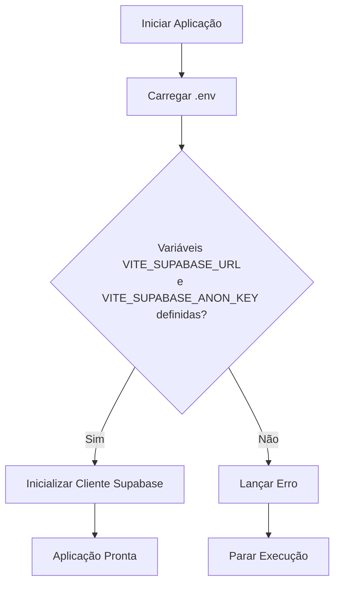

# Configuração de Ambiente

<cite>
**Arquivos Referenciados neste Documento**  
- [README.md](file://README.md)
- [src/lib/supabase.ts](file://src/lib/supabase.ts)
- [netlify.toml](file://netlify.toml)
- [package.json](file://package.json)
</cite>

## Sumário
1. [Introdução](#introdução)
2. [Estrutura do Projeto](#estrutura-do-projeto)
3. [Configuração de Variáveis de Ambiente](#configuração-de-variáveis-de-ambiente)
4. [Processo de Instalação](#processo-de-instalação)
5. [Integração com Supabase](#integração-com-supabase)
6. [Implantação no Netlify](#implantação-no-netlify)
7. [Solução de Problemas Comuns](#solução-de-problemas-comuns)
8. [Conclusão](#conclusão)

## Introdução

Este guia fornece instruções detalhadas para configurar o ambiente de desenvolvimento do projeto **easyComand**, um sistema de gestão para restaurantes e bares. O foco está em preparar o ambiente local, configurar corretamente as variáveis de ambiente para integração com o Supabase, e garantir que o projeto possa ser executado e implantado com sucesso. O documento é voltado para desenvolvedores que desejam iniciar rapidamente com o projeto, evitando armadilhas comuns.

## Estrutura do Projeto

O projeto easyComand é uma aplicação frontend moderna baseada em React com Vite, TypeScript e Tailwind CSS. Ele utiliza o Supabase como backend para autenticação, banco de dados e armazenamento. A estrutura de diretórios é organizada de forma clara:

- `src/`: Contém todo o código-fonte da aplicação.
  - `lib/`: Bibliotecas e utilitários, incluindo a integração com o Supabase.
  - `App.tsx`, `main.tsx`: Ponto de entrada da aplicação.
- `supabase/migrations/`: Scripts SQL para definir e atualizar o esquema do banco de dados no Supabase.
- Arquivos de configuração principais: `vite.config.ts`, `tailwind.config.js`, `tsconfig.json`.
- `package.json`: Define os scripts de desenvolvimento, build e as dependências do projeto.
- `netlify.toml`: Configurações para implantação no Netlify.

**Section sources**
- [README.md](file://README.md#L1-L9)

## Configuração de Variáveis de Ambiente

Para que a aplicação se comunique com o Supabase, é necessário configurar as variáveis de ambiente. O Vite, utilizado como bundler, carrega automaticamente variáveis do arquivo `.env` e as expõe via `import.meta.env`.

### Criando o Arquivo .env

Como o arquivo `.env` não está presente no repositório (por razões de segurança), você deve criá-lo com base nas variáveis esperadas pelo código.

1. Crie um arquivo chamado `.env` na raiz do projeto.
2. Adicione as seguintes linhas, substituindo os valores pelos do seu projeto Supabase:

```env
VITE_SUPABASE_URL=seu_supabase_url_aqui
VITE_SUPABASE_ANON_KEY=sua_chave_anonima_aqui
```

> **Importante**: O prefixo `VITE_` é obrigatório para que o Vite exponha a variável ao código da aplicação.

### Validação no Código

O arquivo `src/lib/supabase.ts` demonstra como essas variáveis são utilizadas e validadas:

```ts
const supabaseUrl = import.meta.env.VITE_SUPABASE_URL
const supabaseAnonKey = import.meta.env.VITE_SUPABASE_ANON_KEY

if (!supabaseUrl || !supabaseAnonKey) {
  throw new Error("Supabase URL and Anon Key must be defined in .env file");
}
```

Se qualquer uma das variáveis não estiver definida, a aplicação lançará um erro claro, facilitando a identificação do problema.

**Diagram sources**
- [src/lib/supabase.ts](file://src/lib/supabase.ts#L2-L9)



**Section sources**
- [src/lib/supabase.ts](file://src/lib/supabase.ts#L1-L10)

## Processo de Instalação

Siga os passos abaixo para configurar o ambiente local:

1. **Clone o repositório**:
   ```bash
   git clone <url-do-repositorio-easyComand>
   cd easyComand
   ```

2. **Instale as dependências**:
   ```bash
   npm install
   ```
   Este comando lê o `package.json` e instala todas as dependências listadas, incluindo `@supabase/supabase-js` e as bibliotecas do React.

3. **Configure as variáveis de ambiente**:
   Siga as instruções na seção anterior para criar o arquivo `.env`.

4. **Inicie o servidor de desenvolvimento**:
   ```bash
   npm run dev
   ```
   Este comando executa o script `dev` definido no `package.json`, que inicia o Vite. O servidor estará disponível em `http://localhost:3000`.

**Section sources**
- [README.md](file://README.md#L1-L9)
- [package.json](file://package.json#L6-L10)

## Integração com Supabase

A integração com o Supabase é feita de forma direta e segura.

### Supabase Local vs. Remoto

- **Remoto**: Use as credenciais do seu projeto no painel do Supabase (https://supabase.com/dashboard). O `SUPABASE_URL` é o URL do seu projeto, e o `SUPABASE_ANON_KEY` está em `Settings > API`.
- **Local**: Se estiver usando o Supabase local com `supabase start`, o URL será `http://localhost:54321` e a chave anônima pode ser encontrada no terminal ou no arquivo de configuração do Docker.

### Inicialização do Cliente

O cliente Supabase é inicializado uma única vez em `src/lib/supabase.ts` e exportado como um objeto singleton. Isso garante que toda a aplicação use a mesma instância, otimizando conexões e mantendo o estado de autenticação.

```ts
export const supabase = createClient(supabaseUrl, supabaseAnonKey)
```

Este cliente pode ser importado em qualquer componente para realizar operações no banco de dados, autenticação, etc.

**Section sources**
- [src/lib/supabase.ts](file://src/lib/supabase.ts#L1-L10)

## Implantação no Netlify

O arquivo `netlify.toml` configura automaticamente a implantação no Netlify.

### Configuração do netlify.toml

```toml
[build]
  command = "npm install && npm run build"
  publish = "dist"
  base = "/"
  ignore = "false"
  force = "true"

[build.environment]
  NODE_VERSION = "18"
  CI = "true"
  NETLIFY_BUILD_SKIP = "false"
```

- `command`: Define o comando de build, que instala dependências e gera a versão de produção.
- `publish`: Diretório de saída do build (gerado pelo Vite).
- `NODE_VERSION`: Garante que o ambiente de build use Node.js 18.

### Variáveis de Ambiente no Netlify

As mesmas variáveis de ambiente (`VITE_SUPABASE_URL`, `VITE_SUPABASE_ANON_KEY`) devem ser definidas no painel do Netlify em **Site settings > Build & deploy > Environment**. O Netlify as injetará durante o processo de build.

**Section sources**
- [netlify.toml](file://netlify.toml#L1-L18)

## Solução de Problemas Comuns

### Variáveis de Ambiente Não Carregadas

**Sintoma**: Erro "Supabase URL and Anon Key must be defined in .env file".

**Soluções**:
1. Verifique se o arquivo `.env` está na raiz do projeto.
2. Confirme que os nomes das variáveis estão corretos e com o prefixo `VITE_`.
3. Reinicie o servidor de desenvolvimento após alterar o `.env`.
4. Certifique-se de que o arquivo não tem extensão (como `.env.txt`).

### Erros de Conexão com o Supabase

**Sintoma**: Requisições falham com erro de rede ou 401.

**Soluções**:
1. Verifique se o `SUPABASE_URL` está correto (sem `/` no final).
2. Confirme que o `SUPABASE_ANON_KEY` é o correto e não foi revogado.
3. Se usando Supabase local, verifique se o serviço está em execução (`supabase status`).
4. Teste o URL e a chave com uma ferramenta como `curl` ou Postman.

### Build Falhando no Netlify

**Sintoma**: Erro durante o comando `npm run build`.

**Soluções**:
1. Verifique se as variáveis de ambiente estão definidas no painel do Netlify.
2. Confirme que a versão do Node.js no Netlify (`NODE_VERSION`) é compatível com o projeto.
3. Execute `npm run build` localmente para reproduzir o erro.

**Section sources**
- [src/lib/supabase.ts](file://src/lib/supabase.ts#L5-L7)

## Conclusão

A configuração do ambiente para o easyComand é um processo simples e bem definido. Ao seguir este guia, qualquer desenvolvedor pode clonar o repositório, configurar as variáveis de ambiente, iniciar o servidor de desenvolvimento e implantar a aplicação no Netlify em minutos. A chave para o sucesso está na correta configuração das variáveis `VITE_SUPABASE_URL` e `VITE_SUPABASE_ANON_KEY`, que são essenciais para a integração com o Supabase. Sempre que enfrentar problemas, verifique primeiro as variáveis de ambiente e a conectividade com o Supabase.