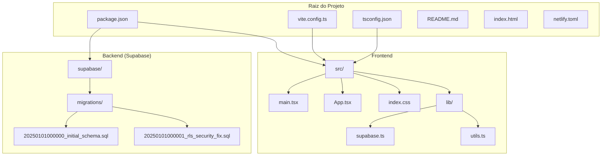

# Estrutura de Diretórios

<cite>
**Arquivos Referenciados neste Documento**  
- [src/main.tsx](file://src/main.tsx)
- [src/App.tsx](file://src/App.tsx)
- [src/lib/supabase.ts](file://src/lib/supabase.ts)
- [vite.config.ts](file://vite.config.ts)
- [tsconfig.json](file://tsconfig.json)
- [supabase/migrations/20250101000000_initial_schema.sql](file://supabase/migrations/20250101000000_initial_schema.sql)
- [README.md](file://README.md)
</cite>

## Sumário
1. [Introdução](#introdução)
2. [Estrutura Geral do Projeto](#estrutura-geral-do-projeto)
3. [Frontend (src/)](#frontend-src)
4. [Utilitários e Configuração (src/lib/)](#utilitários-e-configuração-srclib)
5. [Migrações do Banco de Dados (supabase/migrations/)](#migrações-do-banco-de-dados-supabasemigrations)
6. [Configuração do Projeto (vite.config.ts e tsconfig.json)](#configuração-do-projeto-viteconfigts-e-tsconfigjson)
7. [Fluxo de Trabalho para Novos Componentes e Migrações](#fluxo-de-trabalho-para-novos-componentes-e-migrações)
8. [Organização Lógica entre Frontend, Backend e Configuração](#organização-lógica-entre-frontend-backend-e-configuração)
9. [Conclusão](#conclusão)

## Introdução

Este documento fornece uma análise detalhada da estrutura de diretórios do projeto **easyComand**, um sistema de gestão para restaurantes e bares. O objetivo é orientar novos desenvolvedores na navegação do código, compreensão da separação de responsabilidades e adoção das práticas de desenvolvimento estabelecidas. A arquitetura do projeto é claramente dividida em três grandes domínios: frontend (React), configuração de infraestrutura (Supabase) e configuração de build (Vite e TypeScript). Esta documentação explica o propósito de cada diretório e arquivo principal, destacando os pontos de entrada, mecanismos de configuração e fluxos de trabalho recomendados.

**Section sources**
- [README.md](file://README.md#L1-L9)

## Estrutura Geral do Projeto

A estrutura do projeto easyComand é organizada de forma modular e intuitiva, facilitando a localização de componentes, configurações e scripts. A raiz do projeto contém arquivos de configuração essenciais, enquanto os códigos-fonte e as migrações do banco de dados são separados em diretórios dedicados.

**Diagram sources**
- [README.md](file://README.md#L1-L9)
- [package.json](file://package.json#L1-L47)

## Frontend (src/)

O diretório `src/` é o coração do frontend da aplicação, implementado com React e TypeScript. Ele contém todos os componentes visuais, rotas e o ponto de entrada da aplicação.

### Ponto de Entrada: main.tsx

O arquivo `main.tsx` é o ponto de entrada principal da aplicação React. Ele é responsável por montar a aplicação no DOM, configurando os provedores globais necessários para o funcionamento do sistema. Ele importa e utiliza o `BrowserRouter` do `react-router-dom` para habilitar o roteamento baseado em cliente, permitindo navegação sem recarregar a página. Além disso, ele configura o `QueryClientProvider` do `@tanstack/react-query`, que é uma biblioteca essencial para gerenciar, armazenar em cache e sincronizar dados assíncronos (como chamadas à API do Supabase) de forma eficiente. A combinação desses provedores envolve todo o aplicativo (`<App />`) em um ambiente onde o roteamento e a gestão de estado de dados são centralizados.

**Section sources**
- [src/main.tsx](file://src/main.tsx#L1-L19)

### Definição de Rotas: App.tsx

O arquivo `App.tsx` define a estrutura de rotas da aplicação utilizando o componente `Routes` e `Route` do `react-router-dom`. Atualmente, ele configura uma rota raiz (`/`) que renderiza um componente `Home`. Este componente exibe uma mensagem de boas-vindas e indica que a estrutura do projeto foi configurada com sucesso, servindo como um marcador inicial para o desenvolvimento. As demais rotas, como Login, Dashboard e páginas específicas de gestão, devem ser adicionadas neste arquivo conforme o projeto evolui. Este arquivo é o centro de controle para a navegação entre as diferentes telas da aplicação.

**Section sources**
- [src/App.tsx](file://src/App.tsx#L1-L31)

## Utilitários e Configuração (src/lib/)

O diretório `src/lib/` serve como um repositório para código de utilidade geral e configurações que não são específicas de um único componente, mas são utilizados em vários pontos da aplicação.

### Configuração do Supabase: supabase.ts

O arquivo `supabase.ts` é crucial para a integração com o backend. Ele cria uma instância do cliente Supabase utilizando a URL e a chave anônima fornecidas pelas variáveis de ambiente (`VITE_SUPABASE_URL` e `VITE_SUPABASE_ANON_KEY`). O código inclui uma verificação de segurança que lança um erro caso essas variáveis não estejam definidas, garantindo que a aplicação não inicie com uma configuração de banco de dados inválida. A instância exportada (`supabase`) pode ser importada em qualquer componente do frontend para realizar operações de leitura e gravação no banco de dados, sempre respeitando as políticas de segurança definidas no backend.

**Section sources**
- [src/lib/supabase.ts](file://src/lib/supabase.ts#L1-L11)

## Migrações do Banco de Dados (supabase/migrations/)

O diretório `supabase/migrations/` contém scripts SQL que definem a evolução do esquema do banco de dados. Cada arquivo representa uma migração, nomeado com um prefixo de timestamp para garantir a execução na ordem correta.

### Esquema Inicial e Segurança: initial_schema.sql

O arquivo `20250101000000_initial_schema.sql` é a migração principal que estabelece a estrutura completa do banco de dados para o sistema de gestão. Ele realiza as seguintes ações principais:

1.  **Criação de Tipos e Tabelas:** Define `ENUM`s para campos padronizados (como status, tipos de pagamento) e cria todas as tabelas necessárias, como `establishments`, `users`, `products`, `orders`, `customers`, entre outras. As tabelas são categorizadas em globais (acessíveis a todos os estabelecimentos) e específicas de inquilino (tenant-specific), onde cada estabelecimento tem seus próprios dados isolados.
2.  **Segurança (RLS - Row Level Security):** Habilita a RLS em todas as tabelas específicas de inquilino. Isso é fundamental para a arquitetura multi-inquilino, pois garante que um usuário de um estabelecimento só possa acessar dados do seu próprio estabelecimento. As políticas de RLS são definidas usando uma função `get_my_establishment_id()` que consulta o perfil do usuário autenticado.
3.  **Triggers:** Implementa um trigger `on_auth_user_created` que é acionado após um novo usuário se registrar no sistema de autenticação do Supabase. Esse trigger automaticamente cria um registro correspondente na tabela `public.users`, sincronizando os dados de autenticação com o perfil do usuário na aplicação.

Este arquivo é a fonte da verdade para a estrutura de dados e as regras de segurança do backend.

**Section sources**
- [supabase/migrations/20250101000000_initial_schema.sql](file://supabase/migrations/20250101000000_initial_schema.sql#L1-L506)

## Configuração do Projeto (vite.config.ts e tsconfig.json)

Esses arquivos configuram o ambiente de desenvolvimento e build da aplicação, melhorando a produtividade dos desenvolvedores.

### Aliases de Importação: vite.config.ts e tsconfig.json

Ambos os arquivos são configurados para habilitar aliases de importação absolutos, um recurso que simplifica significativamente os caminhos de importação no código.

-   **vite.config.ts:** Define um alias `@` que aponta para o diretório `./src`. Isso é feito na configuração do `resolve.alias` do Vite, o bundler utilizado.
-   **tsconfig.json:** Repete essa configuração na seção `compilerOptions.paths`, informando ao compilador TypeScript que o alias `@/*` deve ser resolvido para `./src/*`.

Com essa configuração, um desenvolvedor pode importar um componente de qualquer lugar no projeto usando um caminho como `import Header from '@/components/Header'`, em vez do caminho relativo complexo `../../../components/Header`. Isso torna o código mais limpo, legível e menos propenso a erros ao mover arquivos.

**Section sources**
- [vite.config.ts](file://vite.config.ts#L1-L14)
- [tsconfig.json](file://tsconfig.json#L1-L34)

## Fluxo de Trabalho para Novos Componentes e Migrações

Este documento também serve como um guia prático para adicionar novos elementos ao projeto.

### Adicionando um Novo Componente

1.  **Crie o Arquivo:** Dentro do diretório `src/`, crie um novo arquivo com extensão `.tsx` (por exemplo, `Login.tsx`).
2.  **Defina o Componente:** Implemente o componente React funcional ou de classe.
3.  **Importe com Alias:** Utilize o alias `@` para importar outros módulos. Por exemplo, `import { Button } from '@/components/ui/button'`.
4.  **Adicione à Rota:** Abra o arquivo `src/App.tsx` e adicione uma nova rota `<Route path="/login" element={<Login />} />` dentro do componente `Routes`.

### Criando uma Nova Migração

1.  **Gere o Script:** Utilize a CLI do Supabase para gerar um novo arquivo de migração com um nome descritivo (por exemplo, `supabase migration new add_discounts_table`).
2.  **Edite o SQL:** No novo arquivo `.sql` criado em `supabase/migrations/`, escreva as instruções SQL para alterar o esquema (CREATE, ALTER, DROP).
3.  **Considere a RLS:** Se a nova tabela for específica de inquilino, lembre-se de habilitar a RLS e definir as políticas apropriadas para garantir a isolamento de dados.
4.  **Aplique a Migração:** Execute `supabase db push` para aplicar as mudanças ao banco de dados local de desenvolvimento.

## Organização Lógica entre Frontend, Backend e Configuração

A estrutura do easyComand demonstra uma separação de responsabilidades clara e eficaz:

-   **Frontend (`src/`):** Responsável pela interface do usuário, interação com o usuário e chamadas à API. Utiliza React, TypeScript e Tailwind CSS.
-   **Backend (`supabase/migrations/`):** Define a lógica de dados, integridade e segurança no nível do banco de dados. O Supabase atua como o backend, com o esquema e as políticas de segurança sendo geridos por migrações SQL.
-   **Configuração (`vite.config.ts`, `tsconfig.json`, `package.json`):** Gerencia as ferramentas de build, dependências do projeto e configurações de desenvolvimento, atuando como a cola que une o frontend e o backend.

Essa divisão permite que equipes diferentes trabalhem em diferentes camadas do sistema com um acoplamento mínimo, facilitando a manutenção e a escalabilidade.

## Conclusão

A estrutura de diretórios do easyComand é bem projetada, promovendo organização, escalabilidade e facilidade de manutenção. A separação clara entre frontend, configuração de banco de dados e configuração de build, combinada com práticas modernas como aliases de importação e migrações versionadas, cria um ambiente de desenvolvimento robusto. Este documento fornece uma base sólida para novos desenvolvedores entenderem a arquitetura do projeto e começarem a contribuir de forma eficaz.