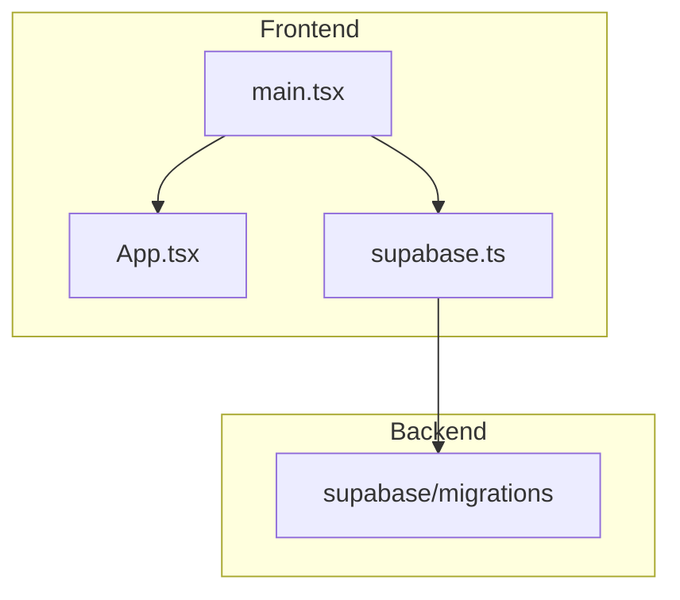
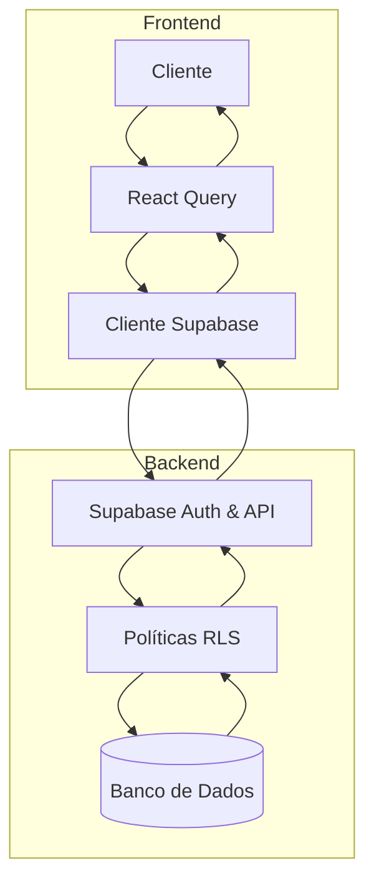
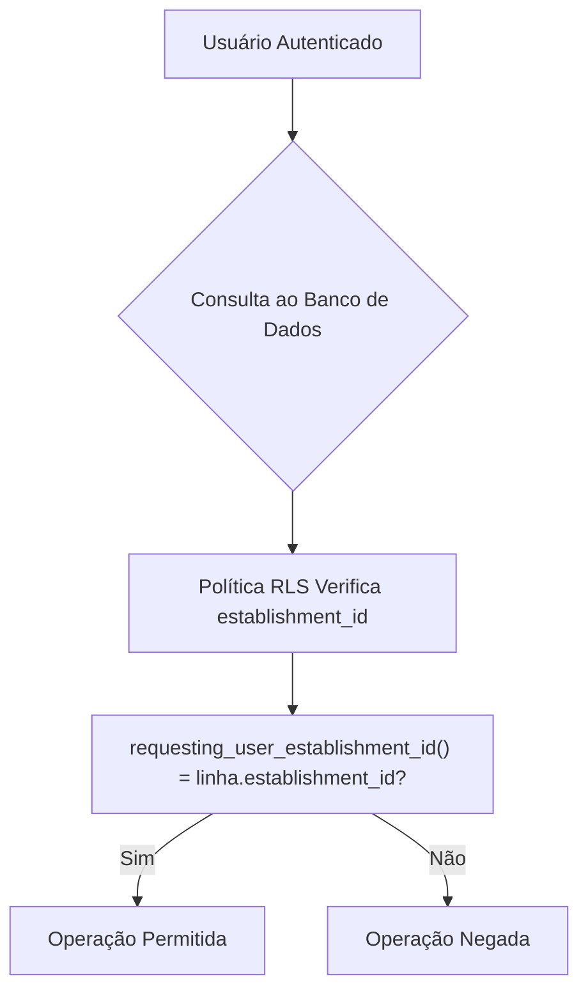
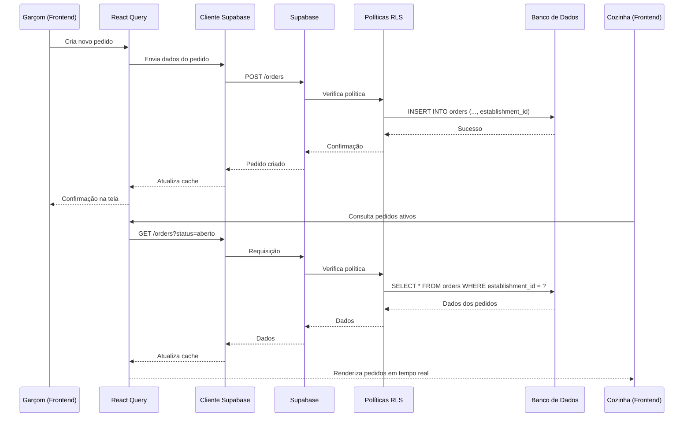
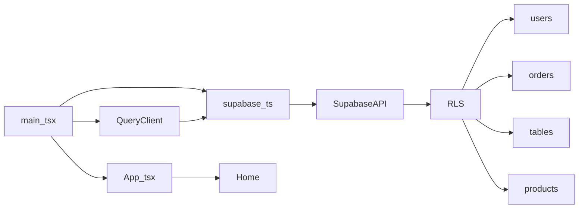

# Fluxo de Dados

<cite>
**Arquivos Referenciados neste Documento**   
- [main.tsx](file://src/main.tsx)
- [App.tsx](file://src/App.tsx)
- [supabase.ts](file://src/lib/supabase.ts)
- [20250101000000_initial_schema.sql](file://supabase/migrations/20250101000000_initial_schema.sql)
- [20250101000001_rls_security_fix.sql](file://supabase/migrations/20250101000001_rls_security_fix.sql)
</cite>

## Sumário
1. [Introdução](#introdução)
2. [Estrutura do Projeto](#estrutura-do-projeto)
3. [Componentes Principais](#componentes-principais)
4. [Visão Geral da Arquitetura](#visão-geral-da-arquitetura)
5. [Análise Detalhada do Fluxo de Dados](#análise-detalhada-do-fluxo-de-dados)
6. [Análise de Dependências](#análise-de-dependências)
7. [Considerações de Desempenho](#considerações-de-desempenho)
8. [Guia de Solução de Problemas](#guia-de-solução-de-problemas)
9. [Conclusão](#conclusão)

## Introdução

Este documento detalha o fluxo de dados no sistema easyComand, uma aplicação de gestão para restaurantes e bares. O foco está na integração entre o frontend React, o banco de dados Supabase e os mecanismos de segurança que garantem a correta segregação de dados entre diferentes estabelecimentos. O documento descreve o caminho completo dos dados, desde a inicialização da aplicação até a visualização em tempo real por diferentes usuários, destacando o papel crítico das políticas de segurança RLS (Row Level Security) e do cache do React Query.

## Estrutura do Projeto

A estrutura do projeto easyComand é organizada de forma modular, separando claramente o código do frontend, as configurações e os scripts de migração do banco de dados. O diretório `src` contém os arquivos principais do frontend React, enquanto o diretório `supabase/migrations` armazena os scripts SQL responsáveis pela definição do esquema do banco de dados e pelas políticas de segurança.

**Fontes do Diagrama**
- [main.tsx](file://src/main.tsx#L1-L18)
- [App.tsx](file://src/App.tsx#L1-L30)
- [supabase.ts](file://src/lib/supabase.ts#L1-L10)
- [20250101000001_rls_security_fix.sql](file://supabase/migrations/20250101000001_rls_security_fix.sql#L1-L356)

**Fontes da Seção**
- [main.tsx](file://src/main.tsx#L1-L18)
- [App.tsx](file://src/App.tsx#L1-L30)
- [supabase.ts](file://src/lib/supabase.ts#L1-L10)
- [20250101000001_rls_security_fix.sql](file://supabase/migrations/20250101000001_rls_security_fix.sql#L1-L356)

## Componentes Principais

Os componentes principais do sistema easyComand são o ponto de entrada da aplicação (`main.tsx`), o componente raiz da interface (`App.tsx`), o cliente Supabase (`supabase.ts`) e as políticas de segurança definidas nos scripts de migração. O `main.tsx` inicializa o aplicativo React, configurando o provedor do React Query e o roteador. O `App.tsx` define a estrutura básica da interface, atualmente renderizando um componente `Home` com uma mensagem de boas-vindas. O `supabase.ts` exporta uma instância do cliente Supabase, configurada com as credenciais do ambiente, que é utilizada em todo o frontend para se comunicar com o banco de dados.

**Fontes da Seção**
- [main.tsx](file://src/main.tsx#L1-L18)
- [App.tsx](file://src/App.tsx#L1-L30)
- [supabase.ts](file://src/lib/supabase.ts#L1-L10)

## Visão Geral da Arquitetura

A arquitetura do easyComand segue um padrão moderno de aplicação web, com um frontend React no cliente, um backend baseado em Supabase e um banco de dados PostgreSQL. O frontend se comunica diretamente com o Supabase, que atua como uma camada de API e autenticação. A segurança é implementada no nível do banco de dados através das políticas RLS, que garantem que um usuário só possa acessar dados do seu próprio estabelecimento. O React Query é utilizado no frontend para gerenciar o estado dos dados, fornecendo cache, atualização em segundo plano e deduplicação de requisições.

**Fontes do Diagrama**
- [main.tsx](file://src/main.tsx#L1-L18)
- [supabase.ts](file://src/lib/supabase.ts#L1-L10)
- [20250101000001_rls_security_fix.sql](file://supabase/migrations/20250101000001_rls_security_fix.sql#L1-L356)

## Análise Detalhada do Fluxo de Dados

### Inicialização e Renderização

O fluxo de dados começa com a inicialização da aplicação no arquivo `main.tsx`. Este arquivo cria uma instância do `QueryClient` do React Query, que é essencial para o gerenciamento de estado e cache dos dados. Em seguida, ele renderiza o componente `App` dentro de um `QueryClientProvider` e de um `BrowserRouter`, fornecendo os contextos necessários para o funcionamento da aplicação. O componente `App` então renderiza o componente `Home`, que é a tela inicial do sistema.

**Fontes da Seção**
- [main.tsx](file://src/main.tsx#L1-L18)
- [App.tsx](file://src/App.tsx#L1-L30)

### Busca de Dados via Supabase

A busca de dados ocorre através do cliente Supabase, instanciado em `supabase.ts`. Este cliente é configurado com a URL e a chave anônima do projeto Supabase, obtidas das variáveis de ambiente. Quando um componente no frontend precisa de dados, ele utiliza métodos como `supabase.from('orders').select('*')` para consultar tabelas específicas. A segurança deste processo é garantida pelas políticas RLS no banco de dados.

### Segurança com Políticas RLS

As políticas de segurança RLS (Row Level Security) são o mecanismo central para garantir que os dados de um estabelecimento não sejam acessados por usuários de outros estabelecimentos. O script de migração `20250101000001_rls_security_fix.sql` define uma função chamada `requesting_user_establishment_id()`. Esta função consulta a tabela `users` para encontrar o `establishment_id` do usuário autenticado (obtido via `auth.uid()`). Em seguida, para cada tabela que contém um campo `establishment_id` (como `orders`, `tables`, `products`), uma política RLS é criada. Essa política usa a função `requesting_user_establishment_id()` na cláusula `USING`, garantindo que qualquer operação de leitura, inserção, atualização ou exclusão só seja permitida se o `establishment_id` da linha for igual ao `establishment_id` do usuário que fez a solicitação.

**Fontes do Diagrama**
- [20250101000001_rls_security_fix.sql](file://supabase/migrations/20250101000001_rls_security_fix.sql#L1-L356)

### Cache e Atualização com React Query

O React Query desempenha um papel vital na otimização do desempenho e na experiência do usuário. Quando um componente faz uma chamada de dados pela primeira vez, o React Query armazena os resultados em cache. Chamadas subsequentes para os mesmos dados são atendidas imediatamente pelo cache, evitando requisições desnecessárias ao servidor. O React Query também pode atualizar os dados em segundo plano, garantindo que a interface do usuário permaneça atualizada. Isso é crucial para cenários em tempo real, como a visualização de pedidos pela cozinha.

#### Exemplo de Fluxo: Abertura de um Pedido

O seguinte diagrama ilustra um exemplo completo do fluxo de dados:

**Fontes do Diagrama**
- [main.tsx](file://src/main.tsx#L1-L18)
- [supabase.ts](file://src/lib/supabase.ts#L1-L10)
- [20250101000001_rls_security_fix.sql](file://supabase/migrations/20250101000001_rls_security_fix.sql#L1-L356)

### O Papel de get_my_establishment_id()

Embora o nome `get_my_establishment_id()` tenha sido mencionado no objetivo, a análise do código revela que a função implementada é chamada de `requesting_user_establishment_id()`. O papel dessa função é idêntico ao descrito: ela é a âncora da segurança do sistema. Ao ser chamada dentro das políticas RLS, ela garante que a identidade do usuário autenticado seja corretamente mapeada para o seu estabelecimento, filtrando automaticamente todos os dados. Isso elimina a necessidade de passar o `establishment_id` explicitamente em cada requisição do frontend, tornando o sistema mais seguro e menos propenso a erros.

**Fontes da Seção**
- [20250101000001_rls_security_fix.sql](file://supabase/migrations/20250101000001_rls_security_fix.sql#L1-L356)

## Análise de Dependências

A análise de dependências mostra uma arquitetura bem definida com acoplamento baixo. O frontend depende diretamente do Supabase apenas através do cliente configurado em `supabase.ts`. O React Query é uma dependência crítica para o gerenciamento de dados. No backend, as políticas RLS criam uma dependência funcional entre a tabela `users` e todas as tabelas de dados do estabelecimento, pois a função `requesting_user_establishment_id()` depende da existência de um registro de usuário com um `establishment_id` válido.

**Fontes do Diagrama**
- [main.tsx](file://src/main.tsx#L1-L18)
- [App.tsx](file://src/App.tsx#L1-L30)
- [supabase.ts](file://src/lib/supabase.ts#L1-L10)
- [20250101000001_rls_security_fix.sql](file://supabase/migrations/20250101000001_rls_security_fix.sql#L1-L356)

**Fontes da Seção**
- [main.tsx](file://src/main.tsx#L1-L18)
- [App.tsx](file://src/App.tsx#L1-L30)
- [supabase.ts](file://src/lib/supabase.ts#L1-L10)
- [20250101000001_rls_security_fix.sql](file://supabase/migrations/20250101000001_rls_security_fix.sql#L1-L356)

## Considerações de Desempenho

O uso do React Query traz benefícios significativos de desempenho, principalmente através do cache. Isso reduz a carga no servidor Supabase e melhora a responsividade da interface do usuário. As políticas RLS, embora adicionem uma camada de verificação, são altamente otimizadas pelo PostgreSQL e têm um impacto mínimo no desempenho, especialmente quando os índices adequados (como um índice no campo `establishment_id`) estão em vigor. A principal consideração de desempenho é garantir que as consultas do frontend sejam bem projetadas para buscar apenas os dados necessários, evitando transferências de dados excessivas.

## Guia de Solução de Problemas

Problemas comuns podem incluir:
*   **Dados não aparecem:** Verifique se o usuário está autenticado corretamente e se o seu registro na tabela `users` possui um `establishment_id` válido. Confirme se a política RLS está habilitada na tabela desejada.
*   **Erro de permissão ao salvar dados:** O erro geralmente indica que o campo `establishment_id` não foi fornecido na inserção ou que o valor fornecido não corresponde ao `establishment_id` do usuário autenticado.
*   **Cache desatualizado:** Se a interface não refletir mudanças recentes, pode ser necessário forçar uma atualização manual dos dados no React Query ou verificar se a configuração de atualização em segundo plano está correta.

**Fontes da Seção**
- [supabase.ts](file://src/lib/supabase.ts#L1-L10)
- [20250101000001_rls_security_fix.sql](file://supabase/migrations/20250101000001_rls_security_fix.sql#L1-L356)

## Conclusão

O sistema easyComand demonstra uma integração eficaz entre um frontend moderno em React e um backend robusto baseado em Supabase. O fluxo de dados é bem definido, começando na inicialização do aplicativo, passando pela renderização da interface e culminando na interação segura com o banco de dados. A combinação do React Query para gerenciamento de estado no cliente e das políticas RLS do Supabase para segurança no servidor cria uma aplicação eficiente, segura e escalável. O exemplo do garçom e da cozinha ilustra perfeitamente como esses componentes trabalham juntos para fornecer uma experiência em tempo real, essencial para a operação de um restaurante. A função `requesting_user_establishment_id()` é o pilar da segurança, garantindo a integridade dos dados em um ambiente multi-inquilino.