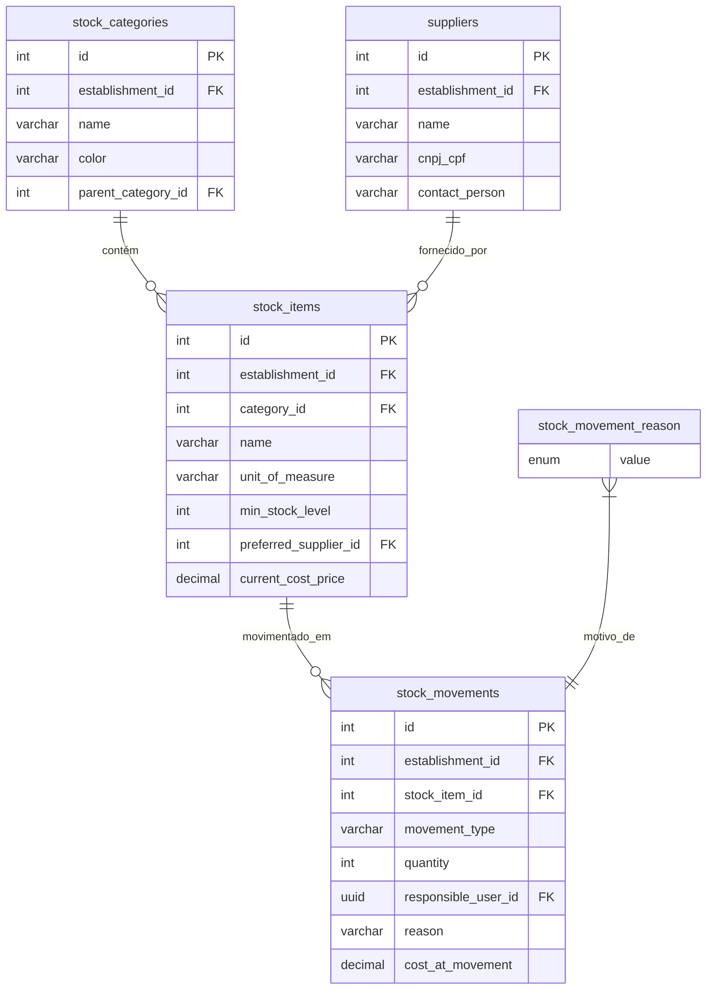

# Estoque

<cite>
**Arquivos Referenciados neste Documento**   
- [20250101000000_initial_schema.sql](file://supabase/migrations/20250101000000_initial_schema.sql)
- [20250101000000_initial_schema_corrected.sql](file://supabase/migrations/20250101000000_initial_schema_corrected.sql)
- [20250101000001_initial_schema_fixed.sql](file://supabase/migrations/20250101000001_initial_schema_fixed.sql)
- [20250101000001_rls_security_fix.sql](file://supabase/migrations/20250101000001_rls_security_fix.sql)
</cite>

## Sumário
1. [Introdução](#introdução)
2. [Estrutura de Tabelas e Relacionamentos](#estrutura-de-tabelas-e-relacionamentos)
3. [Categorização e Unidades de Medida](#categorização-e-unidades-de-medida)
4. [Fornecedores e Aquisição](#fornecedores-e-aquisição)
5. [Movimentações de Estoque](#movimentações-de-estoque)
6. [Controle de Custo](#controle-de-custo)
7. [Monitoramento de Estoque Mínimo](#monitoramento-de-estoque-mínimo)
8. [Políticas RLS por Estabelecimento](#políticas-rls-por-estabelecimento)
9. [Problemas Comuns](#problemas-comuns)
10. [Integração com Pedidos](#integração-com-pedidos)
11. [Exemplos de Consultas](#exemplos-de-consultas)

## Introdução
O módulo de Estoque é responsável pelo gerenciamento completo dos itens armazenáveis em um estabelecimento, desde sua categorização e fornecimento até o controle detalhado de movimentações e custos. Este documento detalha a estrutura do banco de dados, os fluxos de operação e as políticas de segurança que garantem a integridade e isolamento dos dados por estabelecimento.

**Seção fontes**
- [20250101000000_initial_schema.sql](file://supabase/migrations/20250101000000_initial_schema.sql#L1-L50)

## Estrutura de Tabelas e Relacionamentos
O módulo é composto por cinco tabelas principais inter-relacionadas:
- `stock_items`: Armazena os itens de estoque com suas propriedades.
- `stock_categories`: Define categorias hierárquicas para organizar os itens.
- `suppliers`: Mantém informações sobre fornecedores.
- `stock_movements`: Registra todas as entradas, saídas e ajustes.
- `stock_movement_reason`: Define os motivos permitidos para cada movimentação.



**Fontes do diagrama**
- [20250101000000_initial_schema.sql](file://supabase/migrations/20250101000000_initial_schema.sql#L357-L384)
- [20250101000000_initial_schema.sql](file://supabase/migrations/20250101000000_initial_schema.sql#L386-L410)
- [20250101000000_initial_schema_corrected.sql](file://supabase/migrations/20250101000000_initial_schema_corrected.sql#L387-L419)

**Seção fontes**
- [20250101000000_initial_schema.sql](file://supabase/migrations/20250101000000_initial_schema.sql#L357-L410)

## Categorização e Unidades de Medida
Os itens são organizados em categorias hierárquicas através da tabela `stock_categories`, que permite subcategorias via `parent_category_id`. Cada item em `stock_items` é vinculado a uma categoria e possui um campo `unit_of_measure` que utiliza o tipo ENUM `stock_item_unit_of_measure`, com valores permitidos: 'kg', 'liter', 'unit', 'gram', 'box'. Isso garante consistência na medição de todos os itens.

**Seção fontes**
- [20250101000000_initial_schema.sql](file://supabase/migrations/20250101000000_initial_schema.sql#L357-L384)
- [20250101000000_initial_schema_corrected.sql](file://supabase/migrations/20250101000000_initial_schema_corrected.sql#L47-L55)

## Fornecedores e Aquisição
A tabela `suppliers` armazena informações detalhadas sobre fornecedores, incluindo dados de contato e avaliação. Cada item de estoque pode ter um fornecedor preferencial definido pelo campo `preferred_supplier_id` em `stock_items`. Esta relação facilita a padronização na aquisição de materiais.

**Seção fontes**
- [20250101000000_initial_schema_corrected.sql](file://supabase/migrations/20250101000000_initial_schema_corrected.sql#L387-L419)
- [20250101000000_initial_schema.sql](file://supabase/migrations/20250101000000_initial_schema.sql#L357-L384)

## Movimentações de Estoque
Todas as movimentações são registradas na tabela `stock_movements`, que suporta os seguintes tipos definidos no ENUM `stock_movement_type`: 'entry' (entrada), 'exit' (saída), 'adjustment' (ajuste), 'loss' (perda) e 'transfer' (transferência). O campo `reason` utiliza o ENUM `stock_movement_reason` com valores como 'sale' (venda), 'purchase' (compra), 'consumption' (consumo), entre outros, permitindo rastrear a causa exata de cada movimento.

**Seção fontes**
- [20250101000000_initial_schema.sql](file://supabase/migrations/20250101000000_initial_schema.sql#L386-L410)
- [20250101000000_initial_schema_corrected.sql](file://supabase/migrations/20250101000000_initial_schema_corrected.sql#L47-L55)

## Controle de Custo
O custo de cada item é registrado no campo `current_cost_price` da tabela `stock_items`. Em cada movimentação, o custo aplicado é armazenado no campo `cost_at_movement` da tabela `stock_movements`, preservando o valor do custo no momento da operação, mesmo que o custo atual do item seja alterado posteriormente. Isso permite um controle preciso do custo histórico.

**Seção fontes**
- [20250101000000_initial_schema.sql](file://supabase/migrations/20250101000000_initial_schema.sql#L357-L384)
- [20250101000000_initial_schema.sql](file://supabase/migrations/20250101000000_initial_schema.sql#L386-L410)

## Monitoramento de Estoque Mínimo
Cada item possui um campo `min_stock_level` que define o nível mínimo de estoque. Quando a quantidade disponível de um item cai abaixo desse valor, o sistema pode gerar alertas para reposição. Este mecanismo ajuda a prevenir rupturas no fornecimento de itens essenciais.

**Seção fontes**
- [20250101000000_initial_schema.sql](file://supabase/migrations/20250101000000_initial_schema.sql#L357-L384)

## Políticas RLS por Estabelecimento
O sistema implementa segurança de nível de linha (RLS) para isolar os dados por estabelecimento. Todas as tabelas do módulo de estoque possuem o campo `establishment_id` e políticas RLS que garantem que usuários só possam acessar dados do seu próprio estabelecimento. Por exemplo, a política na tabela `stock_items` usa a função `public.requesting_user_establishment_id()` para filtrar os registros.

```mermaid
graph TD
A[Usuário Autenticado] --> B{Função requesting_user_establishment_id()}
B --> C[Obtém establishment_id do usuário]
C --> D[Aplica filtro WHERE establishment_id = ?]
D --> E[Acesso permitido apenas aos dados do estabelecimento]
```

**Fontes do diagrama**
- [20250101000001_rls_security_fix.sql](file://supabase/migrations/20250101000001_rls_security_fix.sql#L208-L235)

**Seção fontes**
- [20250101000001_rls_security_fix.sql](file://supabase/migrations/20250101000001_rls_security_fix.sql#L184-L235)

## Problemas Comuns
- **Estoque negativo**: Pode ocorrer se movimentações de saída não forem validadas contra o saldo disponível. Recomenda-se implementar verificações antes de registrar saídas.
- **Movimentações não autorizadas**: O uso de RLS minimiza esse risco, mas é essencial garantir que as funções de autenticação estejam corretamente configuradas e que os papéis (roles) dos usuários sejam adequadamente definidos.

**Seção fontes**
- [20250101000001_rls_security_fix.sql](file://supabase/migrations/20250101000001_rls_security_fix.sql#L208-L235)

## Integração com Pedidos
Produtos do cardápio consomem itens de estoque através da tabela `recipes`, que define a receita de cada produto. Quando um pedido é feito, o sistema pode automaticamente gerar movimentações de saída do tipo 'consumption' para os itens utilizados na preparação dos produtos, sincronizando o estoque com as vendas.

**Seção fontes**
- [20250101000000_initial_schema_corrected.sql](file://supabase/migrations/20250101000000_initial_schema_corrected.sql#L453-L475)

## Exemplos de Consultas
- **Saldo atual de um item**:
```sql
SELECT name, SUM(CASE WHEN movement_type = 'entry' THEN quantity ELSE -quantity END) as saldo
FROM stock_items si
JOIN stock_movements sm ON si.id = sm.stock_item_id
WHERE si.id = :item_id AND si.establishment_id = :est_id
GROUP BY si.id, si.name;
```

- **Histórico de compras de um item**:
```sql
SELECT sm.created_at, sm.quantity, sm.cost_at_movement, sp.name as fornecedor
FROM stock_movements sm
JOIN stock_items si ON sm.stock_item_id = si.id
LEFT JOIN suppliers sp ON sm.supplier_id = sp.id
WHERE si.id = :item_id AND sm.movement_type = 'entry' AND sm.reason = 'purchase'
ORDER BY sm.created_at DESC;
```

**Seção fontes**
- [20250101000000_initial_schema.sql](file://supabase/migrations/20250101000000_initial_schema.sql#L386-L410)
- [20250101000000_initial_schema_corrected.sql](file://supabase/migrations/20250101000000_initial_schema_corrected.sql#L387-L419)