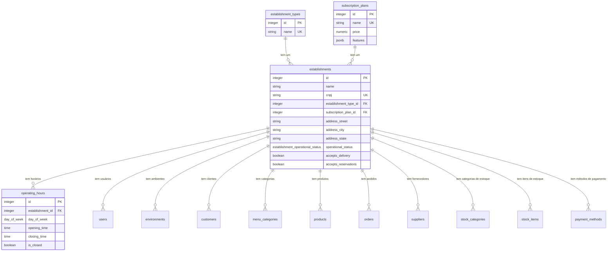
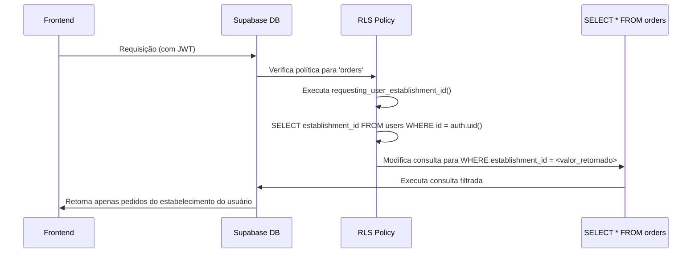

# Gestão de Estabelecimentos

<cite>
**Arquivos Referenciados neste Documento**  
- [20250101000000_initial_schema.sql](file://supabase/migrations/20250101000000_initial_schema.sql)
- [20250101000001_rls_security_fix.sql](file://supabase/migrations/20250101000001_rls_security_fix.sql)
- [supabase.ts](file://src/lib/supabase.ts)
</cite>

## Sumário
1. [Introdução](#introdução)
2. [Estrutura do Banco de Dados](#estrutura-do-banco-de-dados)
3. [Tabelas Principais](#tabelas-principais)
4. [Isolamento de Dados com RLS](#isolamento-de-dados-com-rls)
5. [Exemplos de Uso no Frontend](#exemplos-de-uso-no-frontend)
6. [Problemas Comuns e Soluções](#problemas-comuns-e-soluções)
7. [Conclusão](#conclusão)

## Introdução

O módulo de Gestão de Estabelecimentos é o alicerce do sistema multi-inquilino, sendo responsável por organizar e isolar os dados de cada cliente (restaurante, bar, etc.) dentro da aplicação. Cada estabelecimento registrado no sistema opera de forma completamente independente, com seus próprios produtos, pedidos, clientes e configurações. O coração desse isolamento é o campo `establishment_id`, que atua como um identificador único e obrigatório em todas as operações, garantindo que os dados de um inquilino nunca sejam acessados ou modificados por outro. Este documento detalha a estrutura, funcionamento e segurança desse módulo crítico.

**Seção fontes**
- [20250101000000_initial_schema.sql](file://supabase/migrations/20250101000000_initial_schema.sql#L1-L50)

## Estrutura do Banco de Dados

O esquema de banco de dados foi projetado com uma clara separação entre tabelas globais (compartilhadas por todos os inquilinos) e tabelas específicas de cada estabelecimento (tenant-specific). As tabelas globais armazenam informações que são comuns a todos os clientes do sistema, enquanto as tabelas específicas armazenam os dados operacionais únicos de cada estabelecimento.

**Fontes do Diagrama**
- [20250101000000_initial_schema.sql](file://supabase/migrations/20250101000000_initial_schema.sql#L1-L50)

**Seção fontes**
- [20250101000000_initial_schema.sql](file://supabase/migrations/20250101000000_initial_schema.sql#L1-L50)

## Tabelas Principais

### Tabela `establishments`

Esta é a tabela central do módulo, representando cada cliente do sistema. O `establishment_id` é a chave primária e o âncora para todo o isolamento de dados.

**Campos Principais:**
- **`id`**: Chave primária autoincrementada.
- **`name`**: Nome comercial do estabelecimento.
- **`cnpj`**: Número de identificação único e obrigatório, com restrição de unicidade para prevenir duplicações.
- **`establishment_type_id`**: Chave estrangeira para `establishment_types`, definindo o tipo (ex: restaurante, lanchonete, bar).
- **`address_*`**: Campos completos do endereço.
- **`subscription_plan_id`**: Chave estrangeira para `subscription_plans`, vinculando o plano de assinatura ativo.
- **`operational_status`**: ENUM (`active`, `inactive`, `suspended`) que controla a disponibilidade do estabelecimento no sistema.
- **`accepts_delivery` / `accepts_reservations`**: Flags booleanas para funcionalidades habilitadas.

**Seção fontes**
- [20250101000000_initial_schema.sql](file://supabase/migrations/20250101000000_initial_schema.sql#L75-L105)

### Tabela `establishment_types`

Armazena os tipos genéricos de estabelecimentos que podem ser selecionados durante o cadastro.

**Campos Principais:**
- **`id`**: Chave primária.
- **`name`**: Nome do tipo (ex: "Restaurante", "Pizzaria", "Cafeteria"), com restrição de unicidade.

**Seção fontes**
- [20250101000000_initial_schema.sql](file://supabase/migrations/20250101000000_initial_schema.sql#L45-L50)

### Tabela `subscription_plans`

Define os planos de assinatura disponíveis no sistema, com diferentes preços e funcionalidades.

**Campos Principais:**
- **`id`**: Chave primária.
- **`name`**: Nome do plano (ex: "Básico", "Premium").
- **`price`**: Valor mensal do plano.
- **`features`**: Campo JSONB que armazena uma lista de funcionalidades habilitadas para o plano (ex: `{"online_ordering": true, "inventory": false}`).

**Seção fontes**
- [20250101000000_initial_schema.sql](file://supabase/migrations/20250101000000_initial_schema.sql#L52-L60)

### Tabela `operating_hours`

Armazena os horários de funcionamento para cada dia da semana de um estabelecimento.

**Campos Principais:**
- **`establishment_id`**: Chave estrangeira que vincula o horário ao estabelecimento, essencial para o isolamento.
- **`day_of_week`**: ENUM com os dias da semana.
- **`opening_time` / `closing_time`**: Horários de abertura e fechamento.
- **`is_closed`**: Flag booleana para indicar se o estabelecimento está fechado naquele dia.

A chave primária é composta por `establishment_id` e `day_of_week`, garantindo que apenas um registro por dia por estabelecimento possa existir.

**Seção fontes**
- [20250101000000_initial_schema.sql](file://supabase/migrations/20250101000000_initial_schema.sql#L107-L120)

## Isolamento de Dados com RLS

A segurança e a integridade do sistema multi-inquilino são garantidas pela **Segurança em Nível de Linha (RLS - Row Level Security)** do PostgreSQL. A função `requesting_user_establishment_id()` é o mecanismo central para esse isolamento.

**Fontes do Diagrama**
- [20250101000001_rls_security_fix.sql](file://supabase/migrations/20250101000001_rls_security_fix.sql#L39-L72)
- [20250101000000_initial_schema.sql](file://supabase/migrations/20250101000000_initial_schema.sql#L450-L455)

**Seção fontes**
- [20250101000001_rls_security_fix.sql](file://supabase/migrations/20250101000001_rls_security_fix.sql#L1-L50)
- [20250101000000_initial_schema.sql](file://supabase/migrations/20250101000000_initial_schema.sql#L450-L455)

### Função `requesting_user_establishment_id()`

Esta função SQL, definida no banco de dados, é chamada por todas as políticas RLS. Ela:
1.  Usa `auth.uid()` para obter o ID do usuário autenticado a partir do token JWT.
2.  Consulta a tabela `public.users` para encontrar o `establishment_id` associado a esse usuário.
3.  Retorna o `establishment_id`.

Qualquer consulta feita por um usuário autenticado a uma tabela com RLS habilitada (como `orders`, `products`, `customers`) é automaticamente filtrada pela cláusula `USING (establishment_id = public.requesting_user_establishment_id())`, garantindo que o usuário só veja dados do seu próprio estabelecimento.

## Exemplos de Uso no Frontend

Embora o código frontend não faça chamadas diretas à função `requesting_user_establishment_id()`, ele se beneficia indiretamente de sua existência. O cliente Supabase no frontend (`supabase.ts`) é configurado para se comunicar com o banco de dados, e todas as operações de leitura e gravação são automaticamente filtradas pelo RLS.

### Cadastro de Novo Estabelecimento

1.  Um novo usuário se cadastra na aplicação.
2.  O gatilho `on_auth_user_created` insere um registro na tabela `public.users` com o `id` do usuário e seu `email`, mas o campo `establishment_id` é `NULL`.
3.  O usuário inicia o fluxo de cadastro de estabelecimento no frontend.
4.  O frontend envia os dados do estabelecimento (nome, CNPJ, endereço, etc.) para a tabela `establishments`.
5.  Após o cadastro bem-sucedido, o `establishment_id` do novo estabelecimento é atualizado no registro do usuário na tabela `users`.
6.  A partir desse momento, todas as ações do usuário estão vinculadas ao `establishment_id`, e o RLS garante o acesso exclusivo.

### Atualização de Horários de Funcionamento

1.  O usuário acessa a tela de configurações do estabelecimento.
2.  O frontend consulta a tabela `operating_hours` usando o cliente Supabase.
3.  O RLS automaticamente filtra os resultados para retornar apenas os horários onde `establishment_id` corresponde ao do usuário.
4.  O usuário modifica os horários (ex: alterar o horário de fechamento na sexta-feira).
5.  O frontend envia a atualização para o banco de dados.
6.  O RLS verifica, na política de UPDATE, se o `establishment_id` do registro que está sendo alterado corresponde ao do usuário (`establishment_id = public.requesting_user_establishment_id()`). Se sim, a operação é permitida.

**Seção fontes**
- [supabase.ts](file://src/lib/supabase.ts#L1-L11)

## Problemas Comuns e Soluções

### Duplicação de CNPJ

**Problema:** Tentar cadastrar dois estabelecimentos com o mesmo CNPJ.
**Solução:** A tabela `establishments` possui uma restrição de unicidade (`UNIQUE`) no campo `cnpj`. Qualquer tentativa de inserir um CNPJ já existente resultará em um erro de banco de dados, que deve ser tratado pelo frontend com uma mensagem clara para o usuário.

### Acesso Não Autorizado

**Problema:** Um usuário tentar acessar dados de um estabelecimento diferente do seu.
**Solução:** O RLS é a primeira e mais forte linha de defesa. Mesmo se um atacante tentar forjar uma requisição diretamente para o banco de dados, as políticas RLS bloquearão o acesso. É fundamental que todas as tabelas específicas do inquilino tenham RLS habilitada e políticas corretas configuradas, como feito no script `20250101000001_rls_security_fix.sql`.

## Conclusão

O módulo de Gestão de Estabelecimentos é um exemplo robusto de arquitetura multi-inquilino. A combinação de um campo `establishment_id` bem definido, uma estrutura de banco de dados clara e a implementação rigorosa de políticas RLS garante que os dados de cada cliente sejam seguros, isolados e escaláveis. A função `requesting_user_establishment_id()` atua como o guardião central desse sistema, permitindo que o frontend opere de forma simples e segura, confiando no banco de dados para aplicar as regras de isolamento de forma transparente.