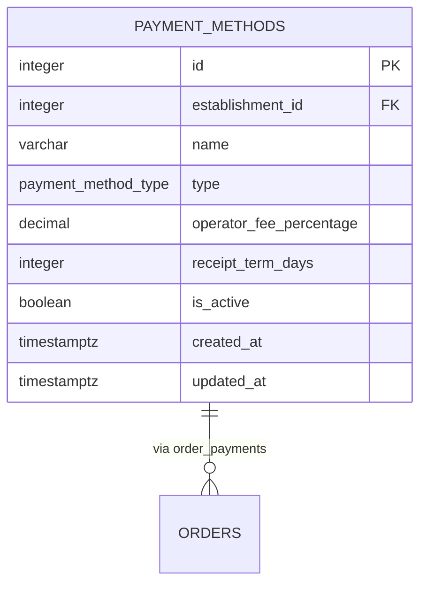
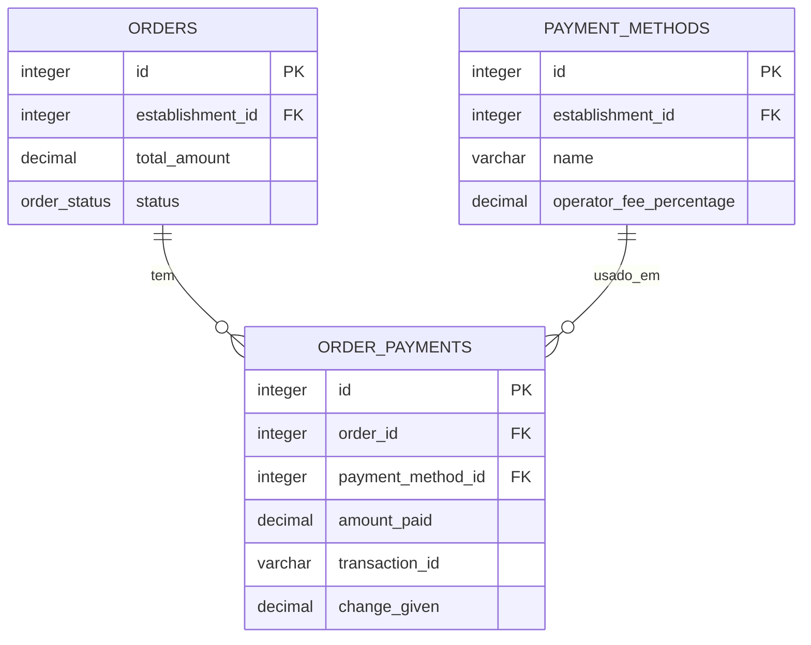
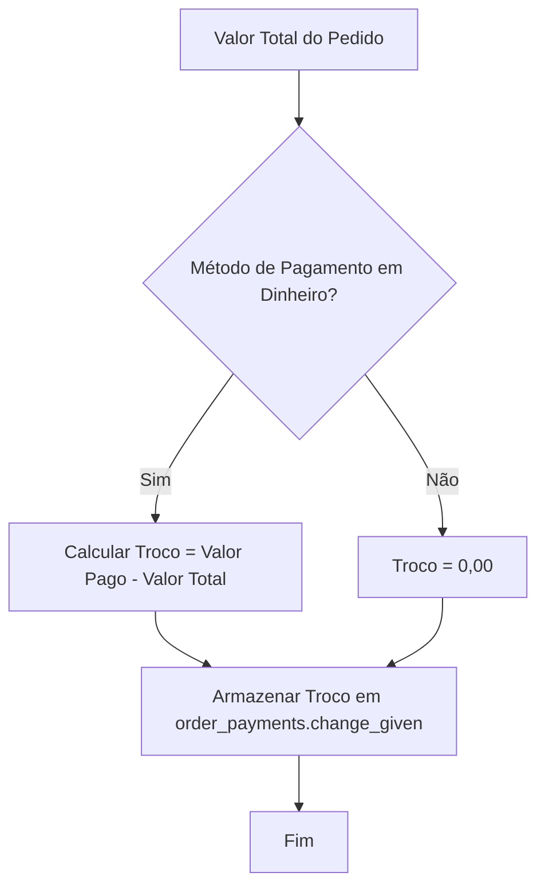
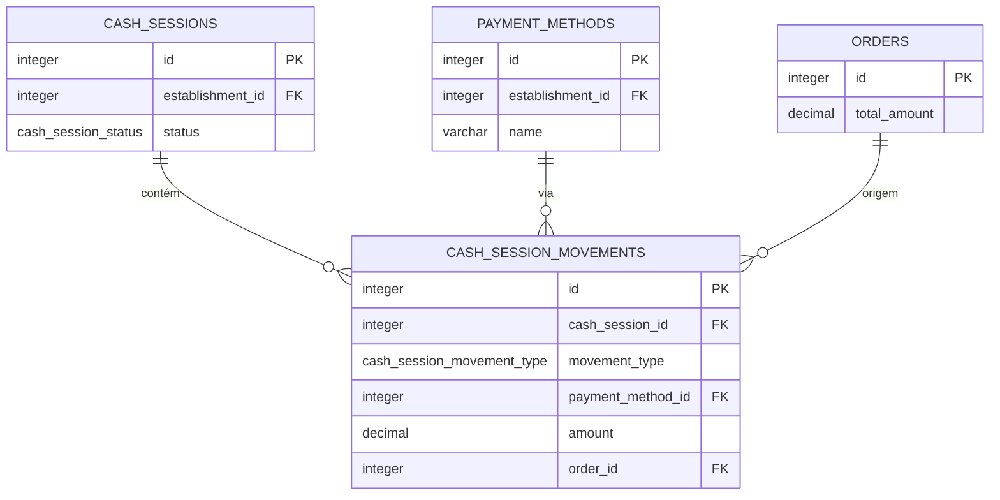

# Pagamentos

<cite>
**Arquivos Referenciados neste Documento**  
- [20250101000000_initial_schema.sql](file://supabase/migrations/20250101000000_initial_schema.sql)
- [20250101000000_initial_schema_corrected.sql](file://supabase/migrations/20250101000000_initial_schema_corrected.sql)
- [20250101000001_rls_security_fix.sql](file://supabase/migrations/20250101000001_rls_security_fix.sql)
- [20250101000001_initial_schema_fixed.sql](file://supabase/migrations/20250101000001_initial_schema_fixed.sql)
</cite>

## Sumário
1. [Visão Geral do Módulo de Pagamentos](#visão-geral-do-módulo-de-pagamentos)
2. [Estrutura da Tabela `payment_methods`](#estrutura-da-tabela-payment_methods)
3. [Tipos de Pagamento Suportados](#tipos-de-pagamento-suportados)
4. [Relacionamento com Pedidos (`orders`)](#relacionamento-com-pedidos-orders)
5. [Ativação e Desativação de Métodos por Estabelecimento](#ativação-e-desativação-de-métodos-por-estabelecimento)
6. [Cálculo do Valor Final do Pedido](#cálculo-do-valor-final-do-pedido)
7. [Políticas de Segurança RLS](#políticas-de-segurança-rls)
8. [Casos de Uso Avançados](#casos-de-uso-avançados)
9. [Integração com Caixa e Movimentações](#integração-com-caixa-e-movimentações)
10. [Considerações Finais](#considerações-finais)

## Visão Geral do Módulo de Pagamentos

O módulo de pagamentos é uma componente central do sistema de gestão de restaurantes, responsável por gerenciar todos os aspectos relacionados ao recebimento de pagamentos pelos pedidos realizados. Este módulo é projetado com uma arquitetura multi-tenante, garantindo que cada estabelecimento comercial tenha controle total sobre seus próprios métodos de pagamento, taxas e políticas, sem interferência de outros estabelecimentos.

A arquitetura do módulo é baseada em três tabelas principais: `payment_methods`, `orders` e `order_payments`, que trabalham em conjunto para registrar, processar e auditar todas as transações financeiras. O sistema permite uma flexibilidade significativa, suportando múltiplos métodos de pagamento simultaneamente, incluindo pagamentos divididos e integração com gateways externos.

**Section sources**
- [20250101000000_initial_schema.sql](file://supabase/migrations/20250101000000_initial_schema.sql#L386-L410)
- [20250101000000_initial_schema_corrected.sql](file://supabase/migrations/20250101000000_initial_schema_corrected.sql#L492-L499)

## Estrutura da Tabela `payment_methods`

A tabela `payment_methods` armazena todas as configurações específicas de cada método de pagamento disponível para um estabelecimento. Cada registro nesta tabela representa um método de pagamento configurado, como "Dinheiro", "Cartão de Crédito" ou "PIX".

Os campos principais desta tabela incluem:

- **`id`**: Identificador único do método de pagamento.
- **`establishment_id`**: Chave estrangeira que vincula o método ao estabelecimento que o utiliza.
- **`name`**: Nome descritivo do método (ex: "Dinheiro em Espécie").
- **`type`**: Tipo do método, baseado no ENUM `payment_method_type`.
- **`operator_fee_percentage`**: Percentual da taxa cobrada pelo operador (ex: 2.99% para cartões).
- **`receipt_term_days`**: Prazo em dias para o repasse do valor (ex: 30 dias para cartões, 0 para dinheiro).
- **`is_active`**: Indicador booleano que determina se o método está ativo ou não.
- **`created_at`** e **`updated_at`**: Campos de auditoria para rastrear quando o registro foi criado e modificado.

A chave primária é o campo `id`, e existe uma restrição de unicidade combinada entre `establishment_id` e `name`, garantindo que um estabelecimento não possa ter dois métodos com o mesmo nome.



**Diagram sources**
- [20250101000000_initial_schema.sql](file://supabase/migrations/20250101000000_initial_schema.sql#L386-L410)
- [20250101000000_initial_schema_corrected.sql](file://supabase/migrations/20250101000000_initial_schema_corrected.sql#L492-L499)

**Section sources**
- [20250101000000_initial_schema.sql](file://supabase/migrations/20250101000000_initial_schema.sql#L386-L410)
- [20250101000000_initial_schema_corrected.sql](file://supabase/migrations/20250101000000_initial_schema_corrected.sql#L492-L499)

## Tipos de Pagamento Suportados

O sistema suporta uma variedade de métodos de pagamento através do ENUM `payment_method_type`. Os tipos disponíveis são:

- **`cash`**: Pagamento em dinheiro físico.
- **`credit_card`**: Pagamento com cartão de crédito.
- **`debit_card`**: Pagamento com cartão de débito.
- **`pix`**: Pagamento instantâneo via sistema PIX do Banco Central.
- **`digital_wallet`**: Carteiras digitais (ex: Apple Pay, Google Pay).
- **`meal_voucher`**: Vales-refeição ou vales-alimentação.

Cada tipo pode ser configurado com diferentes taxas e prazos de repasse, refletindo as condições comerciais reais com operadoras de cartão ou provedores de serviços. Por exemplo, pagamentos com cartão de crédito geralmente têm uma taxa de operadora (ex: 3.99%) e um prazo de repasse de 30 dias, enquanto o PIX é gratuito (taxa de 0%) e o repasse é imediato (prazo de 0 dias).

A definição do ENUM está presente em múltiplos arquivos de migração, garantindo consistência no esquema do banco de dados.

**Section sources**
- [20250101000000_initial_schema.sql](file://supabase/migrations/20250101000000_initial_schema.sql#L42)
- [20250101000000_initial_schema_corrected.sql](file://supabase/migrations/20250101000000_initial_schema_corrected.sql#L50)
- [20250101000001_initial_schema_fixed.sql](file://supabase/migrations/20250101000001_initial_schema_fixed.sql#L43)

## Relacionamento com Pedidos (`orders`)

O relacionamento entre métodos de pagamento e pedidos é gerenciado pela tabela intermediária `order_payments`. Esta tabela é crucial para suportar pagamentos divididos, onde um único pedido pode ser pago com múltiplos métodos.

A estrutura da tabela `order_payments` inclui:

- **`order_id`**: Referência ao pedido (chave estrangeira para `orders.id`).
- **`payment_method_id`**: Referência ao método de pagamento (chave estrangeira para `payment_methods.id`).
- **`amount_paid`**: Valor efetivamente pago com este método.
- **`transaction_id`**: ID da transação no gateway externo (para cartões, PIX, etc.).
- **`change_given`**: Troco fornecido ao cliente (aplicável apenas para pagamento em dinheiro).

Este design permite que um pedido de R$ 100,00 seja pago com R$ 70,00 em cartão de crédito e R$ 30,00 em dinheiro, com cada pagamento registrado como um registro separado na tabela `order_payments`. O valor total do pedido é então a soma de todos os registros `amount_paid` associados a ele.



**Diagram sources**
- [20250101000000_initial_schema_corrected.sql](file://supabase/migrations/20250101000000_initial_schema_corrected.sql#L527-L529)
- [20250101000001_rls_security_fix.sql](file://supabase/migrations/20250101000001_rls_security_fix.sql#L268-L274)

**Section sources**
- [20250101000000_initial_schema_corrected.sql](file://supabase/migrations/20250101000000_initial_schema_corrected.sql#L527-L529)
- [20250101000001_rls_security_fix.sql](file://supabase/migrations/20250101000001_rls_security_fix.sql#L268-L274)

## Ativação e Desativação de Métodos por Estabelecimento

Cada estabelecimento pode gerenciar ativamente quais métodos de pagamento estão disponíveis para seus clientes através do campo `is_active` na tabela `payment_methods`. Quando um método é desativado (`is_active = false`), ele não aparece nas interfaces de pagamento do sistema, mas seu histórico de transações permanece intacto para fins de auditoria e relatórios.

Este mecanismo permite que os estabelecimentos respondam rapidamente a mudanças nas condições comerciais. Por exemplo, se uma operadora de cartão aumentar suas taxas, o estabelecimento pode temporariamente desativar o pagamento com cartão até renegociar as condições, sem perder o histórico de pagamentos anteriores.

A gestão é feita no nível do estabelecimento, garantindo que a ativação ou desativação de um método em um estabelecimento não afete outros estabelecimentos no sistema multi-tenante.

**Section sources**
- [20250101000000_initial_schema.sql](file://supabase/migrations/20250101000000_initial_schema.sql#L408)
- [20250101000000_initial_schema_corrected.sql](file://supabase/migrations/20250101000000_initial_schema_corrected.sql#L497)

## Cálculo do Valor Final do Pedido

O valor final de um pedido é calculado com base no subtotal dos itens, adicionando taxas de serviço e entrega, e subtraindo descontos. Quando o pagamento é realizado, o sistema pode calcular automaticamente o troco devido quando o pagamento é feito em dinheiro.

O cálculo do troco é feito pela seguinte fórmula:

```
Troco = Valor Pago em Dinheiro - Valor Total do Pedido
```

Por exemplo, se um pedido tem um valor total de R$ 85,50 e o cliente paga com uma nota de R$ 100,00, o sistema calcula o troco como R$ 14,50. Este valor é armazenado no campo `change_given` da tabela `order_payments` para o método de pagamento em dinheiro.

Para pagamentos com cartão ou PIX, o campo `change_given` permanece como 0,00, pois não há troco em transações eletrônicas.



**Diagram sources**
- [20250101000000_initial_schema_corrected.sql](file://supabase/migrations/20250101000000_initial_schema_corrected.sql#L532-L534)

**Section sources**
- [20250101000000_initial_schema_corrected.sql](file://supabase/migrations/20250101000000_initial_schema_corrected.sql#L532-L534)

## Políticas de Segurança RLS

O sistema implementa políticas rigorosas de Segurança em Nível de Linha (RLS - Row Level Security) para garantir que os dados de pagamento sejam acessados apenas pelos estabelecimentos apropriados. A função central para esta segurança é `public.requesting_user_establishment_id()`, que determina o ID do estabelecimento do usuário autenticado.

A política RLS aplicada à tabela `payment_methods` é:

```sql
CREATE POLICY "Allow access to own establishment data" ON public.payment_methods FOR ALL
USING (establishment_id = public.requesting_user_establishment_id());
```

Esta política garante que qualquer operação (SELECT, INSERT, UPDATE, DELETE) na tabela `payment_methods` só seja permitida se o `establishment_id` do registro for igual ao `establishment_id` do usuário que está fazendo a requisição. Isso previne efetivamente que um usuário de um estabelecimento acesse ou modifique métodos de pagamento de outro estabelecimento.

As políticas RLS são aplicadas a todas as tabelas do sistema, criando uma camada de segurança robusta que é essencial em um ambiente multi-tenante.

**Section sources**
- [20250101000001_rls_security_fix.sql](file://supabase/migrations/20250101000001_rls_security_fix.sql#L237-L242)
- [20250101000001_rls_security_fix.sql](file://supabase/migrations/20250101000001_rls_security_fix.sql#L0-L37)

## Casos de Uso Avançados

### Pagamentos Divididos

O sistema suporta nativamente pagamentos divididos através da tabela `order_payments`. Um caso de uso comum é quando um grupo de clientes deseja dividir a conta, com cada membro pagando uma parte com um método diferente.

O fluxo é:
1. O pedido é finalizado com um valor total.
2. O sistema permite registrar múltiplos pagamentos para o mesmo pedido.
3. Cada pagamento é registrado com seu método e valor.
4. O sistema valida que a soma dos pagamentos iguala o valor total do pedido.
5. O status do pedido é atualizado para "pago".

### Estornos

Para estornos, o sistema não modifica os registros existentes de `order_payments`, mas cria novos registros com valores negativos no campo `amount_paid` e uma descrição indicando que é um estorno. Isso mantém um histórico completo e auditável de todas as transações, permitindo rastrear o fluxo completo de dinheiro.

**Section sources**
- [20250101000000_initial_schema_corrected.sql](file://supabase/migrations/20250101000000_initial_schema_corrected.sql#L527-L559)

## Integração com Caixa e Movimentações

Os pagamentos são integrados ao módulo de caixa através da tabela `cash_session_movements`. Quando um pagamento é registrado, uma movimentação correspondente é criada para atualizar o saldo do caixa.

Os tipos de movimentação relevantes são:
- **`sale`**: Para pagamentos que aumentam o saldo do caixa (dinheiro, PIX).
- **`cancellation`**: Para estornos que diminuem o saldo do caixa.

Cada movimentação está vinculada ao método de pagamento usado (`payment_method_id`) e ao pedido (`order_id`), criando um rastro financeiro completo desde o pedido até o fechamento do caixa.

Esta integração garante que o balanço do caixa sempre reflita com precisão todas as transações financeiras realizadas.



**Diagram sources**
- [20250101000000_initial_schema_corrected.sql](file://supabase/migrations/20250101000000_initial_schema_corrected.sql#L501-L525)
- [20250101000001_rls_security_fix.sql](file://supabase/migrations/20250101000001_rls_security_fix.sql#L260-L266)

**Section sources**
- [20250101000000_initial_schema_corrected.sql](file://supabase/migrations/20250101000000_initial_schema_corrected.sql#L501-L525)
- [20250101000001_rls_security_fix.sql](file://supabase/migrations/20250101000001_rls_security_fix.sql#L260-L266)

## Considerações Finais

O módulo de pagamentos apresentado é uma solução robusta e segura para a gestão de transações financeiras em um ambiente multi-tenante de restaurantes. Sua arquitetura permite flexibilidade operacional, segurança rigorosa e integração completa com outros módulos do sistema, como pedidos e caixa.

A implementação de RLS garante a isolamento de dados entre estabelecimentos, enquanto o design das tabelas permite cenários complexos como pagamentos divididos e estornos, mantendo um histórico auditável completo. A configuração por estabelecimento permite que cada negócio personalize seus métodos de pagamento de acordo com suas necessidades comerciais específicas.

Para implementações futuras, recomenda-se a integração com gateways de pagamento externos através de APIs seguras, utilizando o campo `transaction_id` para vincular transações do sistema com transações no gateway, permitindo confirmação em tempo real e redução de fraudes.