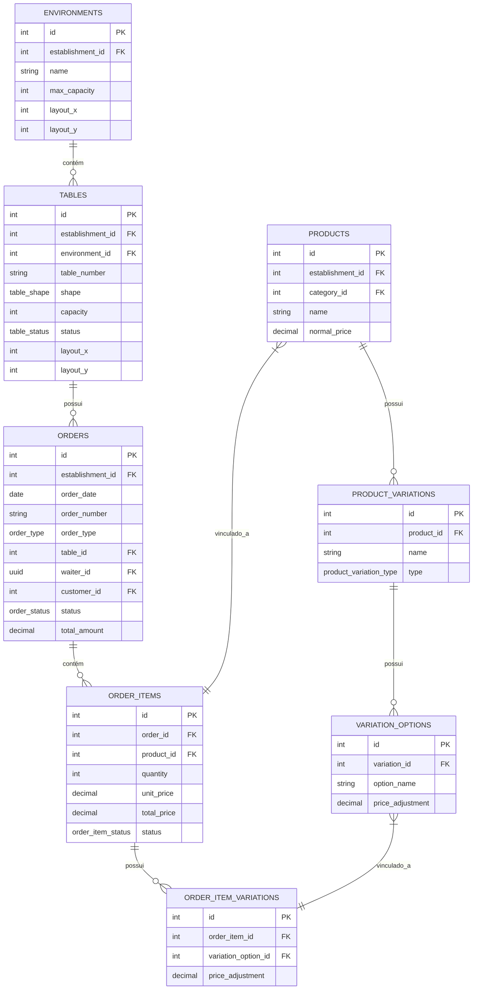
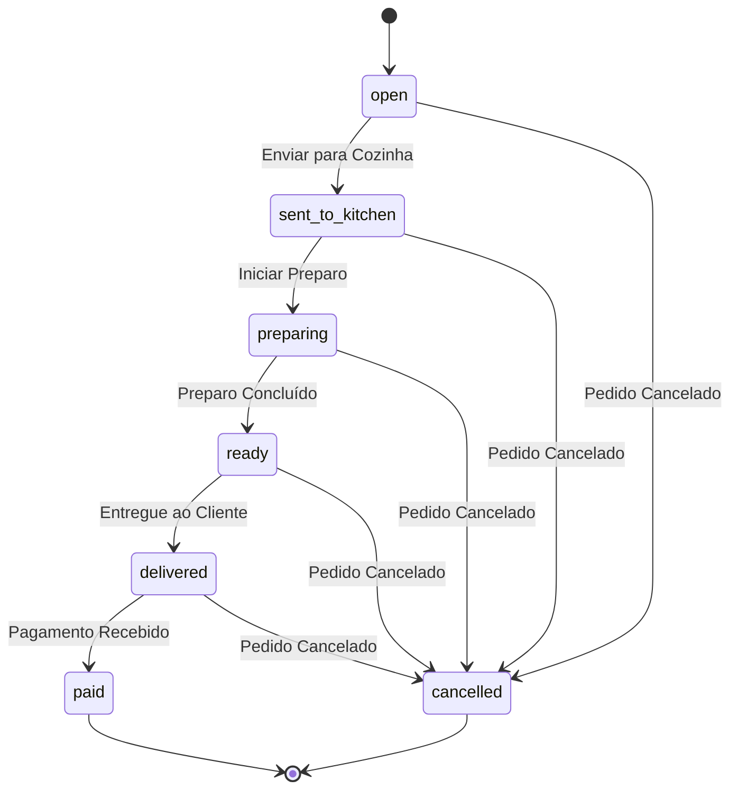

# Pedidos e Mesas

<cite>
**Arquivos Referenciados neste Documento**  
- [20250101000000_initial_schema.sql](file://supabase/migrations/20250101000000_initial_schema.sql)
- [20250101000001_initial_schema_fixed.sql](file://supabase/migrations/20250101000001_initial_schema_fixed.sql)
- [20250101000001_rls_security_fix.sql](file://supabase/migrations/20250101000001_rls_security_fix.sql)
</cite>

## Sumário
1. [Introdução](#introdução)
2. [Estrutura de Dados](#estrutura-de-dados)
3. [Ciclo de Vida do Pedido](#ciclo-de-vida-do-pedido)
4. [Gestão de Mesas e Ambientes](#gestão-de-mesas-e-ambientes)
5. [Consultas Comuns](#consultas-comuns)
6. [Segurança e Políticas RLS](#segurança-e-políticas-rls)
7. [Casos de Uso e Integração](#casos-de-uso-e-integração)

## Introdução

Este documento detalha o fluxo de pedidos e a gestão de mesas no sistema de gestão de restaurantes. O foco está nas tabelas centrais `orders`, `order_items`, `tables` e `environments`, que formam a espinha dorsal do sistema de atendimento. O documento abrange desde a estrutura de dados e o ciclo de vida dos pedidos até as políticas de segurança que garantem a integridade e a privacidade dos dados em um ambiente multi-estabelecimento.

**Section sources**
- [20250101000000_initial_schema.sql](file://supabase/migrations/20250101000000_initial_schema.sql#L1-L50)
- [20250101000001_initial_schema_fixed.sql](file://supabase/migrations/20250101000001_initial_schema_fixed.sql#L1-L50)

## Estrutura de Dados

O sistema é baseado em um modelo de dados relacional que garante integridade e escalabilidade. As tabelas principais estão interligadas por chaves estrangeiras, criando um fluxo de dados coerente.

### Diagrama de Entidades e Relacionamentos (ERD)



**Diagram sources**
- [20250101000001_initial_schema_fixed.sql](file://supabase/migrations/20250101000001_initial_schema_fixed.sql#L100-L200)
- [20250101000000_initial_schema.sql](file://supabase/migrations/20250101000000_initial_schema.sql#L100-L200)

### Descrição das Tabelas Principais

#### Tabela `orders`
Armazena todos os pedidos do estabelecimento. Cada pedido é identificado por um número único (`order_number`) dentro de uma data específica. O pedido está vinculado a um estabelecimento (`establishment_id`), uma mesa (`table_id`), um garçom (`waiter_id`) e pode ter um tipo (`order_type`) como local, balcão, entrega ou retirada.

**Section sources**
- [20250101000001_initial_schema_fixed.sql](file://supabase/migrations/20250101000001_initial_schema_fixed.sql#L450-L470)

#### Tabela `order_items`
Representa os itens individuais dentro de um pedido. Cada item está vinculado a um produto específico (`product_id`) e armazena o preço unitário e o preço total no momento da criação, garantindo que o valor não seja alterado se o preço do produto mudar posteriormente.

**Section sources**
- [20250101000001_initial_schema_fixed.sql](file://supabase/migrations/20250101000001_initial_schema_fixed.sql#L470-L490)

#### Tabela `tables`
Gerencia as mesas físicas do estabelecimento. Cada mesa tem um número, forma, capacidade e status (disponível, ocupada, reservada, em manutenção). A mesa está localizada dentro de um ambiente (`environment_id`).

**Section sources**
- [20250101000001_initial_schema_fixed.sql](file://supabase/migrations/20250101000001_initial_schema_fixed.sql#L390-L410)

#### Tabela `environments`
Define os ambientes físicos do estabelecimento, como "Sala Interna", "Sala Externa" ou "Balcão". Cada ambiente pode ter uma capacidade máxima e coordenadas para um layout gráfico.

**Section sources**
- [20250101000001_initial_schema_fixed.sql](file://supabase/migrations/20250101000001_initial_schema_fixed.sql#L370-L390)

## Ciclo de Vida do Pedido

O ciclo de vida de um pedido é gerenciado por meio de um ENUM de status, que garante consistência e permite a automação de fluxos de trabalho.

### Diagrama de Estados do Pedido



**Diagram sources**
- [20250101000001_initial_schema_fixed.sql](file://supabase/migrations/20250101000001_initial_schema_fixed.sql#L38)
- [20250101000000_initial_schema.sql](file://supabase/migrations/20250101000000_initial_schema.sql#L37)

### Fluxo de Status
1.  **`open`**: O pedido é criado e está aberto para adição de itens.
2.  **`sent_to_kitchen`**: O pedido é enviado para a cozinha para início do preparo.
3.  **`preparing`**: A cozinha confirmou o início do preparo.
4.  **`ready`**: O item ou pedido está pronto para ser servido.
5.  **`delivered`**: O pedido foi entregue ao cliente.
6.  **`paid`**: O pagamento foi processado e o pedido está encerrado.
7.  **`cancelled`**: O pedido foi cancelado em qualquer etapa anterior ao pagamento.

Cada mudança de status é registrada com um carimbo de data/hora (`updated_at`), permitindo auditoria e análise de tempos de atendimento.

### Vinculação de Itens e Variações de Produtos

Um `order_item` é criado a partir de um `product`. Um produto pode ter várias `product_variations` (por exemplo, tamanho, sabor). Quando um item é adicionado ao pedido, as opções de variação escolhidas são vinculadas ao item através da tabela `order_item_variations`.

Por exemplo, um produto "Refrigerante" pode ter uma variação de tipo "tamanho" com opções "350ml" (ajuste de preço +0.00) e "1L" (ajuste de preço +5.00). Ao adicionar um refrigerante de 1L ao pedido, um registro é criado em `order_items` e outro em `order_item_variations` vinculando a opção "1L" ao item, com o ajuste de preço aplicado.

**Section sources**
- [20250101000001_initial_schema_fixed.sql](file://supabase/migrations/20250101000001_initial_schema_fixed.sql#L470-L500)

## Gestão de Mesas e Ambientes

A gestão de mesas é fundamental para a operação do restaurante, permitindo o controle de ocupação e a otimização do espaço.

### Capacidade e Localização

A capacidade de uma mesa é definida pelo campo `capacity` na tabela `tables`. A capacidade total de um ambiente é a soma da capacidade de todas as mesas dentro dele. A localização física da mesa é definida pelas coordenadas `layout_x` e `layout_y`, que podem ser usadas por um frontend para renderizar um mapa interativo do ambiente.

### Relacionamento Ambiente-Mesa

Cada mesa pertence a um único ambiente (`environment_id`). Isso permite agrupar mesas logicamente (por exemplo, fumantes/não fumantes, área VIP) e gerenciar a ocupação por ambiente.

**Section sources**
- [20250101000001_initial_schema_fixed.sql](file://supabase/migrations/20250101000001_initial_schema_fixed.sql#L370-L410)

## Consultas Comuns

### Buscar Pedidos Ativos por Mesa

Esta consulta retorna todos os pedidos que ainda não foram pagos ou cancelados para uma mesa específica.

```sql
SELECT o.*, oi.quantity, p.name as product_name
FROM orders o
JOIN order_items oi ON o.id = oi.order_id
JOIN products p ON oi.product_id = p.id
WHERE o.table_id = :table_id
AND o.status NOT IN ('paid', 'cancelled')
ORDER BY o.created_at;
```

### Buscar Mesas Disponíveis

Esta consulta retorna todas as mesas que estão com status 'available' em um ambiente específico.

```sql
SELECT t.*
FROM tables t
WHERE t.environment_id = :environment_id
AND t.status = 'available';
```

**Section sources**
- [20250101000001_initial_schema_fixed.sql](file://supabase/migrations/20250101000001_initial_schema_fixed.sql#L390-L410)
- [20250101000001_initial_schema_fixed.sql](file://supabase/migrations/20250101000001_initial_schema_fixed.sql#L450-L470)

## Segurança e Políticas RLS

O sistema implementa Row Level Security (RLS) para garantir que os dados de um estabelecimento não sejam acessíveis por usuários de outros estabelecimentos.

### Políticas de Segurança

Todas as tabelas específicas do estabelecimento (tenant-specific) têm RLS habilitada. A política principal utiliza uma função `auth.get_current_establishment_id()` que consulta a tabela `users` para obter o `establishment_id` do usuário autenticado (`auth.uid()`).

```sql
-- Política aplicada à tabela orders
CREATE POLICY "Enable access for users of the same establishment" ON public.orders
FOR ALL USING (establishment_id = auth.get_current_establishment_id());
```

Esta política garante que um usuário só possa ver, criar, atualizar ou excluir pedidos do seu próprio estabelecimento.

**Section sources**
- [20250101000001_initial_schema_fixed.sql](file://supabase/migrations/20250101000001_initial_schema_fixed.sql#L530-L540)
- [20250101000001_rls_security_fix.sql](file://supabase/migrations/20250101000001_rls_security_fix.sql#L168-L170)

## Casos de Uso e Integração

### Mesas Ocupadas sem Pedido Aberto

Este cenário pode ocorrer quando um cliente ocupa uma mesa antes de fazer um pedido. O sistema permite que a mesa seja marcada como `occupied` independentemente da existência de um pedido. Quando o pedido for criado, ele será automaticamente vinculado à mesa ocupada.

### Cancelamentos

O cancelamento de um pedido é feito alterando seu status para `cancelled`. O sistema deve garantir que todos os itens do pedido também sejam cancelados. Isso pode ser feito por um trigger no banco de dados ou pela lógica da aplicação.

### Integração com o Frontend

Para uma experiência em tempo real, o frontend deve se inscrever em mudanças nas tabelas `orders` e `tables` usando o sistema de real-time do Supabase. Quando o status de um pedido muda para `ready`, o frontend pode exibir uma notificação. Quando o status de uma mesa muda para `available`, o mapa do ambiente é atualizado instantaneamente.

**Section sources**
- [20250101000001_initial_schema_fixed.sql](file://supabase/migrations/20250101000001_initial_schema_fixed.sql#L450-L490)