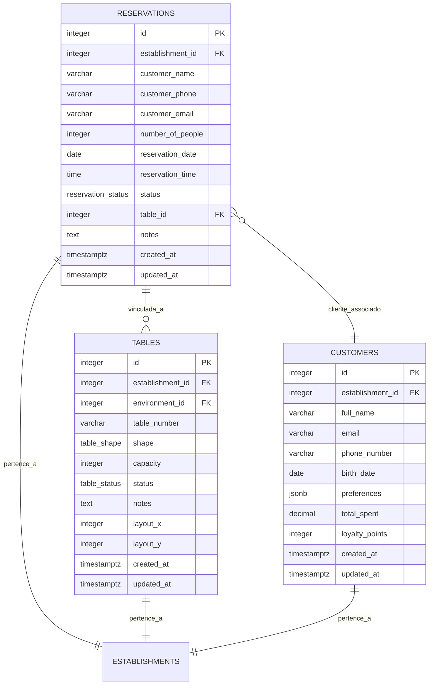
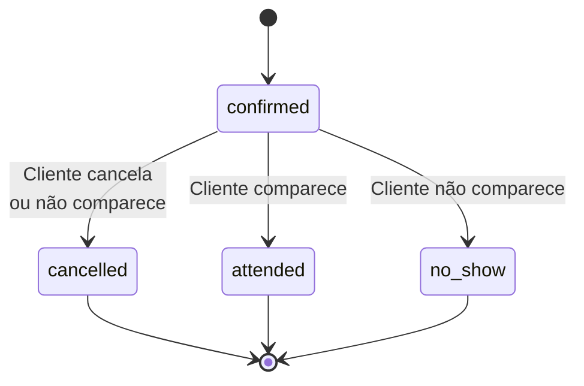

# Reservas

<cite>
**Arquivos Referenciados neste Documento**  
- [20250101000000_initial_schema_corrected.sql](file://supabase/migrations/20250101000000_initial_schema_corrected.sql)
- [20250101000001_rls_security_fix.sql](file://supabase/migrations/20250101000001_rls_security_fix.sql)
- [20250101000001_initial_schema_fixed.sql](file://supabase/migrations/20250101000001_initial_schema_fixed.sql)
- [20250101000000_initial_schema.sql](file://supabase/migrations/20250101000000_initial_schema.sql)
</cite>

## Sumário
1. [Introdução](#introdução)
2. [Estrutura do Módulo de Reservas](#estrutura-do-módulo-de-reservas)
3. [Campos da Tabela `reservations`](#campos-da-tabela-reservations)
4. [Integração com `tables` e `customers`](#integração-com-tables-e-customers)
5. [Políticas de Segurança de Linha (RLS)](#políticas-de-segurança-de-linha-rls)
6. [Verificação de Disponibilidade de Mesas](#verificação-de-disponibilidade-de-mesas)
7. [Casos de Uso e Fluxos de Trabalho](#casos-de-uso-e-fluxos-de-trabalho)
8. [Orientações para Implementação no Frontend](#orientações-para-implementação-no-frontend)
9. [Conclusão](#conclusão)

## Introdução

O módulo de Reservas é um componente central do sistema de gestão de restaurantes, projetado para gerenciar eficientemente as reservas de clientes. Este documento detalha a estrutura da tabela `reservations`, sua integração com as tabelas `tables` e `customers`, as políticas de segurança que garantem a isolamento de dados entre diferentes estabelecimentos, e fornece orientações para a implementação de funcionalidades no frontend. O objetivo é fornecer uma visão clara e completa para desenvolvedores e administradores do sistema.

**Section sources**
- [20250101000000_initial_schema_corrected.sql](file://supabase/migrations/20250101000000_initial_schema_corrected.sql#L196-L225)

## Estrutura do Módulo de Reservas

A arquitetura do módulo de reservas é baseada em um modelo de dados relacional que garante integridade e consistência. A tabela principal, `reservations`, armazena todas as informações sobre uma reserva, incluindo dados do cliente, horário, número de pessoas e status. Ela está diretamente relacionada à tabela `tables` para vincular uma reserva a uma mesa específica e à tabela `customers` para armazenar informações do cliente. O sistema é multi-inquilino, o que significa que múltiplos estabelecimentos podem usar o mesmo banco de dados, com seus dados logicamente separados.



**Diagram sources**
- [20250101000000_initial_schema_corrected.sql](file://supabase/migrations/20250101000000_initial_schema_corrected.sql#L196-L225)
- [20250101000000_initial_schema_corrected.sql](file://supabase/migrations/20250101000000_initial_schema_corrected.sql#L158-L194)

**Section sources**
- [20250101000000_initial_schema_corrected.sql](file://supabase/migrations/20250101000000_initial_schema_corrected.sql#L158-L225)

## Campos da Tabela `reservations`

A tabela `reservations` contém os seguintes campos, cada um com um propósito específico:

| Campo | Tipo de Dado | Obrigatório | Descrição |
| :--- | :--- | :--- | :--- |
| `id` | `serial` | Sim | Identificador único da reserva. |
| `establishment_id` | `integer` | Sim | Chave estrangeira que referencia o estabelecimento ao qual a reserva pertence. É crucial para a segurança multi-inquilino. |
| `customer_name` | `varchar(255)` | Sim | Nome completo do cliente que fez a reserva. |
| `customer_phone` | `varchar(20)` | Sim | Número de telefone do cliente para contato. |
| `customer_email` | `varchar(255)` | Não | Endereço de e-mail do cliente, usado para envio de confirmações. |
| `number_of_people` | `integer` | Sim | Número de pessoas para as quais a reserva é feita. |
| `reservation_date` | `date` | Sim | Data da reserva. |
| `reservation_time` | `time` | Sim | Horário da reserva. |
| `status` | `public.reservation_status` | Sim | Status atual da reserva. O valor padrão é `'confirmed'`. |
| `table_id` | `integer` | Não | Chave estrangeira opcional que referencia a mesa específica reservada. Se `NULL`, a reserva está pendente de alocação. |
| `notes` | `text` | Não | Observações adicionais sobre a reserva (ex: aniversário, dieta especial). |
| `created_at` | `timestamptz` | Sim | Timestamp de quando a reserva foi criada. Padrão: `now()`. |
| `updated_at` | `timestamptz` | Sim | Timestamp de quando a reserva foi atualizada pela última vez. Padrão: `now()`. |

O tipo de dado `reservation_status` é um ENUM definido no banco de dados com os seguintes valores possíveis: `'confirmed'`, `'cancelled'`, `'attended'`, e `'no_show'`.



**Diagram sources**
- [20250101000000_initial_schema.sql](file://supabase/migrations/20250101000000_initial_schema.sql#L32)
- [20250101000000_initial_schema.sql](file://supabase/migrations/20250101000000_initial_schema.sql#L204)

**Section sources**
- [20250101000000_initial_schema_corrected.sql](file://supabase/migrations/20250101000000_initial_schema_corrected.sql#L196-L225)

## Integração com `tables` e `customers`

### Integração com a Tabela `tables`

A integração com a tabela `tables` é feita através do campo `table_id` na tabela `reservations`. Esse campo é uma chave estrangeira opcional que pode ser `NULL`. Isso permite dois fluxos de trabalho distintos:

1.  **Reserva com Mesa Específica:** Quando um cliente solicita uma mesa específica (por exemplo, perto da janela), o campo `table_id` é preenchido com o `id` da mesa desejada. O status da mesa é automaticamente atualizado para `'reserved'`.
2.  **Reserva Pendente:** Quando um cliente faz uma reserva sem especificar uma mesa, o campo `table_id` permanece `NULL`. A reserva é marcada como pendente, e uma mesa será alocada posteriormente, geralmente no momento do check-in.

A tabela `tables` possui um campo `status` do tipo `public.table_status`, que pode ser `'available'`, `'occupied'`, `'reserved'`, ou `'maintenance'`. A integração entre as tabelas garante que uma mesa marcada como `'reserved'` não possa ser alocada para outra reserva no mesmo horário.

### Integração com a Tabela `customers`

Embora a tabela `reservations` não tenha uma chave estrangeira direta para `customers`, ela armazena informações do cliente (`customer_name`, `customer_phone`, `customer_email`) para fins de rastreabilidade e comunicação. Essa abordagem foi escolhida para manter um histórico imutável da reserva, mesmo que os dados do cliente na tabela `customers` sejam alterados posteriormente. A integração é lógica: uma reserva está associada a um cliente, mas os dados são duplicados para garantir a integridade do histórico.

**Section sources**
- [20250101000000_initial_schema_corrected.sql](file://supabase/migrations/20250101000000_initial_schema_corrected.sql#L196-L225)
- [20250101000000_initial_schema_corrected.sql](file://supabase/migrations/20250101000000_initial_schema_corrected.sql#L158-L194)

## Políticas de Segurança de Linha (RLS)

Para garantir que os dados de um estabelecimento não sejam acessados por usuários de outro estabelecimento, o sistema implementa Políticas de Segurança de Linha (Row Level Security - RLS) no Supabase. Essas políticas são aplicadas a todas as tabelas que contêm o campo `establishment_id`.

A política principal é definida na função `public.requesting_user_establishment_id()`, que determina o `establishment_id` do usuário autenticado atual. A política `Allow access to own establishment data` é então aplicada à tabela `reservations`:

```sql
CREATE POLICY "Allow access to own establishment data" ON public.reservations FOR ALL
USING (establishment_id = public.requesting_user_establishment_id());
```

Isso significa que qualquer operação (SELECT, INSERT, UPDATE, DELETE) em uma reserva só será permitida se o `establishment_id` da reserva for igual ao `establishment_id` do usuário que está fazendo a solicitação. Essa medida de segurança é fundamental para a arquitetura multi-inquilino do sistema.

**Section sources**
- [20250101000001_rls_security_fix.sql](file://supabase/migrations/20250101000001_rls_security_fix.sql#L74-L96)

## Verificação de Disponibilidade de Mesas

Para verificar a disponibilidade de mesas em um horário específico, é necessário consultar a tabela `tables` e verificar quais mesas não têm reservas conflitantes. O seguinte exemplo de consulta SQL retorna todas as mesas disponíveis para um número de pessoas e horário específico:

```sql
SELECT 
    t.id,
    t.table_number,
    t.capacity,
    t.status
FROM 
    public.tables t
WHERE 
    -- A mesa deve pertencer ao estabelecimento do usuário
    t.establishment_id = (SELECT public.requesting_user_establishment_id())
    -- A mesa deve ter capacidade suficiente
    AND t.capacity >= 4
    -- A mesa não deve estar em manutenção
    AND t.status != 'maintenance'
    -- A mesa não deve ter uma reserva ativa no horário solicitado
    AND t.id NOT IN (
        SELECT 
            r.table_id 
        FROM 
            public.reservations r 
        WHERE 
            r.table_id IS NOT NULL
            AND r.reservation_date = '2025-04-05'
            AND r.status IN ('confirmed', 'attended')
            AND (
                -- Verifica sobreposição de horários
                (r.reservation_time <= '19:30:00' AND (r.reservation_time + '02:00:00'::interval) > '19:30:00')
                OR
                (r.reservation_time >= '19:30:00' AND r.reservation_time < ('19:30:00' + '02:00:00'::interval))
            )
    );
```

Esta consulta considera um período de permanência padrão de 2 horas para uma reserva. Ela verifica se há sobreposição entre o horário da nova reserva e o horário de qualquer reserva existente para a mesma mesa.

**Section sources**
- [20250101000000_initial_schema_corrected.sql](file://supabase/migrations/20250101000000_initial_schema_corrected.sql#L196-L225)
- [20250101000000_initial_schema_corrected.sql](file://supabase/migrations/20250101000000_initial_schema_corrected.sql#L158-L194)

## Casos de Uso e Fluxos de Trabalho

### Sobreposição de Reservas

O sistema previne sobreposições de reservas através da lógica de verificação de disponibilidade descrita acima. Quando um novo registro é inserido na tabela `reservations`, a aplicação frontend ou uma função de banco de dados deve primeiro executar uma consulta de disponibilidade. Se nenhuma mesa estiver disponível, a inserção da nova reserva deve ser rejeitada com uma mensagem de erro apropriada.

### Clientes que Não Comparecem (No-Show)

Quando um cliente não comparece, o status da reserva deve ser atualizado de `'confirmed'` para `'no_show'`. Isso pode ser feito manualmente por um funcionário do restaurante ou automaticamente por um sistema de cron que marque como "no-show" todas as reservas confirmadas cujo horário já passou e que não foram marcadas como "attended". Atualizar o status libera a mesa para outras reservas ou uso imediato.

**Section sources**
- [20250101000000_initial_schema_corrected.sql](file://supabase/migrations/20250101000000_initial_schema_corrected.sql#L196-L225)

## Orientações para Implementação no Frontend

### Calendário de Reservas

O frontend deve incluir um calendário interativo que permita aos usuários visualizar todas as reservas confirmadas em um determinado dia. O calendário deve agrupar as reservas por horário e destacar o status (confirmado, cancelado, etc.) com cores diferentes. A integração com a tabela `tables` permite mostrar visualmente em qual mesa cada reserva está alocada.

### Notificações de Confirmação

Após a criação de uma nova reserva, o sistema deve enviar uma notificação de confirmação ao cliente. Isso pode ser feito por e-mail (usando o `customer_email`) ou por SMS (usando o `customer_phone`). A mensagem deve incluir todos os detalhes da reserva: data, horário, número de pessoas, número da mesa (se já alocada) e informações de contato do estabelecimento.

**Section sources**
- [20250101000000_initial_schema_corrected.sql](file://supabase/migrations/20250101000000_initial_schema_corrected.sql#L196-L225)

## Conclusão

O módulo de Reservas é um sistema robusto e seguro, projetado para atender às necessidades operacionais de um restaurante. Sua estrutura de banco de dados bem definida, combinada com políticas de segurança rigorosas, garante a integridade e a privacidade dos dados. A flexibilidade na alocação de mesas (específica ou pendente) e a clareza dos status de reserva proporcionam uma experiência de usuário eficiente tanto para os clientes quanto para a equipe do restaurante. As orientações fornecidas aqui devem servir como um guia completo para a implementação e manutenção deste módulo.