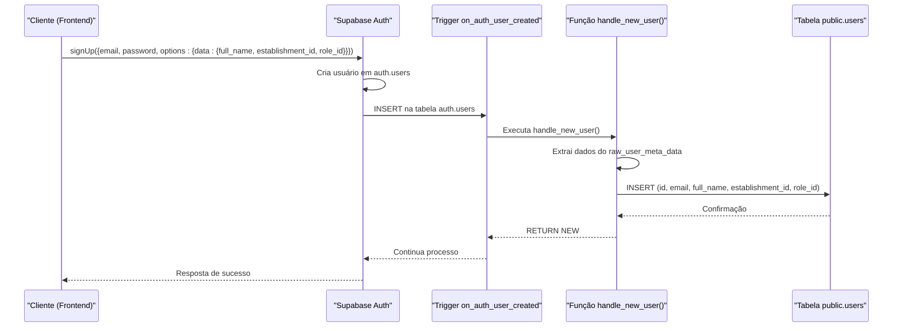
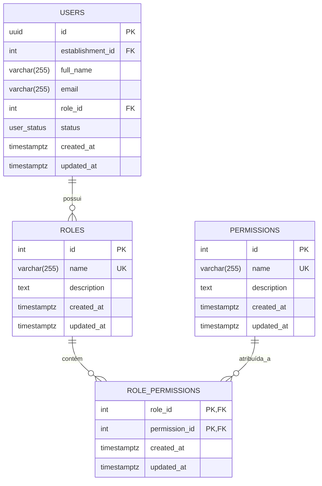
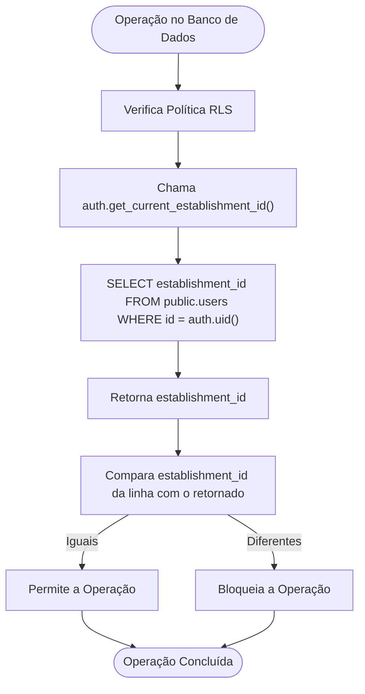
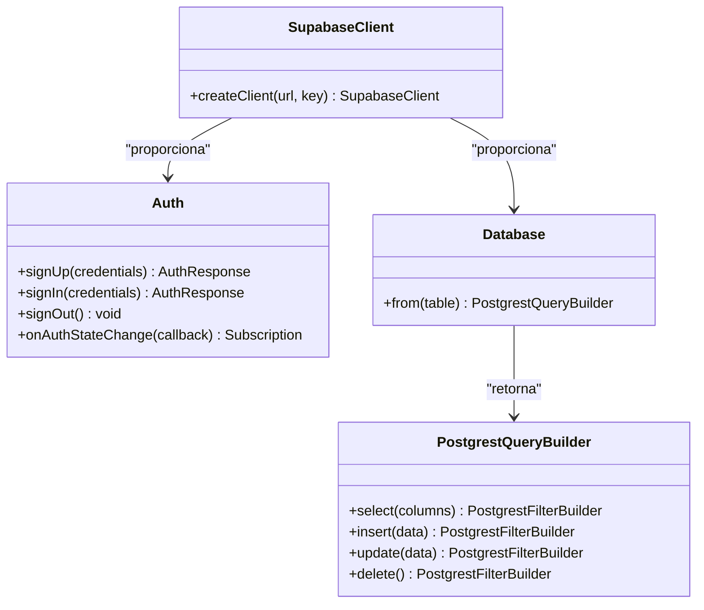

# Usuários e Permissões

<cite>
**Arquivos Referenciados neste Documento**   
- [supabase.ts](file://src/lib/supabase.ts)
- [20250101000001_initial_schema_fixed.sql](file://supabase/migrations/20250101000001_initial_schema_fixed.sql)
- [20250101000000_initial_schema_corrected.sql](file://supabase/migrations/20250101000000_initial_schema_corrected.sql)
</cite>

## Sumário
1. [Introdução](#introdução)
2. [Fluxo de Autenticação e Sincronização](#fluxo-de-autenticação-e-sincronização)
3. [Modelo de Dados](#modelo-de-dados)
4. [Controle de Acesso Baseado em Papéis (RBAC)](#controle-de-acesso-baseado-em-papéis-rbac)
5. [Segurança em Nível de Linha (RLS)](#segurança-em-nível-de-linha-rls)
6. [Implementação no Frontend](#implementação-no-frontend)
7. [Solução de Problemas Comuns](#solução-de-problemas-comuns)
8. [Conclusão](#conclusão)

## Introdução

Este documento detalha o módulo de Usuários e Permissões do sistema de gestão para restaurantes e bares. O sistema utiliza o Supabase Auth para autenticação e autorização, integrado a um modelo de dados multi-tenant que garante a segurança e isolamento dos dados entre diferentes estabelecimentos. A arquitetura combina autenticação robusta, sincronização automática de perfis, controle de acesso baseado em papéis (RBAC) e políticas de segurança em nível de linha (RLS) para criar um ambiente seguro e escalável.

## Fluxo de Autenticação e Sincronização

O processo de autenticação inicia-se quando um novo usuário realiza o cadastro através da API do Supabase Auth. O sistema está configurado com um mecanismo de sincronização automática que garante que um perfil público seja criado imediatamente na tabela `public.users` sempre que um novo usuário se registrar.

### Trigger `on_auth_user_created` e Função `handle_new_user()`

O coração desse processo é o trigger `on_auth_user_created`, que é acionado após cada inserção na tabela protegida `auth.users`. Esse trigger executa a função `handle_new_user()`, responsável por criar o registro correspondente na tabela `public.users`.



**Diagram sources**
- [20250101000001_initial_schema_fixed.sql](file://supabase/migrations/20250101000001_initial_schema_fixed.sql#L398-L432)

**Section sources**
- [20250101000001_initial_schema_fixed.sql](file://supabase/migrations/20250101000001_initial_schema_fixed.sql#L398-L432)
- [20250101000000_initial_schema_corrected.sql](file://supabase/migrations/20250101000000_initial_schema_corrected.sql#L649-L684)

A função `handle_new_user()` é definida com `SECURITY DEFINER`, o que permite que ela execute com os privilégios do seu proprietário (geralmente um superusuário), contornando as restrições de permissão que impediriam uma função comum de acessar a tabela `auth.users`. Os dados necessários para o perfil público (como `full_name`, `establishment_id` e `role_id`) são passados durante o cadastro no objeto `metadata` do Supabase.

## Modelo de Dados

O modelo de dados para usuários e permissões é composto por quatro tabelas principais que trabalham em conjunto para implementar um sistema de controle de acesso robusto.

### Tabelas Principais

As tabelas `users`, `roles`, `permissions` e `role_permissions` formam a base do sistema RBAC.



**Diagram sources**
- [20250101000001_initial_schema_fixed.sql](file://supabase/migrations/20250101000001_initial_schema_fixed.sql#L85-L124)
- [20250101000000_initial_schema.sql](file://supabase/migrations/20250101000000_initial_schema.sql#L49-L89)

**Section sources**
- [20250101000001_initial_schema_fixed.sql](file://supabase/migrations/20250101000001_initial_schema_fixed.sql#L85-L124)

### Relacionamentos e Restrições

- **Tabela `users`**: Armazena o perfil público do usuário. A coluna `id` é um UUID que faz referência ao `id` do usuário em `auth.users`, mas sem uma chave estrangeira direta para evitar problemas de permissão. A coluna `establishment_id` cria a ligação com o estabelecimento ao qual o usuário pertence, e `role_id` define seu papel.
- **Tabela `roles`**: Define os papéis (roles) disponíveis no sistema, como "Proprietário", "Gerente", "Garçom", etc. O nome do papel é único.
- **Tabela `permissions`**: Define as permissões atômicas do sistema, como "criar_pedido", "editar_cardapio", "ver_relatorios_financeiros", etc. Cada nome de permissão é único.
- **Tabela `role_permissions`**: É uma tabela de junção que implementa uma relação muitos-para-muitos entre `roles` e `permissions`. Uma chave primária composta (`role_id`, `permission_id`) garante que uma permissão não possa ser atribuída mais de uma vez ao mesmo papel. As restrições `ON DELETE CASCADE` garantem que, se um papel ou uma permissão for excluída, todas as atribuições relacionadas sejam removidas automaticamente.

## Controle de Acesso Baseado em Papéis (RBAC)

O sistema implementa um modelo RBAC onde o acesso a funcionalidades específicas é controlado pelo papel (role) atribuído ao usuário.

### Funcionamento do RBAC

O papel de um usuário é definido no momento do cadastro, através do campo `role_id` fornecido nos metadados. Esse papel determina o conjunto de permissões que o usuário herda. Por exemplo, um papel "Gerente" pode ter permissões para criar pedidos, gerenciar mesas e visualizar relatórios, enquanto um papel "Proprietário" teria todas essas permissões mais a capacidade de gerenciar usuários e configurações do estabelecimento.

Para atribuir permissões a um papel no backend, é necessário inserir registros na tabela `role_permissions`. Por exemplo, para permitir que o papel com `id = 2` (Gerente) tenha a permissão com `id = 5` (criar_pedido), a seguinte operação SQL deve ser realizada:

```sql
INSERT INTO public.role_permissions (role_id, permission_id) VALUES (2, 5);
```

Essa operação pode ser feita diretamente no banco de dados ou através de uma interface administrativa no frontend que execute uma chamada à API do Supabase.

## Segurança em Nível de Linha (RLS)

A segurança em nível de linha (Row Level Security - RLS) é fundamental para a arquitetura multi-tenant do sistema. Ela garante que um usuário só possa acessar dados do seu próprio estabelecimento.

### Política RLS para Acesso por Estabelecimento

A política RLS principal é aplicada a todas as tabelas que contêm a coluna `establishment_id`. A política é definida da seguinte forma:

```sql
CREATE POLICY "Users can view and manage users in their own establishment" ON public.users FOR ALL USING (establishment_id = auth.get_current_establishment_id());
```

Esta política, aplicada à tabela `users`, permite que um usuário execute operações (SELECT, INSERT, UPDATE, DELETE) apenas em registros onde o `establishment_id` corresponde ao ID do estabelecimento do usuário autenticado.

### Funções de Ajuda para RLS

A política depende da função `auth.get_current_establishment_id()`, que consulta a tabela `public.users` para encontrar o `establishment_id` associado ao `id` do usuário autenticado (`auth.uid()`).



**Diagram sources**
- [20250101000001_initial_schema_fixed.sql](file://supabase/migrations/20250101000001_initial_schema_fixed.sql#L469-L501)

**Section sources**
- [20250101000001_initial_schema_fixed.sql](file://supabase/migrations/20250101000001_initial_schema_fixed.sql#L469-L501)
- [20250101000000_initial_schema_corrected.sql](file://supabase/migrations/20250101000000_initial_schema_corrected.sql#L686-L717)

## Implementação no Frontend

O frontend interage com o sistema de autenticação e permissões principalmente através da biblioteca `@supabase/supabase-js`.

### Autenticação no Frontend

O arquivo `supabase.ts` configura o cliente do Supabase, que é usado em todo o aplicativo para realizar operações autenticadas.



**Section sources**
- [supabase.ts](file://src/lib/supabase.ts)

Para realizar o cadastro de um novo usuário e atribuir seu papel e estabelecimento, o código no frontend deve incluir os metadados necessários:

```javascript
const { data, error } = await supabase.auth.signUp({
  email: 'usuario@exemplo.com',
  password: 'senha123',
  options: {
    data: {
      full_name: 'Nome do Usuário',
      establishment_id: 1,
      role_id: 3
    }
  }
});
```

### Verificação de Papéis no Frontend

Para verificar o papel de um usuário no frontend, é necessário consultar a tabela `public.users` após a autenticação. Como o `role_id` não está disponível diretamente no objeto de sessão do Supabase Auth, uma consulta à API é necessária:

```javascript
// Após o login bem-sucedido
const { data: { user } } = await supabase.auth.getUser();

if (user) {
  const { data: userData, error } = await supabase
    .from('users')
    .select('role_id')
    .eq('id', user.id)
    .single();

  if (userData) {
    // Armazena o role_id no estado da aplicação
    setUserRole(userData.role_id);
    // Pode-se então verificar permissões com base no role_id
  }
}
```

## Solução de Problemas Comuns

### Usuários Não Sincronizados

**Sintoma**: Um usuário se cadastrou com sucesso, mas não aparece na lista de usuários do estabelecimento no painel administrativo.

**Causas e Soluções**:
1.  **Metadados ausentes no cadastro**: O trigger `handle_new_user()` depende dos campos `establishment_id` e `role_id` nos metadados. Se não forem fornecidos, a função tentará inserir `NULL`, o que pode falhar devido a restrições `NOT NULL`. **Solução**: Garanta que o frontend esteja enviando todos os metadados obrigatórios no objeto `options.data` durante o `signUp`.
2.  **Erro na função do trigger**: A função `handle_new_user()` pode falhar por algum erro de sintaxe ou permissão. **Solução**: Verifique os logs do Supabase para erros relacionados ao trigger. Confirme que a função existe e está correta com `\df+ public.handle_new_user` no editor SQL do Supabase.
3.  **Trigger desativado**: O trigger pode ter sido acidentalmente removido. **Solução**: Verifique se o trigger `on_auth_user_created` existe na tabela `auth.users` usando o editor de esquema do Supabase.

### Permissões Não Aplicadas

**Sintoma**: Um usuário com um papel que deveria ter uma permissão específica não consegue executar a ação correspondente.

**Causas e Soluções**:
1.  **Atribuição de permissão ausente**: A permissão pode não ter sido atribuída ao papel na tabela `role_permissions`. **Solução**: Consulte a tabela `role_permissions` para confirmar que a combinação `(role_id, permission_id)` existe.
2.  **Cache de dados no frontend**: O frontend pode estar usando um `role_id` ou lista de permissões em cache que não foi atualizada. **Solução**: Force uma atualização dos dados do usuário após qualquer alteração de papel ou permissão.
3.  **Erro na política RLS**: A política RLS pode estar bloqueando a operação por um motivo diferente do papel. **Solução**: Verifique se a operação está sendo feita no contexto do estabelecimento correto. Use o editor SQL do Supabase para testar a consulta com o usuário autenticado.

## Conclusão

O módulo de Usuários e Permissões apresentado é uma solução completa e segura para um sistema de gestão multi-tenant. A integração entre o Supabase Auth e o esquema de banco de dados personalizado permite uma autenticação robusta, uma sincronização de perfis automática e um controle de acesso granular baseado em papéis. A combinação de RBAC e RLS garante que os dados sejam protegidos e que os usuários tenham acesso apenas às funcionalidades e dados apropriados para seu papel e estabelecimento. Para manter a integridade do sistema, é crucial seguir os padrões de cadastro de usuários e gerenciar permissões com cuidado, utilizando as ferramentas de solução de problemas descritas quando necessário.