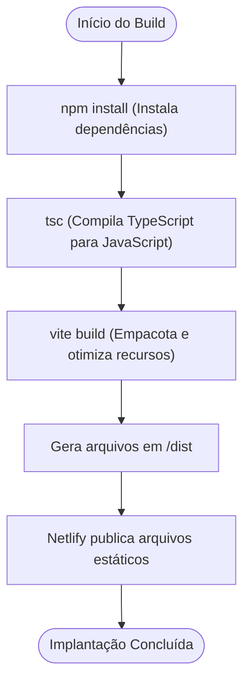
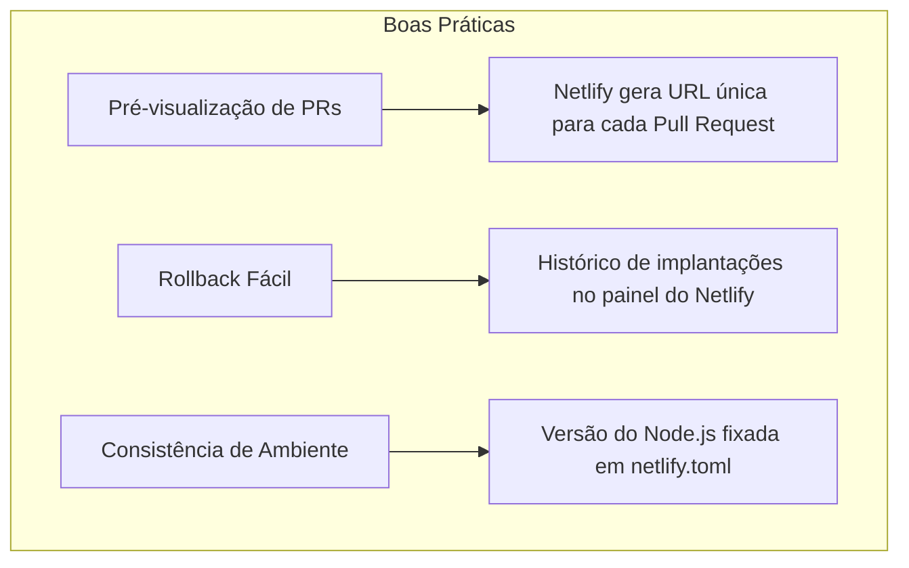

# Pipeline CI/CD

<cite>
**Arquivos Referenciados neste Documento**  
- [netlify.toml](file://netlify.toml)
- [package.json](file://package.json)
- [vite.config.ts](file://vite.config.ts)
- [src/main.tsx](file://src/main.tsx)
- [README.md](file://README.md)
</cite>

## Sumário
1. [Introdução](#introdução)
2. [Estrutura do Projeto](#estrutura-do-projeto)
3. [Configuração do Netlify.toml](#configuração-do-netlifytoml)
4. [Processo de Build e Geração de Arquivos Estáticos](#processo-de-build-e-geração-de-arquivos-estáticos)
5. [Gatilhos de Implantação Automática](#gatilhos-de-implantação-automática)
6. [Variáveis de Ambiente no Netlify](#variáveis-de-ambiente-no-netlify)
7. [Boas Práticas no Pipeline CI/CD](#boas-práticas-no-pipeline-cicd)
8. [Conclusão](#conclusão)

## Introdução

Este documento detalha o pipeline de integração e entrega contínua (CI/CD) do projeto **easyComand**, utilizando o Netlify como plataforma de hospedagem e automação. O objetivo é fornecer uma visão clara de como o sistema é construído, implantado e mantido de forma confiável, capacitando equipes a operarem e evoluírem o pipeline com segurança. O foco está na configuração do arquivo `netlify.toml`, no processo de build definido no `package.json`, nos gatilhos de implantação a partir do GitHub e nas práticas recomendadas para garantir a estabilidade do sistema.

## Estrutura do Projeto

O projeto easyComand é uma aplicação web moderna baseada em React, utilizando Vite como ferramenta de build, TypeScript para tipagem, e Tailwind CSS para estilização. A estrutura de diretórios é organizada de forma convencional, com o código-fonte principal localizado na pasta `src/`. O diretório `supabase/migrations` indica o uso do Supabase para gerenciamento de banco de dados, com scripts de migração versionados. Os arquivos de configuração principais, como `vite.config.ts`, `tailwind.config.js`, e `tsconfig.json`, definem as configurações específicas de cada ferramenta. O `package.json` gerencia as dependências e os scripts de execução, enquanto o `netlify.toml` orquestra o processo de implantação no Netlify.

**Section sources**
- [README.md](file://README.md#L1-L8)

## Configuração do Netlify.toml

O arquivo `netlify.toml` é o coração da configuração do pipeline CI/CD no Netlify. Ele define com precisão como o site deve ser construído e publicado. A seção `[build]` especifica o comando de build como `npm install && npm run build`, garantindo que todas as dependências sejam instaladas antes da execução do script de build. O diretório de saída para os arquivos estáticos gerados é definido como `dist`, que é o padrão do Vite. A opção `base = "/"` indica o diretório raiz do projeto, e `force = "true"` assegura que o build seja executado mesmo que o Netlify não detecte mudanças, prevenindo falhas silenciosas. A seção `[build.environment]` define variáveis de ambiente críticas, como `NODE_VERSION = "18"` para garantir consistência na versão do Node.js, e `CI = "true"` para indicar que o ambiente é de integração contínua. A seção `[dev]` configura o servidor de desenvolvimento local com o comando `vite`, rodando na porta 3000.

**Section sources**
- [netlify.toml](file://netlify.toml#L1-L18)

## Processo de Build e Geração de Arquivos Estáticos

O processo de build é acionado pelo script `"build"` definido no `package.json`, que executa o comando `tsc && vite build`. Este comando realiza duas etapas principais: primeiro, o compilador TypeScript (`tsc`) converte todo o código TypeScript (`.ts`, `.tsx`) em JavaScript compatível com navegadores; segundo, o Vite (`vite build`) otimiza, minifica e empacota todos os recursos (JavaScript, CSS, imagens) em um conjunto de arquivos estáticos altamente eficientes. O resultado final é colocado no diretório `dist/`, conforme especificado no `netlify.toml`. O Netlify então pega todos os arquivos desse diretório e os serve como uma aplicação web estática. A configuração do Vite, definida em `vite.config.ts`, inclui um alias `@` para o diretório `src/`, facilitando as importações no código-fonte, mas não interfere diretamente no processo de build para produção.

**Diagram sources**
- [package.json](file://package.json#L7-L10)
- [netlify.toml](file://netlify.toml#L2-L4)
- [vite.config.ts](file://vite.config.ts#L1-L14)

**Section sources**
- [package.json](file://package.json#L7-L10)
- [vite.config.ts](file://vite.config.ts#L1-L14)

## Gatilhos de Implantação Automática

A implantação automática do easyComand é acionada diretamente por eventos no repositório GitHub. O Netlify está integrado ao repositório, monitorando a branch principal (geralmente `main` ou `master`). Sempre que um novo commit é feito para essa branch, o Netlify detecta a mudança e inicia automaticamente o pipeline de CI/CD. O processo começa com a clonagem do repositório, seguido pela execução do comando de build definido em `netlify.toml` (`npm install && npm run build`). Após a conclusão bem-sucedida do build, os arquivos gerados no diretório `dist/` são automaticamente publicados na URL de produção do Netlify. Esse fluxo garante que as últimas alterações sejam disponibilizadas aos usuários de forma rápida e consistente, sem intervenção manual.

## Variáveis de Ambiente no Netlify

As variáveis de ambiente são configuradas diretamente no painel de administração do Netlify, dentro das configurações do site. Isso é essencial para manter segredos, como chaves de API do Supabase, fora do código-fonte versionado no GitHub. No painel do Netlify, as variáveis são adicionadas na seção "Build & deploy" > "Environment". Por exemplo, as variáveis `VITE_SUPABASE_URL` e `VITE_SUPABASE_ANON_KEY` são definidas lá. Durante o processo de build, o Vite injeta essas variáveis no código da aplicação, pois elas são prefixadas com `VITE_`, tornando-as acessíveis via `import.meta.env.VITE_SUPABASE_URL`. Isso permite que a aplicação se conecte ao banco de dados Supabase em produção com as credenciais corretas, enquanto ambientes de desenvolvimento podem usar variáveis diferentes definidas localmente em um arquivo `.env.local`.

## Boas Práticas no Pipeline CI/CD

Para manter o pipeline de entrega contínua do easyComand confiável, várias boas práticas são essenciais. A primeira é a **pré-visualização de pull requests (PRs)**. O Netlify gera automaticamente uma URL de pré-visualização para cada PR aberto no GitHub. Isso permite que a equipe revise as mudanças em um ambiente de staging que reflete exatamente como o site ficará após a implantação, facilitando testes de usabilidade e revisão de código visual. A segunda prática é o **rollback fácil**. O Netlify mantém um histórico completo de todas as implantações. Se uma nova versão introduzir um erro, é possível reverter imediatamente para qualquer implantação anterior com apenas um clique no painel, restaurando a funcionalidade em segundos. Além disso, a configuração explícita da versão do Node.js no `netlify.toml` elimina o "funciona na minha máquina" e garante consistência entre desenvolvimento e produção.

**Diagram sources**
- [netlify.toml](file://netlify.toml#L10-L12)

## Conclusão

O pipeline CI/CD do easyComand, orquestrado pelo Netlify, é um exemplo eficiente de entrega contínua moderna. Ao combinar a simplicidade do `netlify.toml` para definir o processo de build com a integração nativa ao GitHub, o pipeline automatiza a implantação com confiança. A separação clara entre código e segredos através das variáveis de ambiente do Netlify aumenta a segurança. Práticas como pré-visualizações de PRs e rollbacks fáceis garantem que a equipe possa inovar rapidamente enquanto mantém a estabilidade da aplicação. Compreender este fluxo é fundamental para qualquer membro da equipe que precise manter, depurar ou evoluir o sistema com confiança.