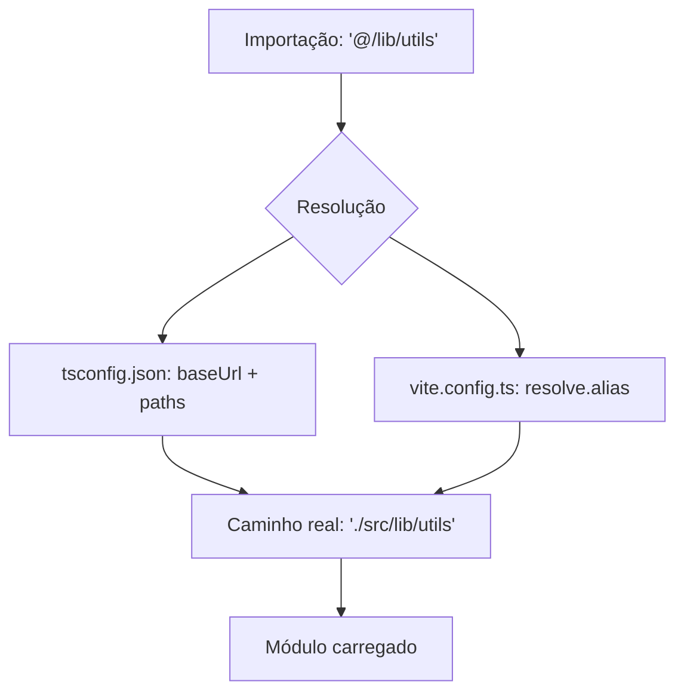
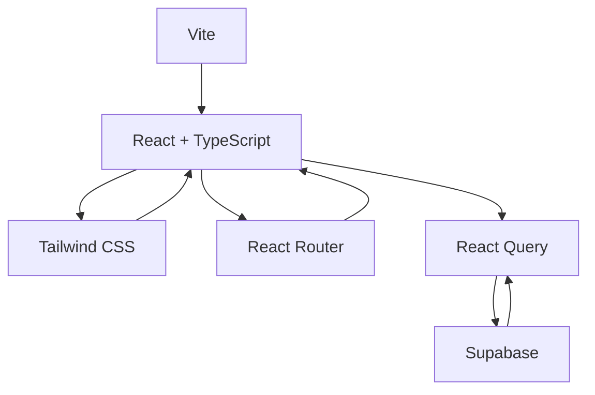

# Stack Tecnológica

<cite>
**Arquivos Referenciados neste Documento**  
- [package.json](file://package.json)
- [tsconfig.json](file://tsconfig.json)
- [vite.config.ts](file://vite.config.ts)
- [tailwind.config.js](file://tailwind.config.js)
- [src/App.tsx](file://src/App.tsx)
- [src/lib/supabase.ts](file://src/lib/supabase.ts)
- [src/main.tsx](file://src/main.tsx)
</cite>

## Sumário
1. [Introdução](#introdução)
2. [Estrutura do Projeto](#estrutura-do-projeto)
3. [Tecnologias Frontend](#tecnologias-frontend)
   - [React com TypeScript](#react-com-typescript)
   - [Vite como Bundler](#vite-como-bundler)
   - [Tailwind CSS para Estilização](#tailwind-css-para-estilização)
4. [Tecnologias Backend com Supabase](#tecnologias-backend-com-supabase)
5. [Gerenciamento de Estado e Navegação](#gerenciamento-de-estado-e-navegação)
   - [React Query para Estado Assíncrono](#react-query-para-estado-assíncrono)
   - [react-router-dom para Navegação](#react-router-dom-para-navegação)
6. [Configurações Críticas](#configurações-críticas)
   - [Aliases no tsconfig.json e vite.config.ts](#aliases-no-tsconfigjson-e-viteconfigts)
   - [Dependências no package.json](#dependências-no-packagejson)
7. [Integração entre Tecnologias](#integração-entre-tecnologias)
8. [Boas Práticas Adotadas](#boas-práticas-adotadas)
9. [Conclusão](#conclusão)

## Introdução

O projeto easyComand é uma aplicação moderna de gestão para restaurantes e bares, construída com uma stack tecnológica robusta e orientada à produtividade, desempenho e segurança. Este documento detalha as tecnologias utilizadas, seu papel no ecossistema do projeto e como elas se integram para formar uma base sólida para o desenvolvimento. A stack foi cuidadosamente escolhida para garantir tipagem segura, alto desempenho no desenvolvimento, estilização eficiente e backend escalável com autenticação e controle de acesso.

## Estrutura do Projeto

A estrutura do projeto segue uma organização clara e modular, facilitando a manutenção e a escalabilidade. O diretório `src` contém o código-fonte da aplicação, com subdiretórios como `lib` para utilitários e serviços compartilhados. Arquivos de configuração como `package.json`, `tsconfig.json`, `vite.config.ts` e `tailwind.config.js` estão na raiz, permitindo uma configuração centralizada e fácil de gerenciar. A presença de migrações no diretório `supabase/migrations` indica o uso de banco de dados versionado com Supabase.

**Section sources**
- [src](file://src)
- [supabase/migrations](file://supabase/migrations)

## Tecnologias Frontend

### React com TypeScript

O frontend do easyComand é construído com React, uma biblioteca JavaScript amplamente adotada para construção de interfaces de usuário dinâmicas e reativas. A integração com TypeScript adiciona tipagem estática ao projeto, permitindo detecção precoce de erros, melhor documentação do código e suporte avançado de IDE. Isso resulta em uma base de código mais segura, especialmente em aplicações complexas como sistemas de gestão.

A combinação React + TypeScript promove componentes reutilizáveis e previsíveis, essenciais para manter a consistência da interface do usuário. A tipagem rigorosa é aplicada em props, estados e retornos de funções, garantindo que os dados fluam corretamente entre os componentes.

**Section sources**
- [src/App.tsx](file://src/App.tsx#L1-L30)
- [src/main.tsx](file://src/main.tsx#L1-L18)

### Vite como Bundler

O Vite é utilizado como bundler e servidor de desenvolvimento, oferecendo tempos de inicialização extremamente rápidos e recarga instantânea (HMR - Hot Module Replacement). Sua arquitetura moderna, baseada em ESM (ECMAScript Modules), elimina a necessidade de empacotamento completo durante o desenvolvimento, resultando em uma experiência de desenvolvimento altamente responsiva.

A configuração em `vite.config.ts` define plugins essenciais, como `@vitejs/plugin-react`, que habilita o suporte a React, e configura aliases para facilitar a importação de módulos. O uso de Vite permite um fluxo de trabalho ágil, onde os desenvolvedores podem ver alterações refletidas quase instantaneamente no navegador.

**Section sources**
- [vite.config.ts](file://vite.config.ts#L1-L13)

### Tailwind CSS para Estilização

O Tailwind CSS é adotado como framework de estilização utility-first, permitindo a construção de interfaces personalizadas diretamente no JSX com classes de baixo nível. Essa abordagem elimina a necessidade de arquivos CSS separados e promove a consistência visual através de um sistema de design baseado em tokens.

A configuração em `tailwind.config.js` define temas, cores, espaçamentos e animações personalizadas, alinhadas ao design system do projeto. O uso de variáveis CSS (`hsl(var(--primary))`) permite suporte a temas claros e escuros. O plugin `tailwindcss-animate` adiciona animações prontas para uso, como acordeões, melhorando a experiência do usuário.

**Section sources**
- [tailwind.config.js](file://tailwind.config.js#L1-L77)
- [src/App.tsx](file://src/App.tsx#L2-L18)

## Tecnologias Backend com Supabase

O Supabase é a escolha para o backend, fornecendo um conjunto completo de serviços: banco de dados PostgreSQL, autenticação, armazenamento e RLS (Row Level Security). A integração é feita através do cliente `@supabase/supabase-js`, que permite operações CRUD, autenticação de usuários e escuta de mudanças em tempo real diretamente no frontend.

O arquivo `src/lib/supabase.ts` inicializa o cliente Supabase com credenciais carregadas de variáveis de ambiente, garantindo segurança. O RLS é configurado nas migrações SQL, permitindo controle granular de acesso aos dados com base na identidade do usuário. Essa arquitetura elimina a necessidade de um backend intermediário, acelerando o desenvolvimento.

**Section sources**
- [package.json](file://package.json#L20-L21)
- [src/lib/supabase.ts](file://src/lib/supabase.ts#L1-L10)

## Gerenciamento de Estado e Navegação

### React Query para Estado Assíncrono

O React Query (`@tanstack/react-query`) é utilizado para gerenciar o estado assíncrono, como dados obtidos de APIs. Ele simplifica o processo de busca, cache, sincronização e atualização de dados, eliminando a necessidade de gerenciadores de estado globais complexos para dados externos.

No arquivo `src/main.tsx`, o `QueryClientProvider` envolve toda a aplicação, fornecendo acesso ao cache global. Isso permite que componentes usem hooks como `useQuery` e `useMutation` para interagir com o Supabase de forma declarativa, com tratamento automático de loading, erro e stale data.

**Section sources**
- [package.json](file://package.json#L19-L20)
- [src/main.tsx](file://src/main.tsx#L9-L18)

### react-router-dom para Navegação

O `react-router-dom` é responsável pela navegação entre telas na aplicação SPA (Single Page Application). Ele permite definir rotas declarativas e navegar entre elas sem recarregar a página. No componente `App`, as rotas são definidas com `Routes` e `Route`, mapeando caminhos a componentes como `Home`.

Essa abordagem facilita a organização da aplicação em telas distintas (Login, Dashboard, Pedidos, etc.) e permite navegação programática e baseada em URL, essencial para uma experiência de usuário fluida.

**Section sources**
- [package.json](file://package.json#L27-L28)
- [src/App.tsx](file://src/App.tsx#L1-L30)

## Configurações Críticas

### Aliases no tsconfig.json e vite.config.ts

Para melhorar a legibilidade e manutenção do código, aliases são configurados em ambos `tsconfig.json` e `vite.config.ts`. O alias `@/` aponta para o diretório `src`, permitindo importações como `import { supabase } from '@/lib/supabase'` em vez de caminhos relativos complexos (`../../lib/supabase`). Isso reduz erros e torna o código mais portável.

A configuração é consistente entre os dois arquivos: `tsconfig.json` define o alias para o compilador TypeScript, enquanto `vite.config.ts` o define para o bundler Vite, garantindo que ambos funcionem corretamente.

**Diagram sources**
- [tsconfig.json](file://tsconfig.json#L15-L19)
- [vite.config.ts](file://vite.config.ts#L7-L11)

**Section sources**
- [tsconfig.json](file://tsconfig.json#L15-L19)
- [vite.config.ts](file://vite.config.ts#L7-L11)

### Dependências no package.json

O arquivo `package.json` lista todas as dependências do projeto, divididas entre `dependencies` e `devDependencies`. As principais dependências incluem:
- `@supabase/supabase-js`: Cliente para integração com Supabase.
- `@tanstack/react-query`: Gerenciamento de estado assíncrono.
- `react` e `react-dom`: Bibliotecas fundamentais do frontend.
- `react-router-dom`: Navegação na aplicação.
- `tailwindcss`: Framework de estilização.
- `typescript`: Linguagem de programação com tipagem estática.

As versões são especificadas com `^`, permitindo atualizações semânticas seguras. As `devDependencies` incluem ferramentas de desenvolvimento como ESLint, TypeScript e plugins do Vite.

**Section sources**
- [package.json](file://package.json#L10-L45)

## Integração entre Tecnologias

As tecnologias se integram de forma harmoniosa para formar um todo coeso. O React com TypeScript define a estrutura da interface, estilizada com Tailwind CSS diretamente nos componentes. O Vite serve e empacota o código com alta eficiência. O Supabase fornece dados e autenticação, acessados via `@supabase/supabase-js`. O React Query gerencia esses dados no frontend, enquanto o `react-router-dom` orquestra a navegação.

Um exemplo claro é o componente `Home` em `App.tsx`, que usa classes Tailwind para estilização, sendo renderizado por React Router e potencialmente consumindo dados do Supabase via React Query em versões futuras.

**Diagram sources**
- [src/App.tsx](file://src/App.tsx)
- [src/main.tsx](file://src/main.tsx)
- [src/lib/supabase.ts](file://src/lib/supabase.ts)

**Section sources**
- [src/App.tsx](file://src/App.tsx)
- [src/main.tsx](file://src/main.tsx)
- [src/lib/supabase.ts](file://src/lib/supabase.ts)

## Boas Práticas Adotadas

O projeto incorpora várias boas práticas de desenvolvimento moderno:
- **Tipagem rigorosa**: Uso completo do TypeScript para segurança de tipos.
- **Modularização**: Código organizado em módulos reutilizáveis (ex: `lib/`).
- **Aliases**: Caminhos de importação simplificados para melhor legibilidade.
- **Configuração centralizada**: Ferramentas como Tailwind e Vite configuradas de forma clara.
- **Segurança no backend**: Uso de RLS no Supabase para controle de acesso.
- **Gerenciamento de estado eficiente**: React Query para dados assíncronos, evitando estados globais desnecessários.
- **Desenvolvimento ágil**: Vite proporciona recarga rápida, acelerando o ciclo de desenvolvimento.

Essas práticas garantem que o código seja sustentável, escalável e fácil de entender por novos desenvolvedores.

## Conclusão

A stack tecnológica do easyComand representa uma escolha moderna e eficaz para o desenvolvimento de aplicações web. A combinação de React com TypeScript, Vite, Tailwind CSS, Supabase e React Query oferece um equilíbrio ideal entre produtividade, desempenho e segurança. Este documento serve como referência para novos membros da equipe entenderem as decisões técnicas, configurar seus ambientes de desenvolvimento e contribuir de forma eficaz para o projeto.