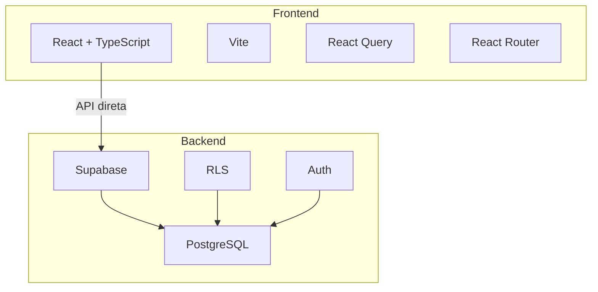
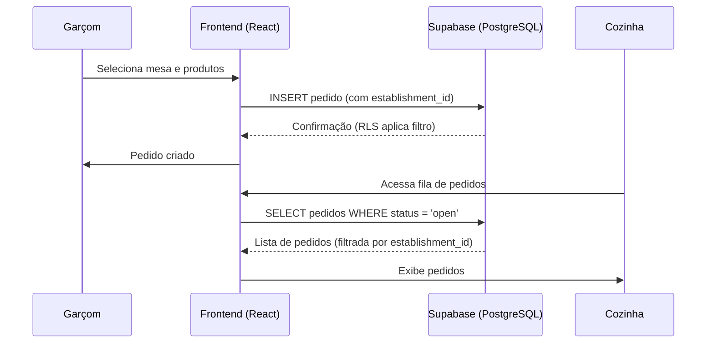

# Visão Geral do Sistema

<cite>
**Arquivos Referenciados neste Documento**  
- [README.md](file://README.md)
- [src/lib/supabase.ts](file://src/lib/supabase.ts)
- [src/main.tsx](file://src/main.tsx)
- [src/App.tsx](file://src/App.tsx)
- [supabase/migrations/20250101000000_initial_schema.sql](file://supabase/migrations/20250101000000_initial_schema.sql)
- [supabase/migrations/20250101000001_rls_security_fix.sql](file://supabase/migrations/20250101000001_rls_security_fix.sql)
- [package.json](file://package.json)
- [tsconfig.json](file://tsconfig.json)
</cite>

## Sumário
1. [Introdução](#introdução)
2. [Arquitetura Geral](#arquitetura-geral)
3. [Componentes Principais](#componentes-principais)
4. [Exemplo de Uso: Fluxo de Pedido](#exemplo-de-uso-fluxo-de-pedido)
5. [Pré-requisitos para Desenvolvimento](#pré-requisitos-para-desenvolvimento)

## Introdução

O **easyComand** é uma aplicação full-stack projetada para a gestão completa de restaurantes e bares, com suporte nativo a arquitetura multi-inquilino (multi-tenant). Isso significa que múltiplos estabelecimentos podem operar de forma completamente isolada dentro de uma única instância da aplicação, compartilhando a mesma base de código e infraestrutura, mas mantendo seus dados rigorosamente separados e seguros. O propósito principal do sistema é fornecer um conjunto integrado de ferramentas para controle operacional, incluindo gestão de pedidos, mesas, reservas, estoque, relatórios financeiros e fidelização de clientes.

A aplicação é construída com foco em simplicidade, segurança e escalabilidade. A arquitetura multi-inquilino permite que o sistema seja facilmente implantado para uma rede de franquias ou oferecido como um serviço SaaS (Software as a Service) para diversos clientes independentes. Cada estabelecimento possui seu próprio espaço de dados, garantindo que informações confidenciais, como cardápios, preços, pedidos e relatórios, não sejam acessíveis por outros inquilinos.

**Section sources**
- [README.md](file://README.md#L0-L8)
- [supabase/migrations/20250101000000_initial_schema.sql](file://supabase/migrations/20250101000000_initial_schema.sql#L0-L505)

## Arquitetura Geral

A arquitetura do easyComand segue um modelo clássico de separação entre frontend e backend, com uma forte ênfase na segurança e no isolamento de dados.

### Frontend
A camada de interface do usuário é construída com tecnologias modernas da stack JavaScript:
- **React**: Uma biblioteca para construção de interfaces de usuário componentizadas.
- **TypeScript**: Uma camada de tipagem estática sobre o JavaScript, que aumenta a robustez e a manutenibilidade do código.
- **Vite**: Um bundler de próxima geração que oferece tempos de inicialização e recarga extremamente rápidos durante o desenvolvimento.
- **React Router**: Para gerenciamento de navegação e rotas dentro da aplicação SPA (Single Page Application).
- **React Query**: Para gerenciamento avançado de estado, especialmente para dados assíncronos provenientes do backend. Ele simplifica o fetch, cache, sincronização e atualização de dados do servidor.

O frontend é estruturado como um aplicativo monolítico, com o ponto de entrada principal definido em `main.tsx`, que inicializa o `QueryClient` do React Query e envolve o componente `App` com os provedores necessários (`QueryClientProvider` e `BrowserRouter`).

### Backend
O backend é totalmente baseado no **Supabase**, uma plataforma de código aberto que fornece uma camada de API em tempo real sobre um banco de dados PostgreSQL. O Supabase atua como o backend completo, eliminando a necessidade de escrever um servidor de API tradicional (como com Node.js ou Python).

- **PostgreSQL**: O banco de dados relacional que armazena todos os dados da aplicação, desde informações de estabelecimentos até pedidos e estoque.
- **Row Level Security (RLS)**: O mecanismo central de segurança do Supabase. Ele permite definir políticas de acesso diretamente no banco de dados, garantindo que um usuário só possa acessar dados do seu próprio estabelecimento. Isso é implementado nas migrações SQL, onde todas as tabelas específicas de um inquilino têm políticas RLS que verificam o `establishment_id`.
- **Autenticação**: O Supabase fornece um sistema de autenticação completo. Um gatilho de banco de dados (`on_auth_user_created`) sincroniza automaticamente novos usuários do sistema de autenticação (`auth.users`) com a tabela `public.users`, vinculando-os a um estabelecimento.

A comunicação entre o frontend e o backend é feita diretamente através da biblioteca `@supabase/supabase-js`, que é configurada no arquivo `supabase.ts` com as credenciais do projeto.

**Diagram sources**
- [src/main.tsx](file://src/main.tsx#L0-L18)
- [src/lib/supabase.ts](file://src/lib/supabase.ts#L0-L10)
- [supabase/migrations/20250101000000_initial_schema.sql](file://supabase/migrations/20250101000000_initial_schema.sql#L0-L505)
- [supabase/migrations/20250101000001_rls_security_fix.sql](file://supabase/migrations/20250101000001_rls_security_fix.sql#L0-L356)

**Section sources**
- [src/main.tsx](file://src/main.tsx#L0-L18)
- [src/lib/supabase.ts](file://src/lib/supabase.ts#L0-L10)
- [package.json](file://package.json#L0-L46)
- [tsconfig.json](file://tsconfig.json#L0-L33)

## Componentes Principais

O sistema easyComand é composto por vários componentes interconectados que trabalham em conjunto para fornecer uma experiência de gestão completa.

### Interface de Usuário (UI)
A interface é construída com React, permitindo uma experiência de usuário dinâmica e responsiva. O arquivo `App.tsx` define a estrutura básica de rotas, com uma tela inicial (`Home`) que serve como ponto de partida. À medida que o sistema evolui, novas rotas serão adicionadas para telas como login, dashboard, gestão de pedidos e relatórios.

### Gerenciamento de Estado com React Query
O React Query é o coração do gerenciamento de estado no frontend. Ele é responsável por:
- Buscar dados do backend Supabase de forma declarativa.
- Armazenar em cache os dados localmente para melhorar o desempenho e a experiência do usuário.
- Sincronizar automaticamente os dados com o servidor (background refetching).
- Gerenciar o estado de carregamento e erro das requisições.

### Segurança e Isolamento de Dados
A segurança é implementada em múltiplas camadas:
- **Papéis (Roles)**: O sistema define papéis (como garçom, cozinheiro, gerente) que determinam as permissões de um usuário. Isso é modelado nas tabelas `roles` e `role_permissions`.
- **Isolamento por `establishment_id`**: Este é o mecanismo fundamental de multi-inquilino. Cada registro em tabelas como `orders`, `products`, e `tables` possui um campo `establishment_id`. As políticas RLS no Supabase garantem que qualquer consulta ao banco de dados seja automaticamente filtrada por este ID, baseado no usuário autenticado. A função `requesting_user_establishment_id()` é usada nas políticas para obter o ID do estabelecimento do usuário atual.

**Section sources**
- [src/App.tsx](file://src/App.tsx#L0-L30)
- [supabase/migrations/20250101000000_initial_schema.sql](file://supabase/migrations/20250101000000_initial_schema.sql#L0-L505)
- [supabase/migrations/20250101000001_rls_security_fix.sql](file://supabase/migrations/20250101000001_rls_security_fix.sql#L0-L356)

## Exemplo de Uso: Fluxo de Pedido

Para ilustrar o funcionamento do sistema, considere o seguinte cenário:

1.  **Login**: Um garçom faz login no sistema. O Supabase autentica o usuário e o frontend obtém seu perfil, incluindo seu `establishment_id`.
2.  **Criação do Pedido**: O garçom navega para a tela de pedidos, seleciona uma mesa e adiciona produtos ao pedido. O frontend usa a biblioteca `supabase.js` para inserir um novo registro na tabela `orders` e registros relacionados na tabela `order_items`. A política RLS garante que o `establishment_id` correto seja aplicado automaticamente.
3.  **Visualização pela Cozinha**: Em uma tela separada, um cozinheiro (com um papel diferente) faz login. Ele acessa a "fila de pedidos". O frontend faz uma consulta para buscar todos os pedidos com status "open". Graças à RLS, o cozinheiro só vê os pedidos do seu próprio estabelecimento. Ele pode então atualizar o status de um item para "preparing" ou "ready".

Este fluxo demonstra a integração perfeita entre o frontend, o backend Supabase e as políticas de segurança, tudo funcionando de forma transparente para o usuário final.

**Diagram sources**
- [src/lib/supabase.ts](file://src/lib/supabase.ts#L9-L9)
- [supabase/migrations/20250101000000_initial_schema.sql](file://supabase/migrations/20250101000000_initial_schema.sql#L0-L505)

## Pré-requisitos para Desenvolvimento

Para desenvolver ou utilizar o sistema easyComand, são necessários os seguintes conhecimentos e ferramentas:

- **TypeScript**: É essencial para trabalhar com o código-fonte do frontend, garantindo tipagem segura e uma melhor experiência de desenvolvimento.
- **Supabase**: Um entendimento profundo do Supabase é crucial, especialmente em relação à sua autenticação, Row Level Security (RLS), e como interagir com o banco de dados PostgreSQL através da biblioteca JavaScript.
- **Ferramentas de Desenvolvimento**: O projeto utiliza `npm` como gerenciador de pacotes. Os comandos principais são:
    - `npm install`: Para instalar todas as dependências listadas no `package.json`.
    - `npm run dev`: Para iniciar o servidor de desenvolvimento Vite.
    - `npm run build`: Para compilar a aplicação para produção.

O ambiente de desenvolvimento pode ser configurado rapidamente seguindo as instruções do `README.md`.

**Section sources**
- [README.md](file://README.md#L0-L8)
- [package.json](file://package.json#L0-L46)