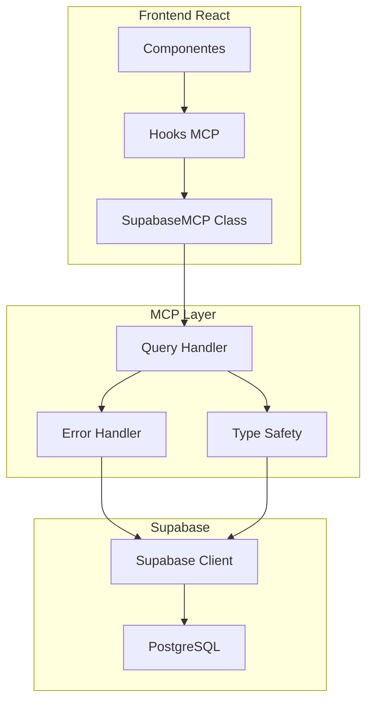

# 🔧 Supabase MCP (Model Context Protocol)

## 📋 Visão Geral

O **Supabase MCP** é uma camada de abstração implementada no projeto EasyComand que padroniza e simplifica as operações com o Supabase. Ele fornece uma interface consistente para operações CRUD, autenticação e funcionalidades em tempo real.

## 🎯 Objetivos

### 1. **Padronização**
- Interface consistente para todas as operações de banco
- Tratamento uniforme de erros
- Respostas padronizadas com `{ success, data, error }`

### 2. **Simplicidade**
- Reduz boilerplate code
- Hooks React prontos para uso
- Operações complexas simplificadas

### 3. **Tipagem**
- TypeScript completo
- Tipos de banco de dados automáticos
- IntelliSense aprimorado

### 4. **Multi-tenant Ready**
- Preparado para isolamento de dados
- Funções específicas para tenant
- RLS integrado

## 🏗️ Arquitetura



## 📂 Estrutura de Arquivos

```
src/
├── lib/
│   ├── supabase-mcp.ts      # Classe principal MCP
│   ├── database.types.ts    # Tipos do banco de dados
│   └── test-connection.ts   # Testes usando MCP
├── hooks/
│   └── useSupabaseMCP.ts   # Hooks React para MCP
└── components/
    └── SupabaseMCPDemo.tsx  # Demonstração prática
```

## 🔨 Componentes Principais

### 1. **SupabaseMCP Class**
```typescript
export class SupabaseMCP {
  // Operações CRUD padronizadas
  async select<T>(table: string, options?: SelectOptions)
  async insert<T>(table: string, data: any)
  async update<T>(table: string, data: any, filter: Record<string, any>)
  async delete(table: string, filter: Record<string, any>)
  
  // Autenticação
  auth: {
    signIn, signUp, signOut, getSession, getUser
  }
  
  // Real-time
  realtime: {
    subscribe
  }
}
```

### 2. **Hooks React**
```typescript
// Hook principal
const { database, auth, loading, error } = useSupabaseMCP()

// Hook específico para estabelecimentos
const { getEstablishmentTypes, loading } = useEstablishments()

// Hook de autenticação
const { user, signIn, signOut, isAuthenticated } = useAuth()
```

### 3. **Tipos de Resposta**
```typescript
type SupabaseResponse<T> = {
  success: boolean
  data: T | null
  error: string | null
}
```

## 🚀 Como Usar

### 1. **Operações Básicas**

```typescript
import { useSupabaseMCP } from '../hooks/useSupabaseMCP'

function MyComponent() {
  const { database, loading, error } = useSupabaseMCP()
  
  // SELECT
  const tipos = await database.select('establishment_types', {
    select: 'id, name',
    orderBy: { column: 'name', ascending: true },
    limit: 10
  })
  
  // INSERT
  const novo = await database.insert('establishment_types', {
    name: 'Novo Tipo'
  })
  
  // UPDATE
  const atualizado = await database.update('establishment_types', 
    { name: 'Nome Atualizado' },
    { id: 1 }
  )
  
  // DELETE
  await database.delete('establishment_types', { id: 1 })
}
```

### 2. **Autenticação**

```typescript
import { useAuth } from '../hooks/useSupabaseMCP'

function LoginComponent() {
  const { signIn, signUp, signOut, user, isAuthenticated } = useAuth()
  
  const handleLogin = async () => {
    const result = await signIn('user@email.com', 'password')
    if (result) {
      console.log('Login realizado com sucesso!')
    }
  }
  
  return (
    <div>
      {isAuthenticated ? (
        <p>Bem-vindo, {user.email}!</p>
      ) : (
        <button onClick={handleLogin}>Login</button>
      )}
    </div>
  )
}
```

### 3. **Real-time**

```typescript
import { mcp } from '../lib/supabase-mcp'

function RealtimeComponent() {
  useEffect(() => {
    // Subscrever mudanças na tabela orders
    const channel = mcp.realtime.subscribe(
      'orders',
      (payload) => {
        console.log('Mudança detectada:', payload)
      },
      { column: 'establishment_id', value: 1 }
    )
    
    return () => {
      channel.unsubscribe()
    }
  }, [])
}
```

## 🎨 Exemplo Completo

```typescript
import { useState, useEffect } from 'react'
import { useSupabaseMCP, useEstablishments } from '../hooks/useSupabaseMCP'

function EstablishmentManager() {
  const { database, loading, error } = useSupabaseMCP()
  const { getEstablishmentTypes } = useEstablishments()
  const [types, setTypes] = useState([])
  
  useEffect(() => {
    async function loadTypes() {
      const result = await getEstablishmentTypes()
      if (result) {
        setTypes(result)
      }
    }
    loadTypes()
  }, [getEstablishmentTypes])
  
  const addNewType = async (name: string) => {
    const result = await database.insert('establishment_types', { name })
    if (result) {
      // Recarregar lista
      const updated = await getEstablishmentTypes()
      if (updated) setTypes(updated)
    }
  }
  
  if (loading) return <div>Carregando...</div>
  if (error) return <div>Erro: {error}</div>
  
  return (
    <div>
      <h2>Tipos de Estabelecimento</h2>
      <ul>
        {types.map(type => (
          <li key={type.id}>{type.name}</li>
        ))}
      </ul>
      <button onClick={() => addNewType('Novo Tipo')}>
        Adicionar Tipo
      </button>
    </div>
  )
}
```

## 🛡️ Tratamento de Erros

O MCP implementa tratamento de erros em várias camadas:

### 1. **Nível da Classe**
```typescript
async query<T>(operation: () => Promise<any>): Promise<SupabaseResponse<T>> {
  try {
    const result = await operation()
    
    if (result.error) {
      return {
        success: false,
        data: null,
        error: result.error.message || 'Erro na operação'
      }
    }
    
    return {
      success: true,
      data: result.data,
      error: null
    }
  } catch (error) {
    return {
      success: false,
      data: null,
      error: error.message || 'Erro desconhecido'
    }
  }
}
```

### 2. **Nível dos Hooks**
```typescript
const { loading, error } = useSupabaseMCP()

// error contém mensagens de erro legíveis
// loading indica estado de carregamento
```

## 🔍 Demo e Testes

### Acessar Demo
1. Execute a aplicação: `npm run dev`
2. Navegue para `/mcp-demo`
3. Veja exemplos práticos de uso

### Componente de Demo
O `SupabaseMCPDemo` demonstra:
- Carregamento de dados
- Operações CRUD
- Estados de loading/error
- Integração com hooks

## 📈 Benefícios

### ✅ **Para Desenvolvedores**
- Menos código boilerplate
- Interface consistente
- Tipagem completa
- Hooks prontos para React

### ✅ **Para o Projeto**
- Manutenibilidade aumentada
- Padronização de código
- Facilita testes
- Preparado para multi-tenant

### ✅ **Para Performance**
- Cache automático do React Query (futuro)
- Otimizações centralizadas
- Redução de re-renders

## 🔮 Roadmap Futuro

### Próximas Implementações
1. **Cache Inteligente**: Integração com React Query
2. **Offline Support**: Sincronização offline
3. **Batch Operations**: Operações em lote
4. **Multi-tenant Complete**: Filtros automáticos por tenant
5. **Audit Trail**: Log automático de alterações
6. **Schema Validation**: Validação automática de dados

### Melhorias Planejadas
- [ ] Paginação automática
- [ ] Filtros avançados
- [ ] Backup/restore
- [ ] Métricas de performance
- [ ] Testes automatizados

## 📚 Referências

- [Supabase Documentation](https://supabase.com/docs)
- [React Query](https://tanstack.com/query)
- [TypeScript](https://typescriptlang.org)
- [Model Context Protocol](https://modelcontextprotocol.io)

---

**Desenvolvido para o projeto EasyComand**  
**Autor**: Rilton Oliveira de Souza  
**E-mail**: riltons@bb.com.br